# OptiDuck

**一台用国产舵机复刻的 Microduck 双足机器人**：主控 Radxa ZERO 3W，执行器换成**飞特 HD-1910 总线舵机**，
步态策略在 MuJoCo / mjlab 里用 PPO 训练，导出 ONNX 后在板子上跑实时推理，
配套一套板端运维服务与 Android 远程运维 App。

这个仓库是**总入口**：它记录整条链路的文档、自研工具链、板端代码与训练侧改动，
上面三块上游代码以 git submodule 引入。

- [部署调试教程.md](docs/Radxa_ZERO_3W部署调试教程_发布版.md)
- [开发教程.md](docs/Radxa_ZERO_3W_开发教程_发布版.md)

> 本项目是**个人学习 / 复刻项目**，不是产品。所有数据、命令、报错原文都来自这台实机，
> 能复现的写了复现方式，没验完的明确标了「待核实」。详见 [NOTICE.md](NOTICE.md)。

---

## 目录

- [它长什么样](#它长什么样)
- [系统架构](#系统架构)
- [仓库结构](#仓库结构)
- [快速开始](#快速开始)
- [自研工具链：URDF / MJCF 可视化](#自研工具链urdf--mjcf-可视化)
- [板端运维工具](#板端运维工具)
- [实测数据](#实测数据)
- [和上游的关系](#和上游的关系)
- [许可与署名](#许可与署名)
- [大体积数据](#大体积数据)
- [这个项目对应哪些能力](#这个项目对应哪些能力)
- [更新日志](#更新日志)

---

## 它长什么样

### 板端：真实开发板上的状态看板

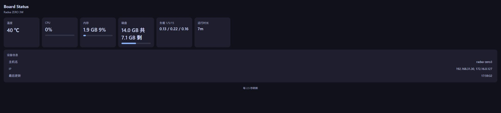

Radxa ZERO 3W 上跑着自研的 Python 状态服务（systemd 托管，端口 8070），
每 2.5 秒刷新温度 / CPU / 内存 / 磁盘 / 负载 / 运行时长。
上图是**这台板子的真实截图**，不是设计稿。

### 训练侧：自研 URDF / MJCF 工具链

三个纯前端（three.js）工具，用来把 SolidWorks 模型转成 MuJoCo 能吃的 MJCF 并肉眼验证：

| 工具 | 干什么 | 截图 |
|---|---|---|
| **查看器** `viewer/` | 加载 MJCF，实时拖动每个关节的滑块，检查限位、碰撞、网格原点 | 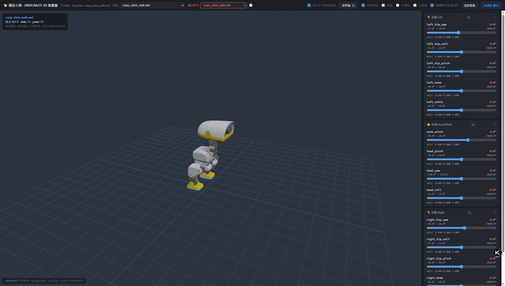 |
| **编辑器** `editor/` | 加载 URDF，改关节 origin / 轴 / 限位、link 质量惯量，左右腿对称诊断，导出修正后的 URDF | 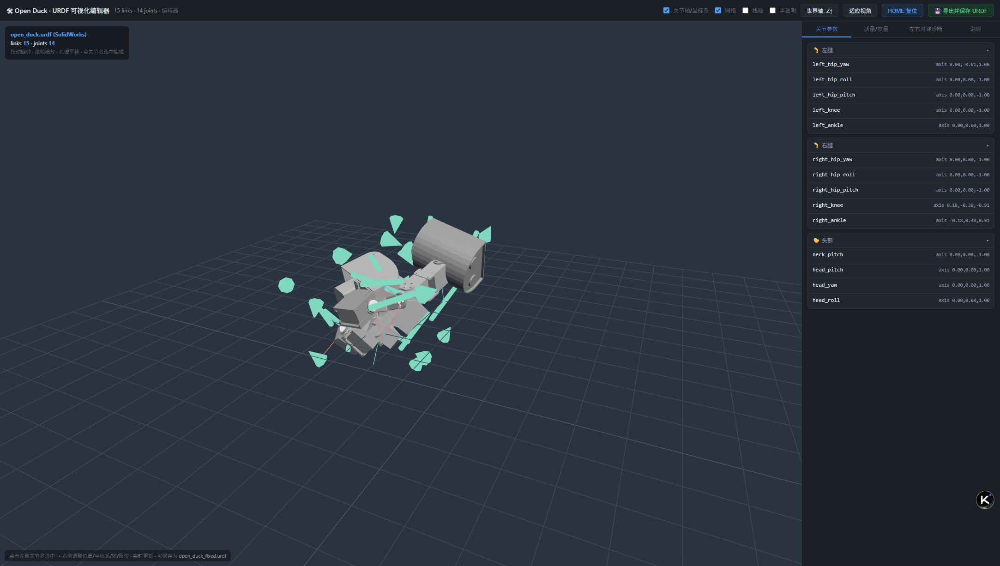 |
| **生成向导** `wizard/` | 扫描 STL 零件目录 → 勾选 → 自动生成 URDF 骨架 | 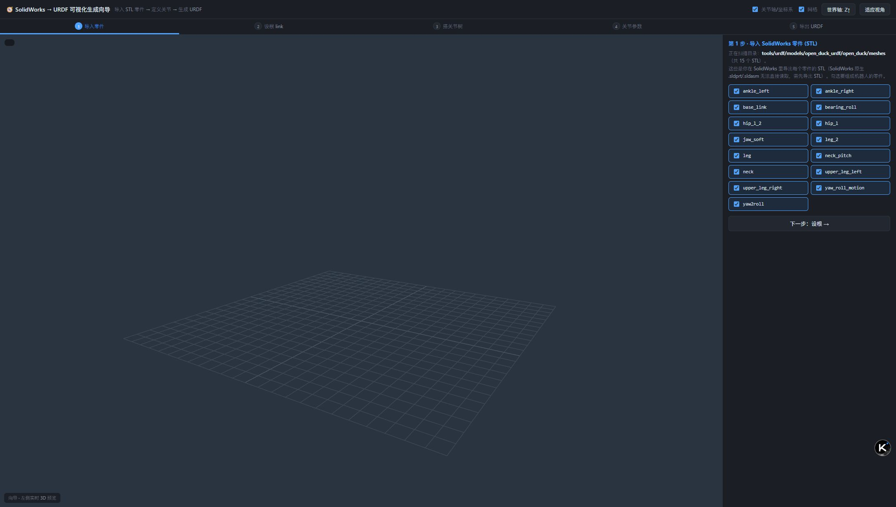 |

还有一个小工具 `mjcf-preview/`：只给 MJCF 的 14 个关节各一个滑块，快速看姿态对不对。

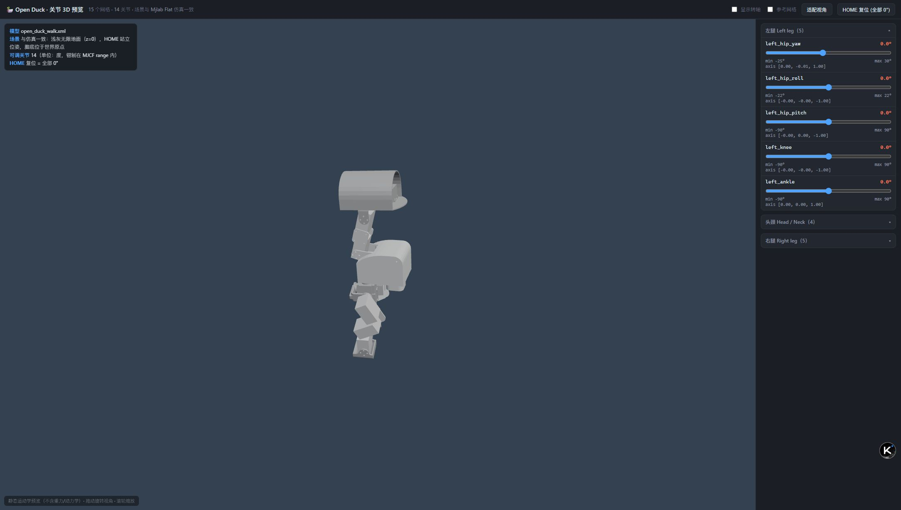

### 仿真：策略 rollout 渲染帧

下面是 `training/` 里那段 rollout 的逐帧渲染（MuJoCo 离线出图，每 20 帧取一张）：

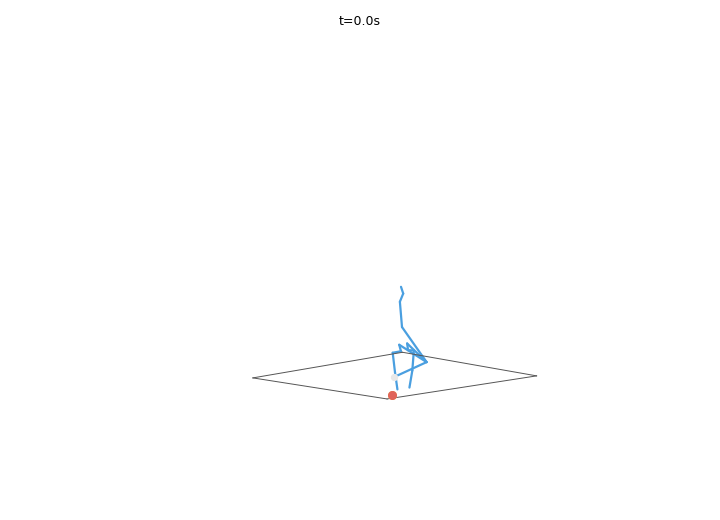
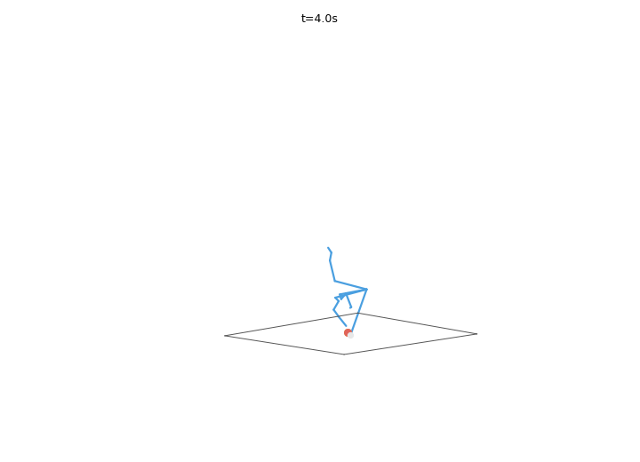
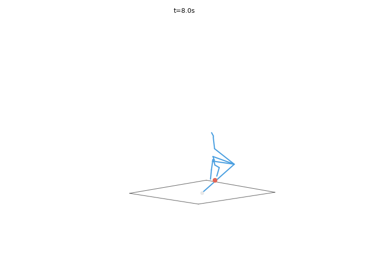

### 移动端：Android 远程运维 App

Kotlin + Jetpack Compose 写的板端运维 App，底部四个页签 —— 连接 / 状态 / 功能 / 终端，
支持远程状态告警、远程 shell（WebSocket + PTY，带 TAB 补全）与 APK 自更新。

下面四张是 **Android 模拟器里实际运行 App、并真的连上这块板子** 截的图：

| 连接 | 状态 |
|---|---|
| 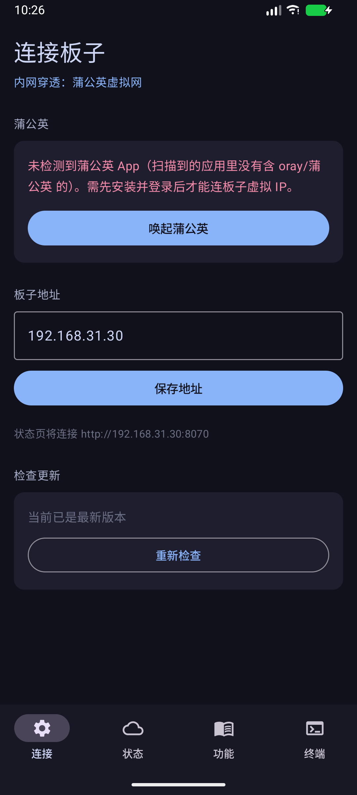 | 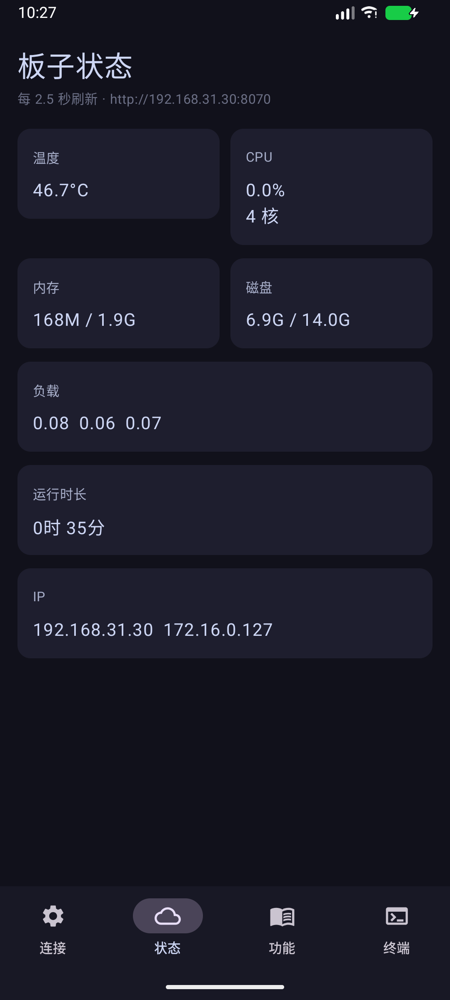 |
| 板子地址、蒲公英检测、APK 自更新入口 | 实时读板上 8070 服务，2.5 s 刷新；图中的温度 / 负载 / IP 都是这台板子的真实值 |

| 功能 | 终端 |
|---|---|
| 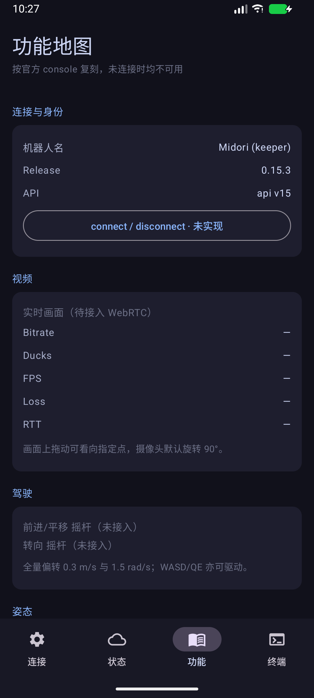 | 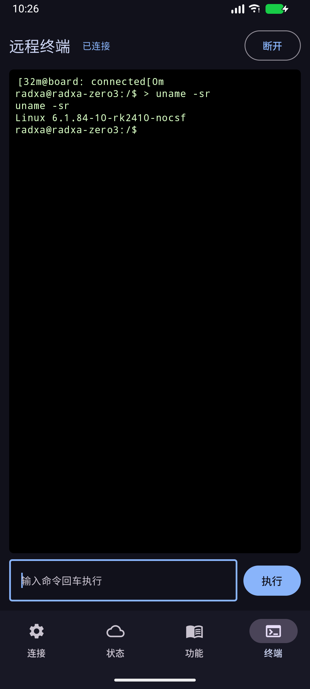 |
| 按官方 console 复刻的功能地图，未接入的项标为「未实现 / 待接入」 | 远程 shell：首包带 token 鉴权，连上后 `uname -sr` 返回 `Linux 6.1.84-10-rk2410-nocsf` |

> 终端那张图里的输出是**真的从那块板子上取回**的，不是摆拍：
> App 先从 `/api/term` 拿 token，再带 token 连 8071 的 WebSocket，
> 板子侧为每个连接 spawn 一个 PTY bash。协议细节见 [board/report_terminal.py](board/report_terminal.py)。

---

## 系统架构

### 数据通路：仿真 → 板载

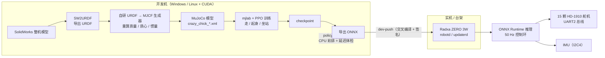

### 板端软件栈

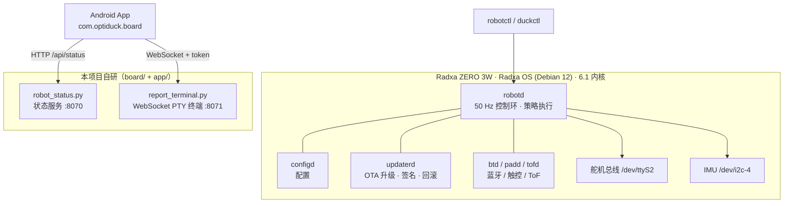

> 控制环固定 **50 Hz**（20 ms 一拍）。7 个策略槽位名在 Rust 枚举里写死，不能增删改名，
> 只能指向不同的 ONNX 文件或置为 `none`。

---

## 仓库结构

| 路径 | 内容 | 来源 | 许可 |
|---|---|---|---|
| [`docs/`](docs/) | 两本实机教程（部署 / 开发）+ 内部草稿 | 自研 | Apache-2.0 |
| [`tools/urdf/`](tools/urdf/) | URDF / MJCF 可视化工具链（three.js，零依赖前端） | 自研 | Apache-2.0 |
| [`board/`](board/) | 板端运维：状态服务、远程终端、systemd 单元、蒲公英组网脚本 | 自研 | Apache-2.0 |
| [`app/`](app/) | Android 运维 App（Kotlin + Compose） | 自研 | Apache-2.0 |
| [`training/`](training/) | 在上游 RL 仓里做的改动（补丁 + 改动后的文件） | 派生 | 见 NOTICE |
| [`assets/`](assets/) | 真实截图与仿真渲染帧（**无 AI 生成图**） | 自研 | Apache-2.0 |
| `joyandai/microduck/` | 上板 Rust 软件栈（子模块） | 上游变体 | Apache-2.0 |
| `microduck_rl/` | RL 训练仓（子模块） | 上游变体 | Apache-2.0 |
| `OpenMicroDuck/` | 结构与硬件：CAD / BOM / 渲染图（子模块） | 上游 | **软件 Apache-2.0 / 硬件 CC-BY-NC-SA-4.0** |
| `_scratch_archive/` | 草稿归档：临时脚本、抓取日志、出图 | 自研 | — |

---

## 快速开始

### 一次拉全（含子模块）

```bash
git clone --recurse-submodules git@github.com:sim336/OptiDuck.git
cd OptiDuck
```

已经 clone 过、当时没带子模块：

```bash
git submodule update --init --recursive
```

### 三条链路从哪读起

**① 硬件 / 结构** —— 先看 `OpenMicroDuck/`

- 选型与零件清单：[OpenMicroDuck/docs/bom.md](OpenMicroDuck/docs/bom.md)、[structure.md](OpenMicroDuck/docs/structure.md)
- 舵机适配评审（为什么要换 HD-1910、装配冲突在哪）：[OpenMicroDuck/docs/servo.md](OpenMicroDuck/docs/servo.md)

> ⚠️ `OpenMicroDuck` 的 CAD 与图纸是 **CC-BY-NC-SA-4.0，不可商用**。
> 另有已知的 **BOM 数量分歧**（轴承 ET2216 的数量），下单前请看装配图确认，别直接照抄 BOM。

**② 训练** —— 看 [training/README.md](training/README.md)

它讲清了「哪些是上游的、哪些是我们改的」：新增的 `crazy_chick` MJCF 全套、
两个新任务（`Mjlab-Jump-Flat-CrazyChick` 62D/15D、`Mjlab-Velocity-Flat-OpenDuck` 61D/14D）、
以及为 12 V 供电补的舵机参数。改动以补丁形式给出，可以 `git apply` 回上游仓。

**③ 上板** —— 看两本教程

| 想做什么 | 看哪一节 |
|---|---|
| 先避坑（电源、烧录、Wi-Fi 自动连接） | 部署篇 §0 |
| 烧系统到 SD 卡 / SSH 免密 / headless | 部署篇 §4–§5 |
| 板级 bring-up（舵机总线 `ttyS2` / IMU `i2c4` / 依赖） | 部署篇 §6 |
| 装 `robotd` 等 daemon 软件栈 | 部署篇 §7 |
| 训练 → 导出 ONNX → CPU 彩排 → 发布上板 | 开发篇「模型链路」 |
| 舵机 / IMU / ToF / 摄像头排障 | 开发篇「硬件链路」 |
| 改 Rust 代码一分钟推到板子生效 | 开发篇「代码链路」（`dev-push`） |
| 自己发版 / 用开发签名 | 部署篇 §12 |

- [docs/Radxa_ZERO_3W_部署调试教程_发布版.md](docs/Radxa_ZERO_3W_部署调试教程_发布版.md)
- [docs/Radxa_ZERO_3W_开发教程_发布版.md](docs/Radxa_ZERO_3W_开发教程_发布版.md)

> `docs/internal/` 里是整理前的个人草稿，保留只是为了记录，别当成正式教程读。

**④ 移动端 App** —— 看 [`app/`](app/)

Kotlin + Jetpack Compose，Android Gradle 工程。仓库里**不带** Gradle Wrapper 和 JDK，
用你自己的环境编译即可：

```bash
cd app
# app/local.properties 里写好 sdk.dir=<你的 Android SDK 路径>
gradle assembleDebug          # 产物：app/app/build/outputs/apk/debug/app-debug.apk
adb install -r app/app/build/outputs/apk/debug/app-debug.apk
```

装好后在「连接」页把**板子地址**填成板子的 IP（默认填的是蒲公英虚拟 IP `172.16.0.127`），
状态页就会去读 `<地址>:8070/api/status`，终端页会去 `<地址>:8071` 建 WebSocket。

> ⚠️ Gradle 工程目录是 `app/`，里面的模块目录**也叫** `app/`，所以产物路径是 `app/app/build/...`，
> 不是 `app/build/...`。别找错。

---

## 自研工具链：URDF / MJCF 可视化

三个工具都是**纯前端**（three.js 本地 vendor，无 npm 依赖），靠一个 40 行的 `serve.mjs` 提供静态服务 + 一个保存端点。

### 跑起来

```bash
# 在仓库根目录
node tools/urdf/serve.mjs 8124 .
```

然后打开：

| 地址 | 工具 |
|---|---|
| `http://127.0.0.1:8124/tools/urdf/viewer/` | MJCF 关节查看器 |
| `http://127.0.0.1:8124/tools/urdf/editor/` | URDF 编辑器 |
| `http://127.0.0.1:8124/tools/urdf/wizard/` | SolidWorks → URDF 生成向导 |
| `http://127.0.0.1:8124/tools/urdf/mjcf-preview/` | 14 关节姿态预览 |

> **注意第二个参数**：`serve.mjs` 的根目录必须是**仓库根**，不能是 `tools/urdf/`。
> 因为 viewer 的模型路径写的是仓库内路径（`/microduck_rl/...`、`/training/...`），
> 根目录设错会全部 404。

### 为什么要有这套东西

从 SolidWorks 导出的 URDF 到 MuJoCo 能跑的 MJCF，中间有几件必须肉眼确认的事：

1. **网格原点对不对** —— STL 的原点不在关节轴上，模型就会飞。viewer 拖动关节滑块能立刻看出来。
2. **关节轴向对不对** —— 轴反了，仿真里腿会朝反方向弯。
3. **质量和惯量是不是瞎填的** —— SW2URDF 出来的惯量经常是占位值，要重算。
4. **左右腿是不是对称** —— editor 里有专门的对称诊断。

`wizard/` 解决的是第 1 步之前的脏活：SolidWorks 一次导出几十个 STL，
文件名毫无规律，手工写 URDF 的 `<link>`/`<joint>` 又慢又容易漏。

---

## 板端运维工具

`board/` 里是这台板子上**实际在跑**的东西（不是示例代码）。

| 文件 | 作用 | 板上位置 |
|---|---|---|
| `robot_status.py` | 健康指标 HTTP 服务（端口 8070，返回 `/api/status` JSON） | `/home/radxa/robot_status.py` |
| `index.html` | 状态看板的单页前端（深色卡片，2.5 s 轮询） | `/home/radxa/robot_status_index.html` |
| `report_terminal.py` | WebSocket 远程终端（端口 8071，每次连接 spawn 一个 PTY bash，支持 TAB 补全与颜色） | `/home/radxa/report_terminal.py` |
| `robot_terminal.py` | 终端侧的辅助脚本 | `/home/radxa/robot_terminal.py` |
| `systemd/robot-status.service` | 状态服务的 systemd 单元 | `/etc/systemd/system/` |
| `systemd/robot-terminal.service` | 终端服务的 systemd 单元 | `/etc/systemd/system/` |
| `scripts/deploy_status.sh` | 一键部署状态服务到板子 | — |
| `scripts/diag_sudo.sh` | 提权环境诊断 | — |
| `scripts/pgy_*.sh` | 蒲公英（异地组网）客户端的安装 / 登录 / 状态脚本 | — |

### 终端鉴权

终端服务**不能裸露**：每个连接的首包必须带上 token，
token 由板子生成在 `/home/radxa/robot_terminal_token`，
App 先从状态服务的 `/api/term` 拿到端口与 token 再去连。

> ⚠️ **不要把 8071 / 8443 这类端口直接转发到公网。** 这是明确的部署禁忌：
> 一旦暴露，等于把一台能跑 `sudo` 的 shell 送出去。

### 板子上的实况

```
$ robotctl health
robot     degraded: no robot on the motor bus after 99 attempts; is servo power on and the bus wired?
  loop      not measured yet, of 50.0 Hz · 0 ticks · 0 missed
  bus       waiting for a robot to answer, 99 attempts
  imu       not ready

software
  updaterd  0.13.0 (rev 84684db)     units
  robotd    0.13.0 (rev 84684db)       updaterd  active · 0.13.0
  configd   0.13.0 (rev 84684db)       robotd    active · 0.13.0
                                       configd   active · 0.13.0
                                       btd       active · 0.13.0
                                       padd      active · 0.13.0
                                       mediad    stopped
                                       tofd      active · 0.13.0
```

这段是**当前这台板子的真实输出**（照抄，未修饰）。`degraded` 是因为舵机电源此刻没开 ——
`robotd` 上电后要先在总线上找到机器人，找不到就一直重试，这是正常且安全的行为。
`mediad` 是 stopped：**没接摄像头时它会崩溃循环**（找不到 `/dev/media*` 就退出，
systemd 每 ~12 s 拉起一次，每次重扫 GStreamer 插件烧满一核），所以按需再启用。

策略槽位的实况：

```
$ robotctl policy list
mode: walk

   SLOT         ORIGIN     POLICY
   walk         official   velstand.onnx
 * stand        local      /home/radxa/standup_hd1910.onnx
   sitstand     official   alpha_sitstand.onnx
   ground_pick  official   alpha_ground_pick.onnx
   kick_left    official   ball_kick_left.onnx
   kick_right   official   ball_kick_right.onnx
   roulade      official   roulade.onnx
```

`stand` 槽位指向的是**我们自己重训的 HD-1910 起身策略**，其余仍是官方策略。

---

## 实测数据

### 板载 ONNX 推理延迟

在**这台 Radxa ZERO 3W 上**用仓库里编译好的 `policy-rehearsal`（`joyandai/microduck` 的
`duck-control/examples/policy-rehearsal.rs`）跑 1000 步纯推理：

```bash
export ORT_DYLIB_PATH=/usr/local/lib/libonnxruntime.so
./target/release/examples/policy-rehearsal /home/radxa/standup_hd1910.onnx
```

```json
"latency_ms": { "p50": 0.367204, "p95": 0.76124, "p99": 0.836198, "max": 1.069237 },
"over_20_ms": 0,
"scope": "actor inference only; excludes sensor and motor I/O",
"steps": 1000
```

- **p50 ≈ 0.37 ms**，占 50 Hz 控制周期（20 ms）的 **约 1.8%**，p99 也只有 0.84 ms。
- **`over_20_ms: 0`** —— 1000 步里没有一次推理超出控制周期。
- ⚠️ 注意 `scope`：**这只统计 actor 网络推理**，不含读传感器和写舵机的时间。
  拿这个数去论证「整个控制环能跑满 50 Hz」是不严谨的。

### 板子本身

| 项 | 值 |
|---|---|
| 主控 | Radxa ZERO 3W（RK3566 · 2 GB LPDDR4） |
| 系统 | Radxa OS（Debian 12 bookworm），内核 `6.1.84-10-rk2410-nocsf` |
| 舵机 | 飞特 HD-1910-C001 × 15，总线 `/dev/ttyS2`（UART2） |
| 舵机 ID | 左腿 20–24、右腿 10–14、头/颈/嘴 30–34、IMU 200 |
| IMU | I²C-4 |
| 摄像头 | IMX219 8 MP（3280×2464，77° 裸模组） |
| 推理库 | ONNX Runtime 1.28.0（`/usr/local/lib/libonnxruntime.so`） |

> 以上是**逐项 SSH 实测核对过**的值；与网上流传的二手资料不一致的地方（例如
> 舵机总线实测是 I²C4 而某些文档写 I²C3 M0、摄像头 overlay 的启用方式）
> 均已按实机修正，教程里标注了核实状态。

---

## 和上游的关系

`joyandai/microduck` 和 `microduck_rl` **不是干净的上游副本**，而是带本地改动的变体。
为了让以后的合并干净可查，它们都被重新挂到上游历史里最接近的 commit 上，
本地改动各自落成一个独立 commit：

- `joyandai/microduck`：基线 `2c61dcc`（上游 2026-09-02），本地变体 commit `83322b6`
  —— HD-1910 台架 bring-up、IMU 迁到 I2C、舵机总线工具、`source-lessons/` 等 57 个文件。
- `microduck_rl`：上游分支 `develop`，本地改动为 HD-1910 台架 bring-up、BAM 作动器参数、
  `air_time` 奖励调参与碰撞配置拆分；另含 Windows 下的彩排控制改造
  （`infer_policy.py` 用 `msvcrt` 替代 Unix 专属的 `termios`，让彩排能在开发机上直接跑）。

这样 `git log` 能直接看出「哪些是上游的、哪些是我们改的」，
`git diff upstream/main` 就是全部本地差异。

### 改动怎么同步（子模块的两步法）

三个代码仓是**独立仓库**，各自提交推送；主仓只记录「指向哪个 commit」。所以一次改动要两步：

```bash
# 第 1 步：在子仓里改、提交、推送
cd microduck_rl
git add -A && git commit -m "..." && git push

# 第 2 步：回主仓更新指针（不能省）
cd ..
git add microduck_rl
git commit -m "bump microduck_rl"
git push
```

第 2 步不能省：别人 clone 主仓时拿到的是主仓里记录的 commit，
你不提交指针，别人就还停在你上次提交的那个版本。

### 合并上游更新

```bash
cd joyandai/microduck
git fetch upstream
git merge upstream/main
```

`microduck_rl` 的上游默认分支是 `develop`。

---

## 许可与署名

| 部分 | 许可 |
|---|---|
| 本仓自有内容（`docs/`、`tools/`、`board/`、`app/`、`assets/`） | **Apache-2.0**（[LICENSE](LICENSE)） |
| `joyandai/microduck`、`microduck_rl` | Apache-2.0 |
| `OpenMicroDuck` 的 CAD / 图纸 / 文档 | **CC-BY-NC-SA-4.0（禁止商用）** |

**完整的分项署名、上游链接与免责声明见 [NOTICE.md](NOTICE.md)。**
商业使用前请务必读一遍 —— `OpenMicroDuck` 那一块是不可商用的。

`assets/` 里**没有任何 AI 生成图片**：截图来自真实浏览器 / Android 模拟器 / 这块开发板，
渲染帧来自 MuJoCo 离线出图。

---

## 大体积数据

以下数据**不在 git 里**（避免仓库膨胀且历史不可撤销），按需作为 Release 附件发布：

| 数据 | 体积 | 说明 |
|---|---|---|
| `hd1910_calibration/` | ~426 MB | HD-1910 舵机台架标定原始 `.log` 轨迹与拟合 `.json` |
| `model_archive/` | ~405 MB | 训练权重归档（sitstand / stand / velocity） |

标定数据拟合后的结果已经浓缩进 `microduck_rl/vendor/bam/bam/params/hd1910/*.json`，
只做仿真训练的话不需要下载原始数据。

---

## 这个项目对应哪些能力

把简历上的项目二拆开到具体产物，方便对照：

| 能力点 | 在本仓的产物 |
|---|---|
| 执行器建模：基于 HD-1910 重绘整机三维模型（SolidWorks） | `OpenMicroDuck/`（CAD / BOM / 结构评审） |
| SW2URDF 导出 + **自研 URDF→MJCF 生成器** | [`tools/urdf/wizard/`](tools/urdf/wizard/)（零件扫描 → URDF）、[`training/microduck_rl/.../crazy_chick/`](training/microduck_rl/src/mjlab_microduck/robot/crazy_chick/)（`make_crazy_chick.py` / `make_open_duck.py`） |
| 重算刚体质量与质心、构建 MuJoCo 仿真模型 | 同上 + [`tools/urdf/viewer/`](tools/urdf/viewer/) 肉眼校验 |
| RL 步态训练（PPO：行走 / 起身 / 坐站） | [`training/README.md`](training/README.md) + `microduck_rl/` 子模块 |
| 针对新舵机增益差异调超参、BAM 作动器辨识 | `microduck_rl/vendor/bam/`、`training/microduck_rl/patches/` |
| Windows 下彩排环境控制（msvcrt 替代 termios） | `microduck_rl/scripts/infer_policy.py` |
| Radxa ZERO 3W 从烧录到 headless 全流程 | [部署调试教程](docs/Radxa_ZERO_3W_部署调试教程_发布版.md) |
| Microduck OTA 升级通道部署与配置 | [开发教程](docs/Radxa_ZERO_3W_开发教程_发布版.md)「代码链路」+ `joyandai/microduck` 的 `updaterd` |
| ONNX 导出 + 板端 ONNX Runtime 推理链路 | [实测数据](#实测数据) 一节（含可复现命令） |
| Python 板端状态服务 + WebSocket 远程终端 | [`board/robot_status.py`](board/robot_status.py)、[`board/report_terminal.py`](board/report_terminal.py) |
| Kotlin/Compose Android App：状态告警 / 远程 shell / APK 自更新 | [`app/`](app/) |
| 跨平台嵌入式开发（C/C++、Python、C#、Kotlin、Rust 周边） | 全仓 |
| ROS / MuJoCo / MATLAB 轨迹规划等工具链经验 | `tools/`（自研可视化）、`microduck_rl`（mjlab + MuJoCo） |

---

## 更新日志

| 版本 | 日期 | 内容 |
|---|---|---|
| **v1.00** | 2026-09-19 | 仓库整体整理为开源项目形态：<br>① 目录重构 —— 教程归 `docs/`、URDF 工具链归 `tools/`、板端运维归 `board/`、Android App 归 `app/`、训练改动归 `training/`、截图与渲染归 `assets/`；<br>② 补齐 `LICENSE`（Apache-2.0）、`NOTICE.md`（分项署名与上游许可）、`.gitignore`；<br>③ 新增真实截图墙（板端看板 / 三个 URDF 工具 / MJCF 预览 / App 四页，均为实际运行截图）；<br>④ 修复状态看板「磁盘」卡片把字节数直接显示的 bug（改为 `xx.x GB 共 xx.x GB 剩`）；<br>⑤ 修复搬迁后工具链的模型路径（viewer / editor / wizard 全部指向仓内路径），并把 `serve.mjs` 的根目录用法写进文档；<br>⑥ 实测并记录板载 ONNX 推理延迟（p50 0.367 ms / 1000 步 / `over_20_ms: 0`）；<br>⑦ App 端到端联调：重新编译 debug APK 装进模拟器，实测「状态页读到板上真实指标 + 终端 WebSocket 带 token 连上并执行 `uname -sr`」，截图与结论一并入库。 |
