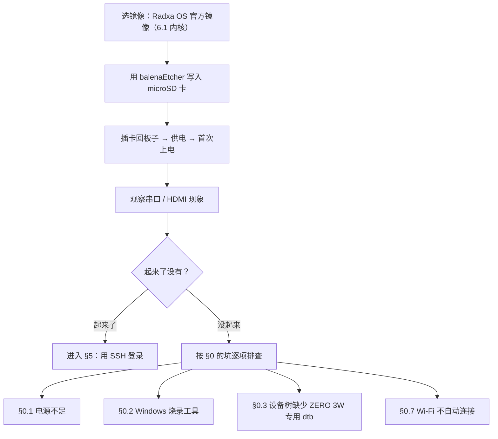
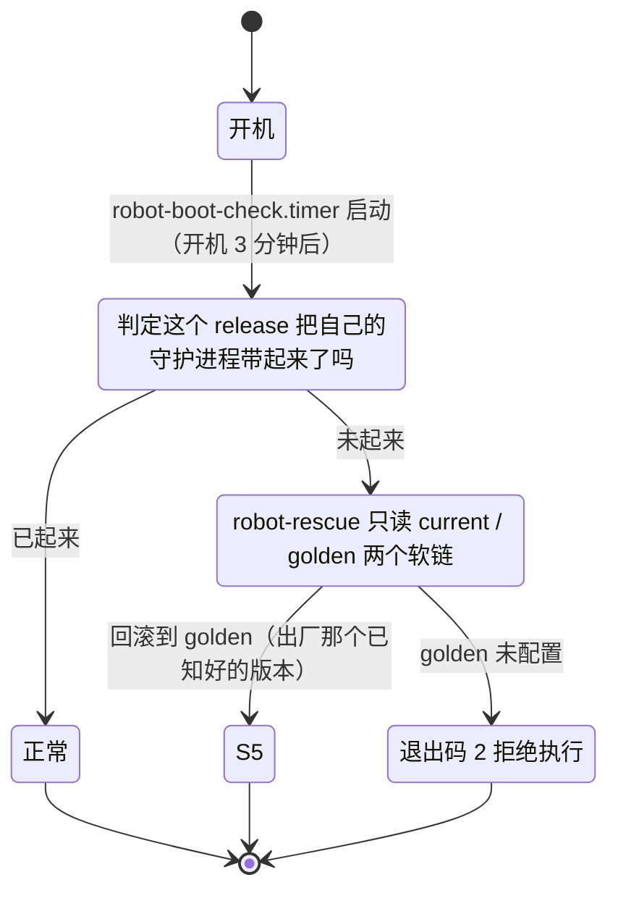
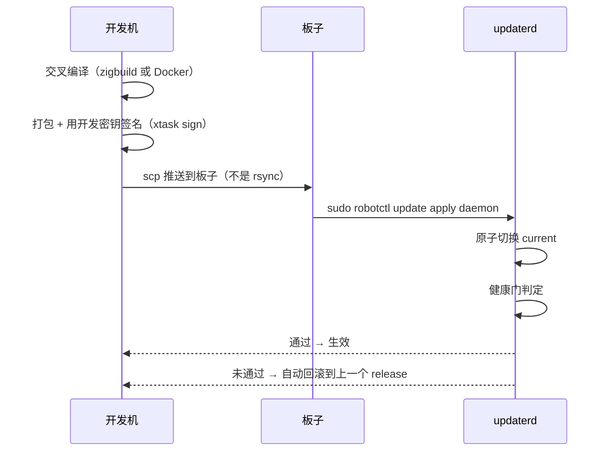

# Radxa ZERO 3W 部署与调试实战：从烧录系统到机器人守护进程

**摘要**：本文完整记录把一块全新的 Radxa ZERO 3W（RK3566 / 2GB LPDDR4 / 无 eMMC）从零配置为 Microduck 机器人主控的全过程 —— 选镜像、烧录 microSD、首次上电、SSH 免密登录、板级 bring-up、部署 Rust 守护进程（`robotd` 等）、验证与排障。文中所有命令、寄存器/设备地址、版本号、报错原文与判定标准均来自实机记录，可直接照做。**前置条件**：一块 Radxa ZERO 3W、≥16GB microSD 卡、5V/2A 以上电源、一台 Windows 开发主机，以及 Linux 命令行、SSH、PowerShell 的基本使用能力。全文按"先诊断、再动手"组织；文末附常见问题速查表、参考来源、待核实事项与更新日志。

**图例说明**（全文只用这一套标记）：

| 标记               | 含义                                            |
| ------------------ | ----------------------------------------------- |
| **【动手】** | 会改变板子 / 存储卡状态的命令，执行前先确认清楚 |
| **【只读】** | 只看不改，可安全执行                            |
| **【原理】** | 解释性内容，赶时间可跳过                        |
| **⚠️**     | 已知的坑、或容易失败的地方                      |

> **关于路径**：下文出现 `<你的工作目录>`、`~/microduck` 或 `C:\Users\<你的用户名>` 的地方，请替换为你自己的本地路径；出现 `<板子IP>` 的地方，替换为板子的局域网地址（获取方法见 §5.2）。本教程使用的参考板为 Radxa ZERO 3W（2GB / 无 eMMC），实测数据见各节标注。

## 本文目录

- [0. 开篇：常见坑速览](#0-开篇常见坑速览)
  - [0.1 电源不足导致 TF 卡无法识别](#01-电源不足导致-tf-卡无法识别)
  - [0.2 Windows 烧录工具导致分区表被清空](#02-windows-烧录工具导致分区表被清空)
  - [0.3 Armbian 设备树缺少 ZERO 3W 专用 dtb](#03-armbian-设备树缺少-zero-3w-专用-dtb)
  - [0.4 PowerShell 管道展开环境变量报错](#04-powershell-管道展开环境变量报错)
  - [0.5 SSH 连接被拒绝：未安装 openssh-server](#05-ssh-连接被拒绝未安装-openssh-server)
  - [0.6 initramfs 中设备节点的三种状态](#06-initramfs-中设备节点的三种状态)
  - [0.7 重启后 Wi-Fi 不自动连接导致 SSH 失联](#07-重启后-wi-fi-不自动连接导致-ssh-失联)
- [1. 板子在项目中的角色](#1-板子在项目中的角色)
- [2. 准备清单](#2-准备清单)
- [3. 认识板子：接口与关键引脚](#3-认识板子接口与关键引脚)
- [4. 烧录系统到 microSD 卡](#4-烧录系统到-microsd-卡)
- [5. 用 SSH 登录](#5-用-ssh-登录)
- [6. 板级环境配置（bring-up）：先诊断再动手](#6-板级环境配置bring-up先诊断再动手)
  - [6.1 先跑七条诊断](#61-先跑七条诊断)
  - [6.2 获取脚本并放到板子上](#62-获取脚本并放到板子上)
  - [6.3 建立用户组](#63-建立用户组)
  - [6.4 运行 setup-board.sh](#64-运行-setup-boardsh)
  - [6.5 网络迁移：netplan 到 NetworkManager](#65-网络迁移netplan-到-networkmanager)
  - [6.6 setup-board.sh 逐段精读](#66-setup-boardsh-逐段精读)
  - [6.7 方法论：如何为新板子设计 bring-up](#67-方法论如何为新板子设计-bring-up)
- [7. 部署 microduck 软件栈](#7-部署-microduck-软件栈)
  - [7.0 先确认前置条件](#70-先确认前置条件)
  - [7.1 确认仓库与版本：三个环境变量](#71-确认仓库与版本三个环境变量)
  - [7.2 设置环境变量](#72-设置环境变量)
  - [7.3 执行安装](#73-执行安装)
  - [7.4 装完必须重启一次](#74-装完必须重启一次)
  - [7.5 国内网络三项修复](#75-国内网络三项修复)
  - [7.6 一条命令完成全部](#76-一条命令完成全部)
- [8. 验证部署是否成功](#8-验证部署是否成功)
- [9. 调试：从浅到深](#9-调试从浅到深)
- [10. 拆箱总纲：还有哪些黑箱与怎么拆](#10-拆箱总纲还有哪些黑箱与怎么拆)
- [11. 常见问题速查表](#11-常见问题速查表)
- [12. 进阶：改一行代码推到板子](#12-进阶改一行代码推到板子)
- [13. 参考文档索引](#13-参考文档索引)
- [参考来源](#参考来源)

---

## 0. 开篇：常见坑速览

这一节把最容易卡住的几个点提前讲完，按影响程度排序。**建议在动手前先通读一遍**，能省下数小时。

### 0.1 电源不足导致 TF 卡无法识别

- **症状**：板子亮、HDMI 有输出、内核起来了，但 initramfs 里 `ls /dev/mmcblk*` 报 `No such file or directory`；
- **根因**：5V/1A 的旧充电头 + 细 Type-C 线电流不够，RK3566 的 SDIO 控制器起不来；
- **修法**：换一个 **5V/2A 或 3A** 的充电头 + **粗一点的 Type-C 线**（例如 90W PD 快充头 + 5A 粗线，实测解决）。**电压必须是 5V（Type-C 默认），不会烧板子，大电流可以放心用**；
- **验证**：换电源后重上电，`blkid` 应能看到 `/dev/mmcblk1`（本教程参考板无 eMMC，SD 卡走 mmcblk1；有 eMMC 的板子 SD 卡走 mmcblk0）。

### 0.2 Windows 烧录工具导致分区表被清空

- **症状**：Armbian imager 校验显示"写入成功"，但板子启动后 initramfs 里 `blkid` 只看到 `/dev/mmcblk1: PTUUID=... PTTYPE="gpt"`（**空 GPT 分区表**——只有一张分区"目录"，实际 p1/p2 分区内容全丢了）；
- **根因**：Windows 上的 Armbian imager / Etcher / Rufus 在写入后会被 Windows 的**分区管理安全机制**干扰——Windows 看到一个带 GPT 头但没有有效分区的磁盘时，可能自动重新生成一张空 GPT，把镜像实际写入的分区内容覆盖掉；
- **修法**（三选一，按推荐顺序）：
  1. **换 Radxa OS 官方镜像 + balenaEtcher 烧录**（本教程推荐，已验证成功，见 §4）；
  2. 确实要用 Armbian → 用 **Win32 Disk Imager** 或 **WSL 里的 `dd`**（直接操作块设备扇区，绕过 Windows 分区管理）；
  3. 烧完后**立刻弹出 TF 卡，不要在 Windows 上点任何"格式化"、"修复驱动器"、"扫描"弹窗**。

### 0.3 Armbian 设备树缺少 ZERO 3W 专用 dtb

- **症状**：板子能启动但 Wi-Fi 不工作 / eMMC 不识别 / 某些 GPIO 控制器找不到；
- **根因**：Armbian 26.8.1 的 vendor 内核（6.1.115）**只 ship 了 `rk3566-radxa-zero3.dtb`，没有 3W 专用的 `rk3566-radxa-zero-3w.dtb`**——3W 有 Wi-Fi/BT 模块（aic8800），占用 SDMMC1 控制器，设备树必须包含对应的 pinctrl/regulator 配置；
- **修法**：直接用 **Radxa OS 官方镜像**（它自己维护设备树，自动识别 ZERO 3W / 3E），绕开这个问题。

### 0.4 PowerShell 管道展开环境变量报错

- **症状**：下面这种写法

  ```powershell
  type $env:USERPROFILE\.ssh\id_ed25519.pub | ssh user@ip "cat >> ~/.ssh/authorized_keys"
  ```

  会报 `Get-Content : 无法将参数绑定到"Path"，因为该参数是空值`；
- **根因**：PowerShell 管道 + 环境变量展开 + 用户名含非 ASCII 字符这三个因素叠加触发的 bug；
- **修法**：**不用管道**，改用 `scp` 直接把公钥文件拷到板子，再在板子上手动合并（见 §5.4）。

### 0.5 SSH 连接被拒绝：未安装 openssh-server

- **症状**：板子能 ping 通、IP 正确、但 `ssh` 报 `Connection refused`；
- **根因**：Radxa OS 出厂**没装 openssh-server**（或装了但没启动）；
- **修法**：在板子的本地终端（HDMI + 键盘）跑

  ```bash
  sudo apt install -y openssh-server && sudo systemctl enable --now ssh
  ```

### 0.6 initramfs 中设备节点的三种状态

在 initramfs 里用 `ls /dev/mmcblk*` 的输出可以区分三种情况：

| 情况                | `ls /dev/mmcblk*` 输出                                                              | 根因                                             |
| ------------------- | ------------------------------------------------------------------------------------- | ------------------------------------------------ |
| ❌ 卡完全没读到     | `No such file or directory`                                                         | 电源不够！换大电流充电头 / 粗线                  |
| ⚠️ 卡读到但空分区 | `/dev/mmcblk1` 存在，但 `blkid` 只有 `PTUUID=... PTTYPE=gpt`（没有 p1/p2）      | 烧录被 Windows 干扰了，换 Radxa OS + Etcher 重烧 |
| ✅ 正常             | `/dev/mmcblk1p1` + `/dev/mmcblk1p2` 都有，`blkid` 输出带 `UUID=` 和 `TYPE=` | 烧录正确，UUID 对得上 cmdline.txt 就能启动       |

### 0.7 重启后 Wi-Fi 不自动连接导致 SSH 失联

- **症状**：在桌面 / 终端里手动连上 Wi-Fi 后一切正常，但**重启后板子不联网、SSH 连不上**；接上显示器，只要**选账户输一次密码登录**，Wi-Fi 立刻自己就通了——看着像"必须先登录才行"，其实是**密码取不到**；
- **根因**：这个 Wi-Fi 连接的密码（PSK）是**以用户身份**保存的：Keyfile 里写着 `psk-flags=1`（agent-owned），**文件里根本没有 `psk=` 这一行**。NetworkManager 开机时以 root 身份运行，取密码要靠桌面会话里的 `secret agent`；而屏蔽 sddm（图形登录）之后，开机**没有任何用户会话 → 没有 agent → 直接判失败**：

  ```text
  (wifi) access point '<你的WiFi名>' has security, but secrets are required.
  no secrets: No agents were available for this request.
  state change: need-auth -> failed (reason 'no-secrets')
  Activation: failed for connection '<你的WiFi名>'
  ```
- **一眼确诊**（在还能连上的时候跑）：

  ```bash
  sudo grep -n -E "psk-flags|^psk=" /etc/NetworkManager/system-connections/*.nmconnection
  ```

  看到 `psk-flags=1` 且**没有** `psk=` → 就是这个坑；
- **修法**（一条命令，把密码改成"系统所有"，开机不需要任何会话）：

  ```bash
  # 自动取 UUID，避免手输中文 SSID 踩 IME 坑
  UUID=$(nmcli -t -f UUID,TYPE connection show | awk -F: '$2=="802-11-wireless"{print $1; exit}')
  echo "$UUID"

  sudo nmcli connection modify "$UUID" wifi-sec.psk "<你的WiFi密码>" wifi-sec.psk-flags 0
  # 顺手把持久化属性一次配齐
  sudo nmcli connection modify "$UUID" \
    connection.autoconnect yes \
    connection.autoconnect-priority 100 \
    connection.autoconnect-retries -1 \
    802-11-wireless.powersave 2

  sudo reboot
  ```

  **验收**：重启后**不接显示器、不做任何登录**，等 90 秒直接

  ```powershell
  ssh radxa@<板子IP>
  ```

  能直接进 = 修好了（显示器上仍旧停在 `login:` 属于正常，与联网无关）；
- **两个小坑**：

  1. `nmcli connection modify` 设置时可以用别名 `wifi-sec.psk-flags`，但 `nmcli -f` **查询字段必须写全名** `802-11-wireless-security.psk-flags`，否则报 `invalid field`；
  2. 改完密码会**明文**存在 `/etc/NetworkManager/system-connections/*.nmconnection`（权限 `600`，仅 root 可读）——这是 NetworkManager 的标准做法，不是配置错误；
- **不需要排查的方向**（别浪费时间）：`wpa_supplicant` 是 active **属于正常**（Debian 上 NetworkManager 通过 D-Bus 调它做 WPA 握手），不是"抢占网卡"；`systemd-networkd` 应该 inactive。

---

## 1. 板子在项目中的角色

这一节先确认型号和它在整机里的职责，避免后面把时间花在"这块板子到底是不是 ZERO 3W"上。

> **型号先确认清楚**：Radxa 官方**没有**一块叫 "ZERO 3" 的板子——**"ZERO 3" 只是这一代的系列名 / 文档目录名**，实际在售的只有两个型号：

|                   | Radxa**ZERO 3W**                           | Radxa**ZERO 3E**                |
| ----------------- | ------------------------------------------------ | ------------------------------------- |
| 无线              | ✅ Wi-Fi 6 + BT 5.4（AIC8800D80）                | ❌ 没有                               |
| 有线              | ❌ 没有网口                                      | ✅ 千兆以太网（支持 PoE，需另配 HAT） |
| 存储              | 板载 eMMC**0**/8/16/32/64GB 可选 + microSD | 只有 microSD                          |
| SoC / 内存 / 尺寸 | RK3566 / LPDDR4 1~8GB / 65×30mm                 | 与 3W 相同                            |

> **本教程参考板 = ZERO 3W（eMMC 0GB 的 SKU）**：Wi-Fi 能连 + 没有 eMMC + 没有网口，三条特征全中，只可能是 3W。所谓"无 eMMC"不是另一个型号，而是 3W 的存储选配（0GB）。
>
> 被绕晕的来源：镜像名 `radxa-zero3_bookworm_kde_b1`、主机名 `radxa-zero3`、文档目录 `/zero/zero3/`——**两个型号共用这套命名**，到处写着 "zero3"，但它不代表型号。
>
> 想再确认一次——**注意 `/proc/device-tree/model` 在 3W 和 3E 上都只打印通用的 `Radxa ZERO 3`，不带 W/E 后缀**（2026-09-15 在真机上验证过），所以别靠它区分型号：

```bash
ls /sys/class/net/                      # 有 wlan0 → 3W；有 eth0 → 3E（3E 无无线，3W 无网口）
ls /dev/mmcblk*                         # 只有 mmcblk1 → 无 eMMC；另有 mmcblk0/mmcblk2 → 有 eMMC
cat /proc/device-tree/model; echo       # 只会打印通用串 "Radxa ZERO 3"
```

Radxa ZERO 3W 是机器鸭的**"大脑 / 主控"**。整台 Microduck（约 25 cm、800g 的双足小鸭）由它负责：

- 跑一个 **50 Hz 控制回路**，读 15 个舵机 + 机身 IMU，组 61 维观测，用 ONNX 神经网络（强化学习策略）推理，输出 14 个关节目标，驱动舵机走路 / 站立 / 踢球 / 翻滚 / 起身；
- 一组 Rust 守护进程：`robotd`（控制 / 电机）、`configd`（Wi-Fi / 名字 / PIN）、`updaterd`（签名更新 / 回滚）、`btd`（蓝牙门面）、`padd`（手柄）、`mediad`（相机 / 推流）、`tofd`（头部深度传感器）；
- 板载 Wi-Fi + 蓝牙：手机 App（BLE）、游戏手柄、远程 WebRTC 都走这里。

**关键概念（先记住这三个，后面都好懂）：**

1. **走路策略在 CPU 上跑 ONNX Runtime（ORT），不在 NPU 上。** NPU 是给"视觉 / 鸭子检测"预留的，且默认是关的。所以"2GB RAM、无 eMMC"对走路这一关没有任何影响——官方那档甚至只有 1GB RAM。
2. **只有 `robotd` 能碰电机。** 其它进程（手柄、手机、脚本）发的都是"意图"，由 `robotd` 内部的安全层决定是否执行。
3. **更新 = 整目录替换 + 验签 + 健康门 + 自动回滚。** 装坏了自己会滚回去，不是打补丁。

> 2GB 内存比官方 1GB 档还多，只会更充裕。**无 eMMC 不是缺陷**：意味着从 microSD 卡启动（对零基础反而更简单，不需要进入 USB 烧录的 maskrom 模式），只是存储介质换成卡。

---

## 2. 准备清单

这一节列出开始前需要备齐的物料，其中电源和 microSD 卡是最容易出问题的两项。

| 物品                            | 要求 / 建议                                                                                                  | 用途                                      |
| ------------------------------- | ------------------------------------------------------------------------------------------------------------ | ----------------------------------------- |
| **microSD 卡**            | **≥16GB，建议 32GB**，**A1/U3 速度等级**（Class 10 起步），正规品牌（SanDisk/Samsung/Kingston） | 系统就装在这张卡里（无 eMMC，卡就是硬盘） |
| **读卡器**                | USB 读卡器（如果电脑没 SD 槽）                                                                               | 写镜像到卡                                |
| **电源**                  | **5V / 2A 或更高** 的 USB-C 充电头 + **粗一点的 Type-C 线**（90W PD 头 + 5A 粗线实测可用）       | 供电。电流不够 TF 卡 / 外设起不来         |
| **Micro-HDMI 转 HDMI 线** | 1 条（强烈建议第一次用）                                                                                     | 第一次开机接显示器，直接看到它有没有起来  |
| **USB 键盘 / USB HUB**    | 第一次接线用（可选，但出问题时救命）                                                                         | 直接登录；没有就用 SSH                    |
| **Wi-Fi**                 | 能上网的 2.4G/5G 路由，且**知道密码**                                                                  | 3W 没有网口，联网只能走 Wi-Fi             |
| **能登录路由器后台**      | 知道管理员地址（常见`192.168.31.1` / `192.168.1.1`）                                                     | 查板子的局域网 IP                         |

**电源选择速记：电压必须 5V（Type-C 默认，不会烧），电流越大越好（5V/3A、5V/5A、90W PD 头都 OK）。PD 头不会烧板子——板子只会按需取电流，多余的电流"空转"。**

---

## 3. 认识板子：接口与关键引脚

这一节速览板子接口，并列出后面调试时会反复见到的设备名与总线。

- 尺寸 **65 × 30 mm**，和树莓派 Zero 一个外形、同样的安装孔位；
- 两个 USB-C：
  - **USB 2.0 OTG / PWR**（用于**供电**，一般插电源的那头，这个口电流能力更强）
  - **USB 3.0 Host**（可接键盘 / 鼠标 / 摄像头等外设，**别拿这个口供电**，电流能力弱）
- **Micro HDMI**（输出显示，最高 1080p60）
- **microSD 卡槽**（系统所在处，无 eMMC 的板子**只能从这里启动**）
- **22 针 CSI 排线座**（摄像头）
- **40 针 GPIO**（3.3V，连到 HAT / 扩展板上，舵机总线、IMU、ToF、喇叭都走这里）

和机器人硬件相关的关键引脚（后面调试时会反复见到的设备名）：

| 功能                  | 设备路径                                | 说明                                                               |
| --------------------- | --------------------------------------- | ------------------------------------------------------------------ |
| 舵机总线              | `/dev/ttyS2`（UART2）                 | 15 个舵机 + 机身 IMU 共用一条半双工 TTL 总线                       |
| 机身 IMU              | `/dev/i2c-imu`（i2c4，地址 `0x6A`） | LSM6DSV16X，独立总线（2026-09-04 起从舵机总线上拆出来了）          |
| 音频 codec + 头部 ToF | `/dev/i2c-pihat`（i2c3）              | TLV320AIC3104 codec（`0x18`）+ VL53L5/8CX 深度传感器（`0x29`） |
| 喇叭数据              | I²S3                                   | 声音不走策略网络                                                   |
| 摄像头                | CSI                                     | IMX219 一类模组                                                    |

---

## 4. 烧录系统到 microSD 卡

这一节解决"系统盘怎么造"的问题。结论先行：

> **推荐路径**：Windows + Armbian imager / Etcher 烧 Armbian 镜像在 Zero 3W 上会出现"空 GPT 分区表"问题。**直接用 Radxa OS 官方镜像 + balenaEtcher**，实测成功。



> **图 1**：从选镜像到首次起来的流程，以及"起来了 / 没起来"两条分支各自去哪一节。

### 4.1 【动手】下载 Radxa OS 官方镜像

- **官方下载页**：`https://docs.radxa.com/zero/zero3/download`
- 找**官方镜像**区块，下载 **6.1 内核的那个**：`radxa-zero3_bookworm_kde_b1`
  - 文件是 `.img.xz` 压缩包（约几十到几百 MB）；
  - **不用解压**，Etcher 支持直接写 xz 压缩包；
  - 如果 GitHub 下载慢，Radxa 页底部有百度网盘镜像。

**在干吗**：在挑一块"装机盘"。这块板子**没有 eMMC**（没有板载硬盘），操作系统没有任何地方可去，只能整份装在 microSD 卡里——所以这一步选的不是"一个软件"，而是这块板子的**整个硬盘内容**。

**为什么必须做 / 为什么只能是 Radxa OS**：两个理由，都在 §0 里踩过——① Armbian 镜像在 Windows 上烧会出现"空 GPT 分区表"（§0.2）；② Armbian 的设备树里只有通用的 `rk3566-radxa-zero3.dtb`，没有 3W 的 Wi-Fi 配置（§0.3）。Radxa OS 是板厂自己维护的，设备树天然对得上这块板子，Wi-Fi、SD 卡、GPIO 开箱即用。

**为什么是 6.1 内核那个**：同页面还有 5.10 内核的旧版（`radxa-zero3_debian_bullseye_xfce_b6`）。选新不选旧——后面的 ONNX Runtime、NetworkManager 版本都更配合新版 Debian。

**完成标志**：本地有一个 `.img.xz` 文件，大小对得上页面标注的数值。

**卡住了怎么办**：GitHub 直连慢 / 断 → 用页面底部的百度网盘镜像。下载完可以顺手核对页面给的 SHA256（不是必须）。

> 备注：Radxa OS 只有 KDE 桌面版（没有 Minimal/CLI 版）。2GB RAM 能跑，后面装完机器人驱动可以一键卸掉 KDE 省空间。

### 4.2 【动手】下载 balenaEtcher

- Windows 版下载：`https://github.com/balena-io/etcher/releases/download/v1.18.11/balenaEtcher-Setup-1.18.11.exe`
- 官方镜像页也推荐 Etcher（Radxa 自己都用它）。

**在干吗**：装一个"写盘工具"。它的作用等价于 Linux 的 `dd`——把镜像文件**逐扇区原样**写进 SD 卡，包括分区表、引导记录、文件系统。

**为什么必须做 / 为什么不能用资源管理器复制**：Windows 把 SD 卡当成"U 盘"，只能往里丢文件；而"可引导的系统盘"需要分区表和引导扇区，这是资源管理器和"格式化为 FAT32"都做不到的。把 `.img.xz` 拷到卡里，板子是绝对启动不了的。

**完成标志**：`balenaEtcher` 能打开（安装时 Windows 可能弹 UAC，允许即可）。

### 4.3 【动手】烧录步骤

> **按顺序执行，不要跳步。**

1. **TF 卡插进电脑读卡器** → 等 Windows 识别到盘符；
   - *在干吗*：让卡以"可移动磁盘"的身份出现在 Windows 里，Etcher 才看得见它。
   - *先记两个东西*：它的**盘符**（比如 `E:`）和**容量**（比如 29.7GB）。下一步要靠这两个认卡——尤其容量。
2. **打开 Etcher** → 点 **「Flash from file」** → 选刚才下的 `.img.xz` 镜像；
   - *在干吗*：告诉 Etcher"要写什么"。xz 是压缩包，**不用解压**，Etcher 边解压边写。
   - *为什么先选镜像再选盘*：Etcher 的默认流程是「选镜像 → 选目标 → 写入」；先选镜像，它才好过滤掉不合理的目标（比如系统盘）。
3. **点「Select target」** → **务必认准 TF 卡容量**（Windows 里会显示成 "29.7GB / 31.3GB" 之类的可移动磁盘，**绝对不要选电脑硬盘**）；
   - *在干吗*：告诉 Etcher"往哪写"。
   - ⚠️ **这一步是整个教程里唯一会毁数据的操作**：选错盘 = 把电脑硬盘整个覆盖掉，且不可恢复。**认容量不认盘符**（盘符会变，容量不会）。拔掉其他 U 盘 / 移动硬盘再选，更保险。
4. **点「Flash!」** → 等进度条走完 → Etcher 会自动校验；
   - *在干吗*：写盘 + **读回来逐字节比对**（这就是 Etcher 比"复制粘贴"靠得住的地方）。
   - *校验失败怎么办*：说明卡有坏块或读卡器不稳。**必须重烧，不要抱侥幸**——侥幸的结果就是 §0.2 那种"烧录显示成功、启动却找不到 root"。
5. **烧完立刻弹出 TF 卡**（Etcher 会提示 "Flash Complete!"）；
   - *在干吗*：把卡从 Windows 的管辖里摘出来，让它不再被系统"顺手"动到。
6. **别在 Windows 上做任何后续操作**——如果 Windows 弹"是否格式化此盘"、"驱动器需要修复"、"扫描"之类的弹窗，**一律点「取消」/「关闭」**。
   - *为什么*：见 §0.2。Windows 看到一个"有 GPT 头但分区不合法"的磁盘，会"好心"重新生成一张空 GPT，把刚才写进去的内容盖掉。一旦格式化，系统就没了——**这是最常见的翻车点**。

**完成标志**：Etcher 显示 `Flash Complete!`，而且**一次都没点过** Windows 的格式化 / 修复弹窗。

**卡住了怎么办**：见 §0.2 的三选一（换 Radxa OS + Etcher 已是最优解）；若 Etcher 写一半报错，换读卡器或换卡再试。

### 4.4 【动手】插卡回板子 → 供电 → 上电

1. TF 卡插进板子卡槽 → **按到底，听到"咔哒"一声锁牢**（再按一下能弹出来那种）；
   - *在干吗*：给板子装上它的"硬盘"。**没插到底 = 没有硬盘** → 板子会掉进 initramfs 报 `No such file or directory`（§0.1 / §0.6 的正面复现）。
2. USB 2.0 OTG / PWR 口接 **PD 头 + 粗 Type-C 线**；
   - *为什么是这两个口里的 OTG/PWR*：见 §3——另一个 USB 3.0 Host 口电流能力弱，**别拿它供电**。
   - *为什么要"粗线 + 大电流头"*：见 §0.1。RK3566 的 SD 控制器在电流不足时**根本起不来**，表现是"板子亮、有输出、但卡一个设备节点都没有"，极难往电源上想。电压 5V 不会烧，电流越大越安全。
3. Micro-HDMI 接显示器；
   - *在干吗*：第一次开机必须有"眼睛"。没显示器就只能靠串口猜，出问题几乎没法查。
4. 上电 → 等 **30~60 秒**；
   - *为什么慢*：首次启动要做一堆一次性动作——扩展 rootfs 到整张卡、生成 SSH host key、生成 machine-id、初始化 KDE 用户目录。**第一次慢是正常的，慢到 2 分钟也别拔电。**
5. **预期出现 KDE 桌面**（不是命令行！是图形桌面）。
   - *这说明什么*：**能进桌面 = 电源、SD 卡、烧录、设备树四关全过**。到这里为止的常见坑（§0.1~§0.3）就全部越过去了。

**首次登录凭据**：

- Radxa OS 出厂默认账号：**用户名 `radxa`，密码 `radxa`**（登录后会强制改密码，先记住改后的那个）。

**卡住了怎么办**：

| 看到的                                     | 说明什么                                                        | 去哪                                                       |
| ------------------------------------------ | --------------------------------------------------------------- | ---------------------------------------------------------- |
| 黑屏 / 无 HDMI 输出                        | 板子没起来，或线 / 显示器接口不对（注意是**Micro**-HDMI） | 先换线换屏；仍不行查 §0.1 电源                            |
| 掉进`initramfs` / `(initramfs)` 提示符 | 卡没读到、或分区表坏了                                          | §0.6 的三种情况对照表                                     |
| 一直停在 Radxa 的启动 logo                 | 卡读到了但 rootfs 挂不上                                        | §0.2（烧录被 Windows 干扰）                               |
| 进了命令行而不是桌面                       | 可能是 KDE 启动失败                                             | 先用命令行继续（后面 §5 照样能走），再查`journalctl -b` |

---

## 5. 用 SSH 登录

这一节把"必须坐在板子跟前接键鼠"变成"从 Windows 远程敲命令"。SSH = 从 Windows 电脑远程登录板子的命令行。Windows 10/11 自带 `ssh` 和 `scp`，不需要装任何东西。

**为什么必须做**：板子最终要 headless 装在鸭子身体里（25cm、800g，不可能挂个显示器），而且后面每一步（拷脚本、跑安装、看日志）都在板子上敲。做完这一节，HDMI 线和键盘就可以永久撤掉了。

**本节顺序不能乱**：5.1 连网 → 5.2 拿 IP → 5.3~5.4 装公钥 → 5.5 验证。中间任何一步跳了，后面都连不上。

### 5.1 【动手】确认板子已连上 Wi-Fi

> **在干吗**：让板子自己有网。3W **没有网口**，联网只有 Wi-Fi 一条路；没网就没有 IP，没有 IP 就没有 SSH。
> **完成标志**：网络图标显示已连接，或 `nmcli -t -f DEVICE,STATE device status` 里 `wlan0:connected`。

如果 Radxa OS 没自动连 Wi-Fi，手动连（两种方式任选）：

- **图形方式**：任务栏右下角网络图标 → 选 Wi-Fi → 输密码；
- **命令行方式**：在 Konsole 终端（KDE 自带，左下角应用菜单搜 Konsole）里跑：

  ```bash
  sudo nmcli device wifi connect "<你的WiFi名>" password "<密码>"
  ```

> **如果命令行连不上、或 SSID / 密码里有中文**：用 `nmtui`（全键盘操作的界面，能避开中文 IME 的坑）：
>
> ```bash
> sudo nmtui
> ```
>
> 进去后选 **Activate a connection** → 选中 Wi-Fi → 输密码。
> ⚠️ 注意：`nmtui` 的 **Activate a connection 只是"连一次"**，想让它开机自动连，得进 **Edit a connection** 把 `Automatically connect` 勾上 `[X]`——但更推荐直接用 §0.7 的 `nmcli connection modify` 一条命令搞定。

> ⚠️ **连上之后，务必先做 §0.7 的那次检查**（`grep psk-flags /etc/NetworkManager/system-connections/*.nmconnection`）。
> 如果密码被存成了"用户密钥环"（`psk-flags=1`），那么在 §6 屏蔽掉 sddm（图形登录）之后，**板子重启就再也连不上 Wi-Fi、SSH 直接失联**，只能接显示器键盘去救。**这一步必须在屏蔽 sddm 之前做完。**

### 5.2 【只读】获取板子 IP 地址

> **在干吗**：问板子"你在局域网里的门牌号是多少"。后面所有 `ssh` / `scp` 命令都要填这个地址。
> **为什么是 wlan0**：3W 只有无线网卡，所以地址一定在 `wlan0` 上（有线是 `eth0`，3W 没有）。

在板子的 Konsole 里：

```bash
ip addr show wlan0
```

找 `inet` 后面那串地址（形如 `192.168.1.42`），**记下来**。

也可以去路由器后台（比如 `http://192.168.31.1`）的 DHCP 租约表里看"已连接设备"。

> ⚠️ **这个地址会变**：路由器按 DHCP 分配，重启路由器 / 隔几天不看，板子可能就换成别的地址了。**SSH 突然连不上、但板子明明开着**——第一件事是去路由器后台重新看它的地址，别急着怀疑板子坏了（§11 速查表里也有这条）。

**完成标志**：能背下 / 贴出这个 IP。

### 5.3 【动手】在 Windows PowerShell 里生成 SSH 密钥（一次性）

> **在干吗**：造一对"钥匙"。SSH 免密登录的原理是**非对称加密**——生成一对数学上配对的密钥：

| 文件                                                | 放哪                                     | 作用                                                     |
| --------------------------------------------------- | ---------------------------------------- | -------------------------------------------------------- |
| `id_ed25519`（**私钥**）                    | 留在 Windows，**永远不要给任何人** | 相当于钥匙本身                                           |
| `id_ed25519.pub`（**公钥**，`.pub` 结尾） | 拷给板子                                 | 相当于锁芯：板子拿它来验证"敲门的人手里有没有配对的钥匙" |

> 所以下面拷过去的**永远是 `.pub` 那个文件**，别拷错。
> **为什么用 ed25519**：现代默认算法，比老式的 RSA 更短、更快、更安全，Windows/Linux 都原生支持。

打开 **Windows PowerShell**（不是 CMD）：

```powershell
ssh-keygen -t ed25519
```

一路回车（提示保存路径回车、passphrase 回车设为空），会在 `C:\Users\<你的用户名>\.ssh\` 生成 `id_ed25519.pub`（公钥）和 `id_ed25519`（私钥）。

> **passphrase 为什么留空**：留空 = 用私钥时不再要你输密码，后面的脚本才能自动连。如果在意安全，可以设一个，但那样每次 `ssh` / `scp` 都要手输一次，后面的自动化步骤会卡住。

**完成标志**：`C:\Users\<你的用户名>\.ssh\` 目录下出现了 `id_ed25519` 和 `id_ed25519.pub` 两个文件。

### 5.4 【动手】把公钥放进板子

> **为什么不用 PowerShell 管道**：见 §0.4，`type xxx.pub | ssh ...` 这类写法容易报错，改用 `scp` 最稳。
>
> **整节在干吗**：把 5.3 生成的公钥"登记"到板子的 `~/.ssh/authorized_keys` 里。这个文件就是板子的"白名单"：里面列了谁的钥匙可以直接进来。
> **为什么不一步到位**：因为此刻还没有免密——**先用密码把公钥送进去，之后才能免密**。这是先有鸡后有蛋的顺序。

#### 步骤 1：scp 拷公钥文件到板子的 /tmp

> **在干吗**：`scp` = "走 SSH 通道的文件拷贝"（secure copy）。它连过去时用的还是**密码**认证。
> **为什么先落到 `/tmp`**：`/tmp` 是临时目录，谁都能写，不需要额外权限；真正"安装"公钥的动作（下一步）要有正确的权限和目录结构，在板子上做更稳。

```powershell
# 把下面的 <板子IP> 换成你刚查到的地址
scp "C:\Users\<你的用户名>\.ssh\id_ed25519.pub" radxa@<板子IP>:/tmp/
```

- 首次连接会提示 `Are you sure you want to continue connecting` → 输入 `yes` 回车；
  - *这是在干吗*：SSH 在问"这台板子的指纹我没见过，你确定这是你的板子吗"。第一次当然是 `yes`，之后它会记到 `known_hosts` 里，不再问。
- 提示输入板子密码 → **输入 `radxa`**（或登录时改后的那个密码）；
- 没输出就表示成功。

> ⚠️ **别用 `type xxx.pub | ssh ...` 这种管道写法**：见 §0.4——PowerShell 的管道 + 环境变量 + 非 ASCII 用户名三个因素叠在一起会报 `Get-Content : 无法将参数绑定到"Path"`。`scp` 一个命令绕开全部问题。

#### 步骤 2：ssh 密码登录板子

> **在干吗**：进板子的命令行，准备做"登记"。

```powershell
ssh radxa@<板子IP>
```

- 输入密码 → 进去后看到 `radxa@radxa-zero3:~$` 提示符；

#### 步骤 3：在板子上把公钥装进 authorized_keys（3 行）

> **在干吗**：逐行解释这三条——
>
> 1. `mkdir -p ~/.ssh`：建 `~/.ssh` 目录，`-p` 表示"已存在就别报错"（幂等）；
> 2. `cat /tmp/id_ed25519.pub >> ~/.ssh/authorized_keys`：把公钥**追加**到白名单里。**注意是 `>>` 不是 `>`**——`>` 会**清空重写**，以后再加第二台电脑的钥匙时，用错符号会把第一把删掉；
> 3. `chmod 600 ~/.ssh/authorized_keys`：把权限收紧成"只有自己可读"。**这一步不是可选的**——`sshd` 出于安全会**主动拒绝**权限过宽的密钥文件，表现为"公钥明明放进去了却还要密码"，极难查。

```bash
mkdir -p ~/.ssh
cat /tmp/id_ed25519.pub >> ~/.ssh/authorized_keys
chmod 600 ~/.ssh/authorized_keys
```

- 每行回车，**没任何输出就是成功**；

#### 步骤 4：退出板子

```bash
exit
```

### 5.5 【动手】测试免密登录

> **在干吗**：验证 5.4 登记进去的公钥真的生效了——不用密码直接进去。

回到 Windows PowerShell：

```powershell
ssh radxa@<板子IP>
```

**如果直接进 `radxa@radxa-zero3:~$`，不再要密码 → 成功。** 之后所有远程操作都从这个窗口敲命令就行。

**完成标志**：`ssh` 不提示 `radxa@<IP>'s password:` 就直接进去了。

**卡住了怎么办**：

| 现象                              | 原因                                    | 修法                                                                                                        |
| --------------------------------- | --------------------------------------- | ----------------------------------------------------------------------------------------------------------- |
| 仍要密码                          | 公钥没进去 / 权限太宽                   | 在板子上看`cat ~/.ssh/authorized_keys` 有没有那行；`ls -l ~/.ssh/authorized_keys` 是不是 `-rw-------` |
| 仍要密码，且重刷过系统            | 板子重建过 host key，Windows 记住了旧的 | `ssh-keygen -R <板子IP>` 清掉旧记录再连                                                                   |
| `Permission denied (publickey)` | 拷过去的是私钥不是公钥，或内容被截断    | 重做步骤 1，确认文件名以`.pub` 结尾                                                                       |

**为什么必须配免密 SSH**：不只是为了少打字——① 后面的 `provision` 脚本会让板子重启并自己重连，密码登录没法在重启后自动重连；② 本节之后每一个命令都要跨机器执行，每次手输密码会在几十个步骤里疯掉。

---

## 6. 板级环境配置（bring-up）：先诊断再动手

这一节把"一块能上网的 Linux 板子"变成"一块能跑机器人的板子"。

> ⚠️ **Radxa OS 和 Armbian 有差异（很重要）**：`setup-board.sh` 硬编码了启动配置文件叫 `/boot/armbianEnv.txt`（Armbian 特有）。Radxa OS 上**没有这个文件**，它用的是 `/boot/extlinux/extlinux.conf`（外加一个 `/boot/uEnv.txt`）。**先诊断再动**，别盲目跑脚本。

**本节要做三件事**：

1. **让硬件设备节点出现**——`/dev/ttyS2`（舵机总线）、`/dev/i2c-imu`（IMU）这类节点**不是插上就有**。RK3566 的每个外设控制器都要在**设备树**里被显式打开（UART2 还要选引脚复用 mux），这一步叫 **overlay（设备树叠加）**；
2. **让这些设备不被别人占着**——UART2 出厂是**内核调试串口**，内核日志会往这条线上写，而这条线正好就是舵机总线，舵机的回复会被冲掉；
3. **装上跑策略的运行时**——**ONNX Runtime**（`robotd` 加载 `.onnx` 神经网络走路要靠它）。

**为什么"先诊断"**：上面这些事在 Armbian 和 Radxa OS 上的做法不一样（配置文件不同、包名不同、overlay 目录不同）。诊断是**只读**的，零风险；先看清现状，能省掉"脚本报错 → 猜 → 乱改 → 板子开不了机"的循环。

**本节完成标志**（全部满足才进 §7）：

| 检查                                     | 期望                                               |
| ---------------------------------------- | -------------------------------------------------- |
| `ls -l /dev/ttyS2`                     | 节点存在                                           |
| `sudo fuser -v /dev/ttyS2`             | **没有任何进程占着**（有 agetty 就是没配好） |
| `ls /usr/local/lib/libonnxruntime.so*` | 存在 1.28.0                                        |
| `ls ~/install.sh ~/team.dev.pub`       | 都在                                               |

### 6.1 【只读】先跑七条诊断

> **在干吗**：不改变任何东西，只问板子 7 个问题。每个问题对应后面一个"要做 / 要跳过"的决定。

```bash
# ① 启动配置文件叫什么？setup-board.sh 找的是 armbianEnv.txt
ls -la /boot/*.txt /boot/extlinux/extlinux.conf 2>/dev/null

# ② 内核版本 & 板子型号
uname -a
cat /proc/device-tree/model 2>/dev/null; echo

# ③ NetworkManager 有没有？Radxa OS 大概率已经有了
command -v nmcli && nmcli -t -f DEVICE,STATE device status

# ④ /dev/ttyS2 有没有（UART2，舵机总线）——关键检查
ls -l /dev/ttyS* /dev/ttyAMA* 2>/dev/null

# ⑤ systemctl 能跑不
systemctl --version | head -1

# ⑥ 内核启动参数里，调试控制台还挂在串口上吗？（决定要不要手动改）
cat /boot/uEnv.txt 2>/dev/null
cat /proc/cmdline

# ⑦ 舵机总线上有没有 getty 在抢（最阴的一个坑）
systemctl is-enabled serial-getty@ttyS2.service 2>/dev/null; systemctl is-active serial-getty@ttyS2.service
```

**每条在判什么**：

| 条 | 看什么                                                                                             | 会决定什么                                                                     |
| -- | -------------------------------------------------------------------------------------------------- | ------------------------------------------------------------------------------ |
| ① | 有`armbianEnv.txt` 还是没有                                                                      | 没有 →`setup-board.sh` 的 overlay 步会跳过，得自己动 `extlinux.conf`      |
| ② | 内核版本；`model` 串**只是通用串 `Radxa ZERO 3`，不带 W/E 后缀**，别拿它认型号（见 §1） | 只作记录                                                                       |
| ③ | `nmcli` 在不在、`wlan0` 是不是它管                                                             | 在 → §6.5 网络迁移**整节跳过**                                         |
| ④ | `/dev/ttyS2` 在不在                                                                              | 在 → overlay 已经好了（比如已经在`rsetup` 里加过 `rk3568-uart2-m0.dtbo`） |
| ⑤ | systemd 版本                                                                                       | 只作记录                                                                       |
| ⑥ | `/proc/cmdline` 里有没有 `console=ttyS0 / ttyFIQ0 / ...`                                       | **有 → 内核日志正在污染舵机总线，必须改**                               |
| ⑦ | ttyS2 上有没有 getty                                                                               | `active` → 必须 mask 掉（`setup-board.sh` 会做）                          |

> ⚠️ **⑥ 的坑**：Radxa OS 出厂把调试控制台放在 UART2（`console=ttyFIQ0,1500000n8`）。把它当舵机总线用之前，必须把 `console=` 改到屏幕（`tty1`）并**删掉 `earlycon`**——改的是 `/boot/extlinux/extlinux.conf` 里 `append` 那一行。**改完必须重启才生效。**

#### 参考实测结果（2026-09-15，可作为对照）

> 不同批次的板子出厂镜像可能不同，下面数据仅作对照，**请以自己板子上的实际输出为准**。

| 条   | 实际输出                                                              | 意味着                                                          |
| ---- | --------------------------------------------------------------------- | --------------------------------------------------------------- |
| ①   | 有`extlinux.conf` + `uEnv.txt`，**没有** `armbianEnv.txt` | 脚本 overlay 步会 warn 跳过——**这是预期行为，不是故障** |
| ②   | `6.1.84-10-rk2410-nocsf` / `Radxa ZERO 3`                         | Radxa 的 vendor 内核；型号串不带后缀                            |
| ③   | `/usr/bin/nmcli`；`wlan0:connected`                               | **§6.5 跳过**                                            |
| ④   | `/dev/ttyS1` + `/dev/ttyS2` 都在                                  | overlay 已就绪 ✅                                               |
| ⑤   | `systemd 252`                                                       | 够用                                                            |
| ⑥⑦ | 取决于`extlinux.conf` 有没有改过 / getty 有没有 mask 过             | 没改就必须补                                                    |

### 6.2 【动手】获取脚本并放到板子上

> **在干吗**：板子是**独立的电脑**，上面没有开发机里的仓库。这一步把要在板子上执行的脚本"送过去"。
> **为什么用 `scp` 而不是让板子自己从 GitHub 下**：① 走局域网，几 MB 秒传，不受 GitHub 在国内的速度影响；② 这仓库若是**私有的**，板子上的 `curl` 会拿到 **404**（GitHub 对私有路径返回 404 而不是 401，看着像网址写错了）；③ 开发机本地本来就有这份代码。

在 Windows 主机上（假设仓库在 `<你的工作目录>\microduck`），用 PowerShell：

```powershell
cd <你的工作目录>\microduck

# 把 setup-board.sh / migrate-network.sh / install.sh + dev key 拷到板子家目录
scp scripts\setup-board.sh scripts\migrate-network.sh radxa@<板子IP>:~/
scp scripts\install.sh deploy\dev-key\team.dev.pub radxa@<板子IP>:~/
```

（`~` 表示板子的家目录 `/home/radxa`）

**这四个文件分别是干嘛的**：

| 文件                   | 用途                                                             | 本次是否用得上                                   |
| ---------------------- | ---------------------------------------------------------------- | ------------------------------------------------ |
| `setup-board.sh`     | §6.4 的板级 bring-up：mask getty、装 ONNX Runtime、打印体检报告 | ✅**必须**                                 |
| `migrate-network.sh` | 把网络从 netplan 迁到 NetworkManager                             | ❌ 已经是 NM，用不到（拷过去无害，脚本自己会退） |
| `install.sh`         | §7 装 microduck 守护进程（robotd 等）                           | ✅ 下一步就用                                    |
| `team.dev.pub`       | 让这块板子成为**"开发板"**：信任团队 dev 签名，之后能装分支构建  | ✅ 建议装                                        |

**完成标志**：`ls -l ~/setup-board.sh ~/migrate-network.sh ~/install.sh ~/team.dev.pub` 四个文件都在。

**卡住了怎么办**：`No such file or directory` 且提示的是 **Windows 这边**的路径 → 先在 PowerShell 里 `dir scripts\setup-board.sh` 确认文件真的在（Windows 文件名不区分大小写，但 `scp` 传到 Linux 后区分）。

### 6.3 【动手】建立用户组（先于重启）

> **在干吗**：建一个系统用户组 `robot`，并把当前用户加进去。
> **为什么需要**：这套软件要让**普通用户**（`radxa`）能操作机器人（跑 `robotctl`、看日志、重启服务），但不该把用户变成 root。做法就是：设备节点和服务归 `robot` 组管，`radxa` 在组里 → 只获得精确的那几个权限。
> **为什么必须"先于重启"**：`usermod -aG` 加组**只对新的登录会话生效**——加完得重新登录 / 重启，`id` 里才会出现 `robot`。

```bash
sudo groupadd --system robot
sudo usermod -aG robot "$USER"
```

**完成标志**：现在跑 `groups` 可能还看不到 `robot`（正常）；重启后 `groups` 里出现 `robot` 才算成。
**卡住了怎么办**：`groupadd: group 'robot' already exists` → 无害，说明之前建过，继续往下。

### 6.4 【动手】运行 setup-board.sh

> **在干吗**：官方给的"板级一次性配置"脚本。它设计成**幂等**（重复跑安全）、**绝不自己重启**（需要重启时会告诉你然后停下）。
> **为什么是 `sudo sh` 而不是 `./setup-board.sh`**：它要改 `/boot` 下的启动配置、mask 系统服务、往 `/usr/local/lib` 装库——全是 root 才能做的事；而且这个镜像上的 `/tmp`、家目录挂载可能带 `noexec`，用 `sh` 显式执行最稳。
> **为什么它不删自己**：第一次跑时它会把自身复制到 `/usr/local/sbin/robot-setup-board`。因为它的工作恰恰是"改配置 → 重启 → 再确认"，而 `/tmp` 重启就没了——一个跨重启的脚本把自己删掉并不是好设计。
>
> 📖 下面这张表是"跑完看结果"用的。想彻底搞懂它内部每一步的原理、以及怎么把这套方法用在别的板子上——直接看 [§6.6](#66-setup-boardsh-逐段精读) 和 [§6.7](#67-方法论如何为新板子设计-bring-up)。

```bash
sudo sh ~/setup-board.sh
```

**它按顺序做这些事**（最后一列是它在**本教程参考板（Radxa OS）上**的实际结果）：

| 步骤                    | 做什么                                                                                       | 为什么                                                        | 在参考板上的结果                                                                                                                                                  |
| ----------------------- | -------------------------------------------------------------------------------------------- | ------------------------------------------------------------- | ----------------------------------------------------------------------------------------------------------------------------------------------------------------- |
| `check_environment`   | 检查 root / aarch64 /`curl tar find install` 齐不齐                                        | 最早失败最省时间                                              | ✅                                                                                                                                                                |
| `persist_self`        | 把自己复制到`/usr/local/sbin/robot-setup-board`                                            | 见上                                                          | ✅ 成功                                                                                                                                                           |
| `check_network`       | 只读：`nmcli` 在不在、`wlan0` 归谁管                                                     | 提醒`configd` 需要 NetworkManager                           | ✅ 报"已连接"，无动作                                                                                                                                             |
| `configure_overlay`   | 在`armbianEnv.txt` 里设 `overlay_prefix=rk3568`、加 `overlays=uart2-m0 i2c4-imu`       | 让设备树能加载，否则`/dev/ttyS2`、`/dev/i2c-imu` 都不存在 | ⚠️**warn 跳过**（找不到 `armbianEnv.txt`）。已用 `rsetup` 加过 `rk3568-uart2-m0.dtbo` / `rk3568-i2c4-m0.dtbo`，等效                               |
| `free_motor_port`     | mask`serial-getty@ttyS2.service`；把内核 `console=` 从串口挪到屏幕                       | 别让登录终端 / 内核日志吃掉舵机回复                           | ✅**mask 这半段生效且有用**；`console=` 那半段跳过（要自己改 `extlinux.conf`，见 6.1 ⑥）                                                               |
| `configure_audio`     | 装`alsa-utils/device-tree-compiler/dkms/gcc/make/i2c-tools`，再装 Armbian 的 vendor 内核包 | 音频 codec 的驱动在 vendor 内核里                             | ⚠️ 前半段能装成；后半段**Radxa OS 源里没有那些包 → warn `could not install the vendor kernel — audio will not work`**。**音频放弃，不影响走路** |
| `configure_tof`       | 写`/dev/i2c-pihat` 的 udev 规则                                                            | 深度传感器要固定名字                                          | ⚠️ 只写规则（无害），但 i2c3 总线可能没开                                                                                                                       |
| `configure_camera`    | 找`*/rockchip/overlay` 目录，装摄像头 overlay                                              | 摄像头要开 CSI/I²S                                           | ⚠️ Radxa OS 的 dtbo 在`/boot/dtbo/`，路径对不上 → warn 跳过                                                                                                  |
| `configure_imu`       | 装 IMU 的 overlay                                                                            | i2c4 上的 LSM6DSV16X                                          | ⚠️ 同上 warn 跳过（i2c4 已由 rsetup overlay 开好）                                                                                                              |
| `install_onnxruntime` | 从 GitHub 下 ONNX Runtime**1.28.0**（aarch64）装进 `/usr/local/lib` + `ldconfig`   | `robotd` 靠它加载 `.onnx` 策略                            | ✅**唯一真正关键的一步**。⚠️ **下载失败脚本会直接 `die` 退出**，见下表                                                                            |
| `report`              | 打印 board status                                                                            | 一眼看出还缺什么                                              | ✅                                                                                                                                                                |

**预期会看到 4~6 条 warning**，全部是 Radxa OS 与 Armbian 的差异导致的**误报**，不用管。

脚本末尾会打印 **board status**。重点看：

- `motor bus /dev/ttyS2 present` → 好消息；
- `ONNX Runtime ABSENT` → 没装上，见下表；
- `wifi NetworkManager, connected` → 正常；
- 末尾 `reboot required` → 有改动要重启才生效，**重启前先确认 §0.7 的 Wi-Fi 自动连已经修好**。

**卡住了怎么办**：

| 现象                                                           | 原因                              | 修法                                                                                                                                                                                                                     |
| -------------------------------------------------------------- | --------------------------------- | ------------------------------------------------------------------------------------------------------------------------------------------------------------------------------------------------------------------------ |
| 卡在下载 ONNX Runtime / curl 报错、脚本退出                    | 国内访问 GitHub releases 慢或被断 | 直接**重跑一次**（脚本幂等）；仍不行就手动装：在能上网的机器下 `onnxruntime-linux-aarch64-1.28.0.tgz`，`scp` 到板子解压，把 `lib/` 里的 `libonnxruntime.so*` 拷进 `/usr/local/lib`，再 `sudo ldconfig` |
| `could not install the vendor kernel — audio will not work` | Radxa OS 没有 Armbian 的包        | **正常，忽略**（除非要音频）                                                                                                                                                                                       |
| `no rockchip overlay directory under /boot`                  | Radxa OS 的 dtbo 路径不同         | **正常，忽略**（uart2/i2c4 已开好）                                                                                                                                                                                |
| 脚本说`reboot required`，但 Wi-Fi 自动连还没修               | —                                | **先看 §0.7**，否则重启即失联                                                                                                                                                                                     |

**完成标志**（就是 §6 开头那张表）：

```bash
ls -l /dev/ttyS2 /dev/i2c-imu
sudo fuser -v /dev/ttyS2          # 期望：无输出（没有任何进程占着）
ls /usr/local/lib/libonnxruntime.so*
```

### 6.5 【动手】网络迁移：netplan → NetworkManager（参考板：跳过）

> **在干吗**：Armbian 出厂用 **netplan + systemd-networkd + wpa_supplicant** 管网络；这套软件要求用 **NetworkManager**。这个脚本就是一次性迁移。
> **为什么要换（而不是"能用就行"）**：netplan 是**配置生成器**，不是网络管理器——它**没有扫描 API**，`netplan apply` 只会说"配置已应用"，不会告诉你**到底连没连上**。而手机 App 给机器人配网最需要的两件事恰好是"给我看看有哪些网络"和"这个密码错了"。NetworkManager 才有这些能力。
> **为什么这步特别标注危险**：它是**唯一能让 headless 板子直接失联**的一步——换网络栈如果出错，SSH 就永远回不来，必须接显示器键盘去救。所以它被**单独拆成一个脚本**，而不是塞在 `setup-board.sh` 里。

**本教程参考板：跳过本节。**

理由（§6.1 ③ 的实测）：`nmcli` 存在、`wlan0:connected`——这块 Radxa OS 出厂就是 NetworkManager，没什么可迁的。

> 如果以后换回 Armbian 镜像，则要跑（模式是"**重启前后各跑一次**"）：
>
> ```bash
> sudo sh ~/migrate-network.sh
> sudo reboot
> # 重启后 SSH 回来，再跑一次，用来撤销兜底配置
> sudo /usr/local/sbin/robot-migrate-network
> ```
>
> 它是"重启前后各跑一次"的两段式：第一次改配置并留下一个**兜底**（万一网络没起来就自动回滚），重启后再跑一次**退掉兜底**。

### 6.6 【原理】setup-board.sh 逐段精读

> **这一节不讲"敲什么命令"，只讲"脚本里到底发生了什么、为什么这么设计"。**读完之后，换一块新板子（甚至换一款机器人），也能自己把 bring-up 流程设计出来。

#### 6.6.0 先看它的设计原则

脚本 `scripts/setup-board.sh` 开头几乎没有代码，全是注释在争论"为什么"。那些争论就是它的设计原则——**理解了这 6 条，整份脚本就没有黑箱了**：

| # | 原则                             | 具体做法                                                                      | 为什么必须这样                                                                                                                                                                                                            |
| - | -------------------------------- | ----------------------------------------------------------------------------- | ------------------------------------------------------------------------------------------------------------------------------------------------------------------------------------------------------------------------- |
| 1 | **只管"板子"，不管"软件"** | 它和`install.sh` 是**两个**脚本                                       | 见下面单独展开                                                                                                                                                                                                            |
| 2 | **幂等**（重复跑安全）     | 每一步都是"**先检查，再决定改不改**"，绝不直接写                        | 它自己的工作就是"改配置 → 重启 → 再确认"，**必然要跑第二遍**；不幂等的话第二遍会毁掉第一遍的成果                                                                                                                  |
| 3 | **绝不自作主张重启**       | 只设一个变量`needs_reboot=1`，最后打印"该重启了"然后**自己结束**      | 重启会瞬间切断 SSH。脚本**没有资格**替操作者决定让板子失联——这个决定必须由拿着板子的人做                                                                                                                          |
| 4 | **先把自己存下来**         | `persist_self`：复制自己到 `/usr/local/sbin/robot-setup-board`            | `/tmp` **不跨重启**。一个"改启动配置 → 重启 → 再确认"的脚本，重启后把自己删掉会让流程断掉                                                                                                                       |
| 5 | **非核心功能一律"软失败"** | 音频 / 摄像头 / ToF / 蓝牙全部"出错就`warn` 然后继续"；只有电机总线是硬需求 | **能走路的板子 > 样样完美的板子。**没有音频的鸭子走得和好的一模一样，所以音频**不允许**中断 provisioning                                                                                                      |
| 6 | **只打印命令，不替你执行** | `fetch_cmd` 只 `printf` 一行 `curl` 命令给你看                          | ① 脚本自己只从**公开**地址下一样东西（ONNX Runtime），不需要 token；② 打印的 token 写成 `$DUCK_TOKEN` **变量名**而不是值——因为 **bring-up 日志会被贴进聊天 / issue**，泄露的 token 得挨个板子轮换 |

**第 1 条展开看（这是整份架构最重要的一刀）**：

|            | `setup-board.sh`                                | `install.sh`                         |
| ---------- | ------------------------------------------------- | -------------------------------------- |
| 管什么     | 操作系统层 bring-up：设备树 overlay、ONNX Runtime | 装一个**签名**的守护进程 release |
| 属于谁     | **板子**                                    | **软件**                         |
| 多久变一次 | 极少变                                            | **每次更新都装**                 |
| 要重启吗   | 要（overlay 要重启才生效）                        | 不要                                   |
| 需要 root  | 是                                                | 是                                     |
| 高风险操作 | 有（改启动配置）                                  | 有（改网络栈是单独脚本）               |

> **如果不拆开会怎样**：每次软件更新都要重新讨论一遍启动配置。overlay、内核 console 这些**和软件版本毫无关系**的东西，会被卷进"更新"里反复处理。**"频率不同、生命周期不同、风险不同"的东西，就该是两个脚本。**

#### 6.6.1 先读 main()：调用顺序就是整个流程

```sh
main() {
    check_environment        # ① 是不是 root / aarch64 / 工具齐不齐
    persist_self             # ② 把自己复制到 /usr/local/sbin（跨重启）
    configure_overlay        # ③ 打开 UART2（舵机总线）+ i2c4（IMU）的设备树开关
    check_network            # ④ 只读：Wi-Fi 归谁管
    free_motor_port          # ⑤ 把登录终端和内核 console 从舵机串口上赶走
    configure_bluetooth      # ⑥ 手柄配对需要的 BlueZ 设置（默认什么都不动）
    configure_audio          # ⑦ 音频 codec：5 层，可失败，顺带装 vendor 内核
    configure_tof            # ⑧ 头部深度传感器的稳定设备名
    configure_camera "${vendor_ver:-}"   # ⑨ 摄像头 overlay（要 ⑦ 装的 vendor 内核）
    configure_imu    "${vendor_ver:-}"   # ⑩ IMU overlay + 稳定设备名（同样要 ⑦）
    install_onnxruntime      # ⑪ 跑走路策略的运行时
    report                   # ⑫ 体检报告（只读）
}
```

**这个顺序不是随便排的，有两处硬依赖**：

- **⑦ 必须在 ⑨ 之前**——音频那步会装 **Armbian vendor 内核**，而摄像头的 MIPI-CSI 采集驱动和 overlay 目录（`/boot/dtb-<ver>/rockchip/overlay`）**只存在于 vendor 内核那个分支**。所以 ⑨⑩ 要拿 ⑦ 算出来的 `vendor_ver`。这就是 `configure_camera "${vendor_ver:-}"` 那个参数的意义。
- **③ 必须在 ⑤ 之前**，而且 ③ 和 ⑤ 都改同一个文件（`armbianEnv.txt`），但改的是**不同变量**（overlay 相关 vs `console=`）——分开写是为了两份逻辑互不干扰。

#### 6.6.2 逐段精读：每一段在干什么

**① `check_environment` —— 三道门**

```sh
[ "$(id -u)" = 0 ] || die "run as root — re-run that same command with sudo"
[ "$arch" = aarch64 ] || die "this targets aarch64 boards, and this box is ${arch}"
for tool in curl tar find install; do command -v "$tool" || die "${tool} is required"; done
```

**在干吗**：检查四个必须条件——root（要改 `/boot`、mask 服务）、aarch64（二进制架构）、`curl`/`tar`（下 ONNX 并解包）、`install`（带权限的复制，比 `cp`+`chmod` 更原子、更简洁）。

**为什么放最前面**：**最早失败 = 最省时间**。四件事里任何一件不满足，后面 11 步全是白做。

> ⚠️ 注意报错消息里**故意不写文件路径**——只说"你刚才敲的那条命令，前面加 `sudo`"。因为写死路径的话，一旦脚本被复制到别处（**而这正是 `persist_self` 干的事**），建议就和现实不符了。

**② `persist_self` —— "先把自己存下来"**

```sh
case "$0" in
    sh|-sh|bash|-bash|/dev/fd/*|/proc/self/fd/*) return 0 ;;   # 管道进来的，没有文件可存
esac
if [ "$(readlink -f "$0")" = "$(readlink -f "$SELF")" ]; then persisted=1; return 0; fi
install -m 0755 "$0" "$SELF" && persisted=1
```

**在干吗**：把自己复制到 `/usr/local/sbin/robot-setup-board`。

**三个细节，每个都有原因**：

1. **`case "$0"` 那一行**：如果是用 `curl ... | sudo sh` 跑的，那 `$0` 就是 `sh` 本身，**磁盘上根本没有这个文件**，无从复制。所以先判断"我是被管道喂进来的吗"，是就直接跳过。
2. **`readlink -f` 比较**：如果当前就是**从已安装的副本**跑的，那"复制到自己身上"会把文件**截断成 0 字节**。必须先判断"来源和目标是同一个文件吗"。
3. **`persisted` 这个标志**：它决定 `report` 最后打印哪种"重启后怎么继续"的提示——存下来了就让你跑 `sudo /usr/local/sbin/robot-setup-board`；没存下来（管道版）就**连 `curl` 命令一起打出来**，因为 `/tmp` 会被这次重启清空，而 shell 历史里也没有那条命令。

**③ `configure_overlay` —— 打开舵机总线和 IMU 的开关**

**先理解"设备树 overlay"是什么**：RK3566 有很多个外设控制器（UART、I²C、SPI…），**出厂时大部分是关着的**。要让某个控制器工作，得在启动时加载一小段"补丁"（`.dtbo` 文件），告诉内核"把 uart2 打开、用 m0 这组引脚"。这段补丁就叫 **overlay（设备树叠加）**。

**脚本改的是 `armbianEnv.txt` 里的两行**：

```text
overlay_prefix=rk3568          ← 决定"去哪里找 dtbo、拼什么名字"
overlays=uart2-m0 i2c4-imu     ← 要加载哪几个 overlay
```

**它要修的三个坑（都在注释里写了）**：

| 坑                                                                                          | 现象                         | 为什么"最难查"                                                                         |
| ------------------------------------------------------------------------------------------- | ---------------------------- | -------------------------------------------------------------------------------------- |
| Armbian 默认写`overlay_prefix=rk35xx`，但 dtbo 实际叫 `rk3568-*.dtbo`                   | **加载器一个都找不到** | 板子**照常启动**、不报错、`dmesg` 也不说，**只是 `/dev/ttyS2` 不存在** |
| `armbian-config` 的 overlay 编辑器在这块板子上直接崩（`Invalid overlay_prefix rk35xx`） | 没法用官方工具改             | 只能直接改文件——**这就是为什么它是个脚本，而不是一份"操作清单"**               |
| 内核升级会重新指向`/boot/{Image,dtb,uInitrd}`                                             | 升级后电机突然全不见了       | 所以`report` 会提醒"该重启了、再跑一遍"                                              |

**代码上的讲究**：加 overlay 词用的是**追加**（`overlays=已有的 uart2-m0`），不是替换整行——因为**镜像原本开了哪些，不该被删掉**。

**还有一个容易忽略的点**：`overlays=` 里写了**磁盘上不存在的名字**会怎样？启动时**静默跳过**，什么都不说。这就是为什么 `configure_imu` 和 `configure_camera` 必须**先确保 `.dtbo` 真的装上了，才敢往 `overlays=` 里加词**。

**④ `check_network` —— 只读，而且故意"不做事"**

**它在干吗**：问三个问题——① `nmcli` 在不在（网络归 NetworkManager 还是 netplan）？② `wlan0` 是不是 NM 管的（迁移做完了吗）？③ 迁移脚本留的"兜底重启服务"收掉了吗？

**为什么"迁移"被拆到 `migrate-network.sh` 而不写在这里**（注释给了两条理由，都不是"文件太大"）：

| 理由                   | 说明                                                                                                                                       |
| ---------------------- | ------------------------------------------------------------------------------------------------------------------------------------------ |
| **生命周期不同** | 它只是因为"Armbian 出厂带 netplan"才存在。等哪天做了自带 NM 的镜像，这个脚本**整份删掉**；而 overlay 和 ONNX 是**永远**需要的  |
| **风险不同**     | 它是**唯一一个能让 headless 板子永久失联**的步骤。这种事不能塞在"随便重跑都没关系"的 bring-up 里，必须**拿出来做一次明确决定** |

**为什么还是要检查**：`configd` 是通过 **D-Bus 驱动 NetworkManager** 的。板子还停在 netplan 上时，每个网络调用的回答都是"没有这个设备"。**在 bring-up 阶段说清楚，比以后在别的地方撞上这个怪错误强。**

**⑤ `free_motor_port` —— 从舵机串口上赶走两个"占座的人"**

**背景**：UART2 是 RK3566 的**调试串口**，所以 Armbian 默认在这条线上跑一个登录终端（`serial-getty@ttyS2`）。

**为什么这是致命问题**：getty **不只是"占着端口"，它会主动读**。舵机回复的字节被 getty 先吃掉了，`robotd` 什么都收不到 → **每个舵机看起来都像不存在** → 和"舵机没插 / 没上电"**完全无法区分**。

> 脚本注释写得很实在：这不是假想问题——它**耗掉了一个下午**，对着一台接线正确、其它工具都能看到所有舵机的机器人，盯着 `read return_delay_time on 20: Operation timed out` 发呆。**第一个说真话的证据，是 `fuser -v /dev/ttyS2` 报出了 `agetty`。**

**两个"占座的人"，要分别赶**：

| 占座者                                 | 赶走方式                                                         | 为什么不能用更轻的方式                                                                                                                             |
| -------------------------------------- | ---------------------------------------------------------------- | -------------------------------------------------------------------------------------------------------------------------------------------------- |
| `serial-getty@ttyS2`                 | **mask**（不是 disable）                                   | `getty.target` 会把它**重新拉回来**。`disable` 只是不自动启动，`mask` 才是"彻底禁止启动"                                               |
| **内核自己的 console**（printk） | 把`console=both` / `console=serial` 改成 `console=display` | 内核消息和舵机回复**走在同一根线上**。而且它**大部分时间是安静的**——所以表现成"没有规律的间歇性总线故障"，**这比一直坏更难查** |

**一句话总结这段的哲学（脚本原话）**：**一根 UART 不可能既是 console 又是电机总线。选择电机总线，就是整个脚本存在的意义。**

> ⚠️ **`console=display` 是 Armbian 专有的写法。** Radxa OS 上**没有这个值**——要改的是 `/boot/extlinux/extlinux.conf` 里 `append` 那一行的 `console=tty1`（并删掉 `earlycon`），见 §6.1 ⑥。**同一个道理，不同镜像不同写法**——这正是"先诊断再动手"的又一个理由，也是参考板上 `free_motor_port` "只能做一半"的原因。

**⑥ `configure_bluetooth` —— 默认"什么都不做"，这是设计**

**先看它的第一段代码**：没给 `--weird-ble` 也没给 `--pause-btd-on-pair`，就直接 `say "leaving bluetooth alone"` 然后返回。

**为什么默认不动**：因为**大部分板子什么都不需要动**。

**那为什么还留这两个开关？** 因为实测发现 Radxa Zero 3W 的蓝牙芯片（aic8800）**在十块板子里大概一半有毛病、另一半没有**，而且**找不到任何可测量的区别**——同样的内核版本、同样的 BlueZ、**逐字节相同**的固件；连"曾经被怀疑的驱动构建版本"也对不上。

**最关键是下面这张实测表**（注释里的原始记录，2026-08-19 在一块板子上单变量测出来的）：

| `Privacy` | 配对时暂停`btd`？ | 结果                                                                         |
| ----------- | ------------------- | ---------------------------------------------------------------------------- |
| `off`     | 否                  | 加密变更后约**800 微秒**配对就死，报 `Remote User Terminated (0x13)` |
| `off`     | **是**        | **配对成功**，45/45 次采样都稳，能真实操作、能开                       |
| `device`  | 是                  | 能配上，但**反复掉线**：46 次 `PIN or Key Missing (0x06)`            |

**这张表推翻了之前的结论**，得到两条**互相独立**的因果：

1. **`btd` 在广播会破坏"新建配对"** → 配对那几分钟把 `btd` 停掉就好。**这也解释了为什么"换个驱动构建就好了"是错觉**——以前所有归咎于驱动的失败，都同时有 `btd` 在广播这个**没被控制的变量**。
2. **`Privacy = device` 会破坏"重连"**——在一块**不需要它**的板子上。而且它**失败得比"干脆配不上"更糟，因为它看起来像成功了**（先配上，然后开始掉线）。

**所以两个开关是"修两种不同的病"，不是一个套餐**：

| 开关                    | 修什么                     | 代价 / 何时用                                                                  |
| ----------------------- | -------------------------- | ------------------------------------------------------------------------------ |
| `--pause-btd-on-pair` | 配对时暂停`btd`          | 几乎无代价，**先试这个**                                                 |
| `--weird-ble`         | 额外设`Privacy = device` | **在不需要它的板子上有害**，所以不默认开。它**隐含**了上面那个开关 |

**还有一个工程细节值得学**：它在 `/var/lib/robot/weird-ble` 写了一个**标记文件**给 `robotctl` 读，而不是让 `robotctl` 自己去解析 `main.conf`。理由：**"有人明确做过的决定"不能和"某个其它途径来的 `Privacy` 值"混为一谈。**

> 注释里还写了"以后怎么办"：**这两个开关都是在对付一颗"最终不会用"的无线电芯片。芯片一换，两个开关和 `robotctl` 里的 `BtdPaused` 一起删掉。**——好代码会写明自己的工作什么时候该结束。

**⑦ `configure_audio` —— 五层，全部"软失败"**

**它的态度**：注释第一句就是"**这里每一步都是软失败的**——没有音频的板子走起来一模一样，所以下面任何一步都不许中断 provisioning"。

**为什么音频这么麻烦（五层缺一不可）**：

| 层 | 做什么                                                                                                             | 为什么少一层就不行                                                                                                                                                       |
| -- | ------------------------------------------------------------------------------------------------------------------ | ------------------------------------------------------------------------------------------------------------------------------------------------------------------------ |
| 1  | 装`alsa-utils` / `device-tree-compiler` / `dkms` / `gcc` / `make` / `i2c-tools`                        | 工具链。顺带：**`i2c-tools` 的 postinst 会创建 `i2c` 用户组**——后面的 codec 和 ToF 都在这个总线上，而且 `i2cdetect` 是设备不响时**第一个**要跑的东西 |
| 2  | 装**Armbian vendor 内核**（image + dtb + headers）                                                           | **codec 的 I²S 时钟树只存在于 vendor 分支**。还要 headers 给 DKMS 编译用                                                                                          |
| 3  | 从`deploy/audio/` 拉 `.dts` 源文件，用 `dtc -@` 编译成 `.dtbo` 装进 overlay 目录，再把词加到 `overlays=` | 硬件 i2c3 总线（排针 3/5），以及**嫁接**到它上面的 codec + I²S 声卡                                                                                               |
| 4  | 用**DKMS 编译 codec 驱动**（`aic3x`）                                                                      | **vendor 内核也不编译 `SND_SOC_AIC3X`**——原厂板子根本没有 aic3104 声卡，必须 out-of-tree 自己编                                                                |
| 5  | 装一个开机服务`aic3104-init.service` 设置混音器电平                                                              | 开机时要把喇叭路径设好、麦克风路由好，才能"开口就出声"                                                                                                                   |

**两个很"老练"的细节**：

- **DKMS 那步要先修内核头文件**：Armbian 发的 vendor headers **不带已经编好的 host 工具**，而 DKMS 需要 `modpost`。所以它先 `dpkg-reconfigure linux-headers-vendor-rk35xx` 把这块补出来——不修的话，DKMS 构建会以一个**看起来像"你代码写错了"**的方式失败。
- **overlay 词的顺序有讲究**：codec 的 overlay **必须排在它依赖的总线 overlay 之后**——因为它是"把 codec 节点嫁接到那个总线节点上"。所以 `ensure_overlay_word` 是**追加**，不是替换。

> **声音本身不在这里做**：注释明确说"**语音资源包不在这里 provisioning**"，由 release 的 postinstall 用自带的 `sounds` 二进制、以 SoC 序列号为种子生成。

**⑧ / ⑩ `configure_tof` / `configure_imu` —— 为什么要给设备"改名字"**

**先看问题**：Linux 里 I²C 总线叫 `/dev/i2c-3`、`/dev/i2c-4`……但**这个编号是内核枚举出来的，会变**。换内核、换 overlay 都可能重新编号。

**解决方式**：写一条 **udev 规则**，按**设备树地址**（一个永不改的硬件标识）给总线起个**稳定别名**：

```text
SUBSYSTEM=="i2c-dev", KERNELS=="fe5c0000.i2c", SYMLINK+="i2c-pihat"     # ToF/音频那条
SUBSYSTEM=="i2c-dev", KERNELS=="fe5d0000.i2c", SYMLINK+="i2c-imu"       # IMU 那条
```

**为什么这样就更稳**：`fe5c0000.i2c` 是这颗 SoC 上这个控制器的**设备树地址**，是硬件的身份证——**不管它被编号成 i2c-3 还是 i2c-7，别名都指向同一个硬件**。这样 `tofd`、`robotd` 的配置里就能写死 `/dev/i2c-imu`，不用跟着编号变。

**四个看起来很讲究的做法**：

- **两条规则分成两个文件**（`99-robot-i2c-pihat.rules` 和 `99-robot-i2c-imu.rules`）——这样它们**互不覆盖**，一条总线一个别名；
- **规则写完立刻 `udevadm control --reload-rules` + `trigger`**——这样**已经插着的传感器不用重启就能用**；
- **`udevadm` 失败是 `|| true`**——不值得中断 provisioning；
- **IMU 的 overlay 和它的别名规则是"两半"**：一半是编译并安装 `i2c4-imu.dtbo`（否则 `configure_overlay` 加进 `overlays=` 的那个词就是个**磁盘上不存在的名字 → 静默跳过**），另一半才是这条 udev 规则。

**⑨ `configure_camera` —— "镜像是同一张，但名字必须加前缀"**

**问题**：Armbian 把摄像头 overlay 叫 `radxa-zero3-rpi-camera-v2.dtbo`（**没有** `rk3568-` 前缀），而这块板子跑的是 `overlay_prefix=rk3568`。于是加载器去找 `rk3568-radxa-zero3-rpi-camera-v2.dtbo` → **找不到 → 高高兴兴启动 → 没有摄像头**。

**这和第 ③ 步的 `overlay_prefix` 错误是同一类"静默失败"。**

**修法**：把文件**复制**一份成带前缀的名字。

**为什么是"复制"而不是"软链接"**（值得学的取舍）：Armbian 的包更新会**替换**那个没前缀的文件。软链接会变成**悬空链接**（彻底坏掉），而复制出来的副本**至少还能用**，重跑脚本时再刷新成新的。**在"可能会旧"和"可能会断"之间，选"可能会旧"。**

**它还有一个 `DUCK_CAMERA_OVERLAY` 开关**——换别的摄像头模组时改这个变量，而不是改脚本。`radxa-zero3-rpi-camera-v1.3` 是 Pi Cam v1.3 / OV5647（注释老实说"**没测过**"）。

**⑪ `install_onnxruntime` —— 唯一真正关键的一步**

**先理解这东西是什么、为什么必须单独装**：`robotd` 走路的神经网络（`.onnx` 文件）**不是自己算的**，它要靠 **ONNX Runtime（一个 C++ 库，约 20MB）** 来跑。

**为什么它不是 release 的一部分**：它**变得比 daemon 慢得多**。塞进每个 release，等于**每次更新都白送 20MB 不变的库**。代价是：它是**运行时 `dlopen` 加载的，不是链接进去的**——所以**没有它的板子能正常安装、正常启动，然后发现走不了路**。

**这段代码最值得学的是"版本感知"，而不是"存在即跳过"**：

```sh
# 解析 libonnxruntime.so → libonnxruntime.so.1.28.0，取出 1.28.0
if [ "$existing" = "$ONNX_VERSION" ]; then say "already present"; return 0; fi
if [ -n "$existing" ]; then say "replacing ${existing} with ${ONNX_VERSION}"; fi
```

**为什么这个改法是被血换来的**（注释里是原始 panic 信息）：

```text
thread 'control' panicked at ort-2.0.0-rc.11/src/lib.rs:191:41:
Failed to load ONNX Runtime dylib: ... expected version >= '1.23.x', but got '1.20.1'
```

- **`ort`（Rust 的 ONNX 绑定）对版本是硬检查、不是警告——它直接 panic**，把 `robotd` 的**控制线程打死**，而不是返回一个错误；
- 所以**光检查"文件在不在"是不够的**：那种写法的板子带上一个不兼容的运行时，**重跑脚本永远修不好**（符号链接存在 → 直接 `return`）。**这正是 1.20.1 那个锁定版本造成的局面。**
- **往上装是安全的**：`ort` 要的是"**至少**它的 API 版本"，而 ONNX Runtime 的 C API **向后兼容**，更高的运行时伺候旧的 API 版本完全没问题。`ONNX_VERSION` 必须和 `Cargo.toml` 里的 `ort` **一起升**——注释原话是"**这是同一个决定，而两者只有一个会在编译期被检查到**"。

**还有一个小坑**：`ldconfig` 在 `/usr/sbin`，**常常不在登录用户的 PATH 里**。如果只用 `command -v ldconfig` 判断，会误判成"没有"从而跳过刷新，**结果刚拷进去的库 `dlopen` 找不到**。所以代码是"先试 PATH，再试绝对路径 `/usr/sbin/ldconfig`"。

**⑫ `report` —— "这块板子现在到底怎么样"**

**为什么它值得单独一段、而且"不管有没有改动都打印"**：因为**"这块板子准备好了吗"本身就是一个值得随时能问的问题**。

**它打印 10 项，每一项背后都是一个真实事故**：

| 打印项                         | 判据                                    | 为什么要单独列                                                                                                                                                                                                 |
| ------------------------------ | --------------------------------------- | -------------------------------------------------------------------------------------------------------------------------------------------------------------------------------------------------------------- |
| **motor bus**            | `/dev/ttyS2` 在不在                   | **分三种情况**：存在 / "已启用，等重启" / **缺失**。第三种会额外警告"没有任何 overlay 改动待生效，所以是别的地方坏了"                                                                              |
| **btd on pairing**       | 标记文件在不在                          | 和下一项配对看，才能判断板子处于三种配置中的哪一种                                                                                                                                                             |
| **bluetooth privacy**    | `Privacy = device` 吗                 | **每次都要说出后果**——因为它就是那个"看起来像成功"的故障                                                                                                                                               |
| **gamepad**              | `/dev/input/js*` 存在吗               | `gilrs` 打开的就是这个节点，**所以这是唯一说了算的判据**                                                                                                                                               |
| **motor bus owner**      | `fuser /dev/ttyS2`                    | **"端口存在"和"端口能用"是两个问题，只有第二个重要**。有人占着 → 每个舵机都会看起来不存在                                                                                                               |
| **kernel console**       | `/proc/cmdline` + 启动配置文件        | **分三种状态**，见下                                                                                                                                                                                     |
| **ONNX Runtime**         | 解析符号链接，**打印版本号**      | 只打印"存在"是不够的：**不兼容的运行时和正确的运行时，在 `robotd` 试着加载策略之前完全无法区分**                                                                                                       |
| **failed units**         | `systemctl list-units --state=failed` | 存在理由是个真实故事：`systemd-networkd-wait-online` 在参考板上**每次开机都失败、持续了一周**，每次多花 20 秒、还把 `updaterd` 挡在 `network-online.target` 后面——**而没有任何东西报告它** |
| **wifi**                 | `nmcli` + `wlan0` 状态              | 四态：没有`nmcli` / 没有 `wlan0` / NM 但没接管 / 已连接                                                                                                                                                    |
| **networkd wait-online** | 是否 masked                             | 没 mask → "等着开机卡顿吧"                                                                                                                                                                                    |
| **clock**                | `NTPSynchronized`                     | 无 RTC 的板子读 1970 → TLS 证书校验失败 →**在安装进行到好几步之后，以"看不懂的握手错误"形式暴露出来**                                                                                                  |

**"kernel console" 那一项要单独讲——它区分三种状态，因为这里有个时间差**：

> `/proc/cmdline` 是**正在运行**的那个内核；启动配置文件里改的是**下次启动**的那个内核。**这两者在重启前不可能一致。**

所以如果只打印一句"还在串口上"，在**刚刚修好这一项的那一次运行**里，会被读成"**修了没生效**"，白白多跑一趟。脚本的处理是：

| 情况                                          | 打印                                                                                                                                                                  |
| --------------------------------------------- | --------------------------------------------------------------------------------------------------------------------------------------------------------------------- |
| 已写`console=display`，且本次有待重启的改动 | `${tty}，直到重启为止`——**不警告**，已处理                                                                                                                  |
| 已写`console=display`，但没有待重启的改动   | `${tty} — CONFLICT` + 警告"这条线之外有别的东西在赢"（比如 `extraargs=`、或 U-Boot 里烧死的 `bootargs`）——**并且明确说"再改一遍 `console=` 也没用"** |
| 没写`console=display`                       | 警告"脚本**故意**没动它——它只重写 `console=both` 和 `console=serial`"                                                                                     |

**最后的分支**：`needs_reboot=1` 就打印"该重启了 + 重启后怎么继续"（按 `persisted` 分两种命令）；否则打印"**板子就绪——下一步装守护进程**" + `install.sh` 的获取命令（按有没有 token 分两种形式，**token 依然只打变量名**）。

#### 6.6.3 记住这个反复出现的"主角"：静默失败

整份脚本里，**最危险的一类失败出现了四次，全都长一个样**：

> **板子正常启动、不报错、`dmesg` 也不说，只是设备不存在。**

| 出问题的地方                                    | 静默的原因                                     |
| ----------------------------------------------- | ---------------------------------------------- |
| `overlay_prefix=rk35xx` 而文件叫 `rk3568-*` | 加载器找不到，什么都不说                       |
| 摄像头 dtbo 没有`rk3568-` 前缀                | 同上                                           |
| `overlays=` 里写了一个磁盘上不存在的名字      | 启动时跳过，什么都不说                         |
| 内核 console 偶尔往舵机总线写日志               | 大部分时间安静 → 表现成"没有规律的间歇性故障" |

**这就是为什么这活儿必须是"脚本"而不是"一份操作清单"**——清单没法替你检查"我刚才那一下到底生效了没有"。**设计任何 bring-up，都要专门为"静默失败"设计一个可观察的判据。**

### 6.7 【原理】方法论：如何为新板子设计 bring-up

> 这一节把上面那份脚本**抽象成方法**。下次硬件换了，照这 8 步走，可以自己写出对应的 bring-up 流程。

#### 第 1 步：列出"这台机器人需要哪些设备节点"

**不要从"要装什么软件"开始，从"软件要打开哪些 `/dev/*` 开始"。** Microduck 的清单是：

| 设备                  | 节点                                    | 谁用                    |
| --------------------- | --------------------------------------- | ----------------------- |
| 舵机总线              | `/dev/ttyS2`                          | `robotd`（15 个舵机） |
| 机身 IMU              | `/dev/i2c-imu`（i2c4，0x6A）          | `robotd`              |
| 音频 codec + 头部 ToF | `/dev/i2c-pihat`（i2c3，0x18 / 0x29） | `mediad` / `tofd`   |
| 摄像头                | `/dev/video*`                         | `mediad`              |
| 手柄                  | `/dev/input/js*`                      | `padd`                |

**这一步的产出 = 一张"节点清单"。** 后面每一步都是为了让这张清单变成现实。

#### 第 2 步：每个节点，问三个问题

| 问题                                 | 怎么查                                            | 为什么问                                       |
| ------------------------------------ | ------------------------------------------------- | ---------------------------------------------- |
| 它挂在哪个**SoC 控制器**上？   | SoC 数据手册 + 板子原理图（引脚复用表）           | 这决定了要开哪个 overlay                       |
| 它的**设备树地址**是什么？     | 内核源码 / 设备树里的`fe5c0000.i2c` 这类地址    | 这是给它做**稳定别名**时唯一靠得住的锚点 |
| 它的**设备地址 / ID** 是什么？ | I²C 是 7 位地址（如`0x6A`）；串口设备是总线 ID | 后面`i2cdetect` 要靠它判断"到没到"           |

#### 第 3 步：确认设备树默认开没开

```bash
ls /dev/ttyS* /dev/i2c-* /dev/video*     # 节点在不在
dmesg | grep -iE 'ttyS|i2c|video'        # 内核探测到没有
cat /proc/device-tree/model; echo        # 确认自己是什么板子
```

**没开 → 要找 / 写 overlay**。找的顺序：

1. 镜像**自带**的 overlay 目录里有没有现成的（Armbian：`/boot/dtb-<ver>/rockchip/overlay`；Radxa OS：`/boot/dtbo/`）；
2. 厂商文档 / 板子论坛；
3. 都不行 → 自己写 `.dts`，用 `dtc -@ -I dts -O dtb -o out.dtbo src.dts` **编译**（**`-@` 是必须的**，它保留符号信息，否则 overlay 没法"嫁接"到基树节点上）。

**装 overlay 时最容易踩的三个"静默失败"**（§6.6.3）：

- **前缀要对**（`overlay_prefix` 要和文件名前缀一致）；
- **文件名要有前缀**（没有就复制一份加上）；
- **`overlays=` 里的每个词，磁盘上都必须真的有对应文件**。

#### 第 4 步：确认没有"别人"占着这个控制器

**这是最容易被完全跳过、又最难查的一步。**

| 占座者                            | 怎么发现                                                             | 怎么赶                                                                                                                              |
| --------------------------------- | -------------------------------------------------------------------- | ----------------------------------------------------------------------------------------------------------------------------------- |
| 登录终端（`serial-getty@ttyX`） | `systemctl is-enabled serial-getty@ttyS2`；`fuser -v /dev/ttyS2` | **mask**（不是 disable），因为 `getty.target` 会把它拉回来                                                                  |
| 内核 console                      | `cat /proc/cmdline` 里有没有 `console=ttyS*`                     | 改成屏幕（Armbian：`console=display`；Radxa OS：`extlinux.conf` 里 `console=tty1` 并删 `earlycon`）。**改完必须重启** |
| 其它驱动                          | `fuser -v /dev/<节点>`                                             | 按驱动本身的方式关掉                                                                                                                |

> **判据永远用 `fuser`，不要靠"我觉得没人用"。**脚本里那句话值得抄下来：**"端口存在"和"端口能用"是两个问题，只有第二个重要。**

#### 第 5 步：给会变号的设备名做稳定别名

`/dev/i2c-N` 这种编号是枚举出来的，**会变**。用 udev 按**设备树地址**起别名：

```text
SUBSYSTEM=="i2c-dev", KERNELS=="fe5d0000.i2c", SYMLINK+="i2c-imu"
```

规则放进 `/etc/udev/rules.d/`，**一个设备一个文件**（互不覆盖）。写完立刻应用：

```bash
sudo udevadm control --reload-rules
sudo udevadm trigger --subsystem-match=i2c-dev
```

**这样已经插着的设备不用重启就生效。**

#### 第 6 步：找出"运行时加载的依赖"，单独装

问一句：**我的程序在运行时 `dlopen` 了什么？**

| 类型                       | 例子                       | 特点                                                         |
| -------------------------- | -------------------------- | ------------------------------------------------------------ |
| **编译期链接进去的** | Cargo 静态链接的 Rust 代码 | 跟 release 一起走，不用管                                    |
| **运行时加载的**     | ONNX Runtime（`.so`）    | **必须单独装**，而且**要检查版本、不只是存在性** |

**为什么单独装**：它比软件变得慢，塞进每个 release 是浪费。**代价是"能装上、能启动，然后功能不可用"**——所以第 7 步的 report 必须把它列为一项。

#### 第 7 步：写一个 report，把"准备好了吗"变成一条命令

**这是整套方法里回报最高的一步。**它要满足四个条件：

1. **只读**（随时能跑，不改任何东西）；
2. **不管有没有改动都打印**（"现在怎么样"本身是个值得问的问题）；
3. **打印"值"而不是"在不在"**（ONNX 要打印**版本**，因为不兼容的版本和正确的版本**在出事之前完全无法区分**）；
4. **每一项都说清"如果不是这样，去查什么"**。

**特别是**：凡是有"改完要重启才生效"的东西，**必须区分"正在运行的"和"下次启动的"**（`/proc/cmdline` vs 启动配置文件），否则会在**刚修好的那一次运行**里以为没修好。

#### 第 8 步：给每一步标"硬 / 软"，决定失败时要不要停

| 等级                     | 判据                                               | 处理           |
| ------------------------ | -------------------------------------------------- | -------------- |
| **硬**（`die`）  | 不做这件事，机器人**完全不能动**             | 立刻退出并说明 |
| **软**（`warn`） | 不做这件事，机器人**照样能走**，只是少个功能 | 警告后继续     |

Microduck 的划分是：**只有电机总线是硬的**；音频、摄像头、ToF、蓝牙全部是软的。

> **为什么这个划分值得较真**：bring-up 是**一次要跑十几步的长流程**。如果音频失败就整个中断，会为了"鸭子叫声"卡住整个机器人——而这两件事之间毫无关系。

#### 附：反面清单（自己写 bring-up 时不要做的事）

| 不要做                                             | 因为                                                         |
| -------------------------------------------------- | ------------------------------------------------------------ |
| 直接写配置、不先检查                               | 第二次跑会搞坏第一次的成果（不幂等）                         |
| 在脚本里自己重启                                   | 会切断 SSH，失去排查窗口                                     |
| 把"改启动配置"和"装软件"揉成一个脚本               | 生命周期、频率、风险都不同                                   |
| 把高风险操作（改网络栈）混进"随便重跑没关系"的流程 | 它需要一次明确的、单独的决策                                 |
| 只判断"文件存在"就跳过                             | 版本不兼容比不存在更难查（它会**启动成功然后 panic**） |
| 在报错里写死文件路径                               | 脚本一旦被复制到别处，建议就与现实不符                       |
| 把 token 的值打印出来                              | bring-up 日志会被贴进聊天和 issue                            |

> **这一节的方法只针对"硬件 bring-up"。** 想拆**任何**脚本 / 工具（不止硬件，包括"别人让你照着敲"的任何东西），看 **§10.0 的七步法**。

## 7. 部署 microduck 软件栈

这一节把 §1 里说的那组 Rust 守护进程（`robotd`、`configd`、`btd`、`padd`、`mediad`、`updaterd`）装进板子，并让 systemd 开机自动拉起它们。做完这一步，板子才从"一台 Linux 小电脑"变成"一台机器人"。

**为什么必须做**：到现在为止板子只是个能上网的 Linux —— 舵机、IMU 都没人读，走路策略也没人跑。这一节装的就是"读舵机、跑 ONNX、走 50Hz 控制回路"的那套软件。

**这一节的核心特点（先理解，后面每一步都是它的推论）**：

| 特点                                        | 含义                                                                                                                  | 会看到什么                                                                |
| ------------------------------------------- | --------------------------------------------------------------------------------------------------------------------- | ------------------------------------------------------------------------- |
| **一切都要签名验证**                  | 每个 release 都用 minisign 签名，板子上只认 baked-in 的公钥                                                           | 签名不对 → 直接拒绝安装，不是"警告一下继续"                              |
| **引导靠"先下一个 updaterd"打破循环** | "更新需要更新器，而更新器本身要靠更新送过来"——解法是先单独下一个裸`updaterd` 二进制，由它走**正常**安装引擎 | 安装日志里会看到`fetching the bootstrap updaterd`                       |
| **装完会验一次哈希闭环**              | 那个裸二进制是**未经签名**下载的；装完后脚本比对它的 sha256 和签名 release 里的 `bin/updaterd`                | 日志里`bootstrap binary verified against the signed release` 就是这一步 |
| **绝不覆盖你的配置文件**              | `/etc/robot/updater.toml`、`/etc/robot/robotd.toml` 装一次就不再动                                                | 重跑时看到`keeping the existing ...` = 正常                             |
| **幂等**                              | 重复跑安全；但如果已经装过 release，它会**跳过引导**                                                            | 会打印`a release is already live (...); skipping the bootstrap`         |

**本节完成标志**：`sudo sh ~/install.sh` 跑到最后打印出 `installed daemon <版本号>` + 一串 `robotctl ...` 提示，且 `systemctl is-active robotd updaterd` 都是 `active`。

> **参考实测（2026-09-16，本教程使用的参考板）—— 先读这个，再往下走**：
>
> - **网络已通**：`raw.githubusercontent.com`、`api.github.com`、`objects.githubusercontent.com` 均可达（`github.com` 主站不通，但 `install.sh` 用不到它）。如果遇到 "raw 超时"，先确认是不是临时网络故障，**不一定需要本地化改造**；
> - **仓库用官方默认 `pollen-robotics/microduck`**：它有稳定 release `daemon-v0.13.0`，且带 `updaterd-bootstrap-aarch64` 引导资产。**不要指向没有发布稳定 release 的个人 fork** —— API 会返回 404，设了会在第 4 步 `die`；
> - **公开仓库 → 不设 `DUCK_TOKEN`**；
> - **`~/team.dev.pub` 已就位**（minisign 公钥 `F7C430D0F54E35CB`），直接 `export DUCK_DEV_KEY=$HOME/team.dev.pub` 即可把板子变成"开发板"；
> - **前置条件已满足**：aarch64、`/dev/ttyS2`、时间已同步（Asia/Shanghai + NTP yes）、robot 组已建（§6 完成过）。
>
> ⚠️ 以上是**一块参考板上的实测值**，不同批次、不同镜像版本可能不同，请按下面各节的命令自行核对。

### 7.0 【只读】先确认前置条件（省得跑到一半才炸）

> **在干吗**：`install.sh` 开头自己会检查这些，但提前看一眼，比等它报错快。

```bash
uname -m                                   # 期望 aarch64（脚本只发 aarch64 二进制）
id -u                                      # 现在是普通用户就行，脚本自己会要 root
command -v curl systemctl sha256sum install # 四个工具都要在（Debian 自带）
timedatectl show --property=NTPSynchronized --value   # 期望 yes
ls -l /dev/ttyS2                           # 期望存在，且没被 getty 占（§6 的验收）
```

**为什么要看时钟**：板子**没有电池 RTC**，开机时间可能是 1970。TLS 校验证书日期时会失败，而报错长得像"网络握手玄学失败"，极难往时钟上想。脚本里有一整段 `wait_for_clock`（最多等 2 分钟），就是为这个。**没同步 = 先解决网络（§5.1）再来。**

### 7.1 【动手】确认仓库与版本：三个环境变量

> **在干吗**：这个脚本本身是**通用**的（官方默认指向 `pollen-robotics/microduck`）。你得告诉它：装**哪个仓库**的 release、从**哪个 ref** 拉脚本和密钥。这三个变量各管一段，不要混：

| 变量           | 管什么                                                    | 默认值                        | 什么时候要设                     |
| -------------- | --------------------------------------------------------- | ----------------------------- | -------------------------------- |
| `DUCK_REPO`  | **release 和密钥从哪个 GitHub 仓库来**              | `pollen-robotics/microduck` | 用自己的 fork / 私有仓库时必须设 |
| `DUCK_REF`   | **脚本和公钥**从哪个 ref 读（不是配置、不是二进制） | `main`                      | 一般用`main`；要复现某次就别改 |
| `DUCK_TOKEN` | 私有仓库的读权限令牌；也用于下载 release 资产             | 空                            | **仓库私有**时必设         |

> ⚠️ **`DUCK_REF` 故意不管配置文件**：脚本从 `main` 拿**公钥**（密钥集合只增不减，最新最安全），却从**正在装的那个 release 的 tag** 拿 `updater.toml`/`robotd.toml`（配置字段只有同版本的二进制才认识）。这不是笔误 —— 用 `main` 的配置喂给旧二进制会报 `unknown field 'allow_users'`，上游为此专门踩过一次。

**这条命令是私有的还是公开的？** —— `DUCK_REPO` 填错会有一个很迷惑的现象：

> **私有仓库忘了 token，GitHub 返回的是 `404` 而不是 `401`** —— 报错看起来像"网址写错了 / 仓库不存在"，而不是"你没权限"。所以一旦看到 `404`，先怀疑 token，别去改 URL。

### 7.2 【动手】设置环境变量

在板子上、SSH 会话里执行：

```bash
# ① 仓库：保持官方默认即可，不要指向没有 release 的个人 fork（会装失败）
export DUCK_REPO=pollen-robotics/microduck

# ② 脚本/公钥的 ref（不动）
export DUCK_REF=main

# ③ 公开仓库：token 留空，不要填任何值
export DUCK_TOKEN=

# ④ 让这块板子成为"开发板"（~/team.dev.pub 已就位，直接指过去）
export DUCK_DEV_KEY=$HOME/team.dev.pub
```

**逐条在干吗**：

- **`DUCK_TOKEN` 从哪来**：GitHub → Settings → Developer settings → **Personal access tokens**，勾 **Contents: Read**（fine-grained）或经典 token 的 `repo`。**只给读权限**，别用全权限 token。
  - **参考板实测**：`pollen-robotics/microduck` 是公开仓库，**`DUCK_TOKEN` 留空即可**，不用建 token。上面命令块里已经留空。
- **`DUCK_DEV_KEY` 是可选但建议**：它做两件事，**缺一不可**（脚本里写得很明确）—— ① 把 `team.dev.pub` 装到 `/etc/robot/trusted_keys/team.dev.pub`；② 把 `/etc/robot/updater.toml` 里的 `allow_dev_keys` 改成 `true`。**只做一件 = 板子依然拒绝分支构建，报错还长得像"release 损坏"。**
  - ⚠️ 这也是个**安全开关**：它让这块板子**无条件信任团队任何人推的分支构建（未经审查）**。所以上游刻意**不**把这个 key 放进仓库、也不自动下载 —— 必须是"这一块板子"的人工决定。**别对要出厂的机器人这么做。**
  - 撤销方法（脚本自己也会打印）：
    ```bash
    sudo rm /etc/robot/trusted_keys/team.dev.pub
    sudo sed -i 's/^allow_dev_keys.*/allow_dev_keys        = false/' /etc/robot/updater.toml
    sudo systemctl restart updaterd
    ```
- **`DUCK_DEV_KEY` 传的必须是公钥**：文件名 `team.dev.pub`，内容以 `untrusted comment:` 开头（minisign 格式）。传成私钥 / 签名文件的话，脚本会 `die`。

**完成标志**：`echo $DUCK_REPO $DUCK_REF` 有值；`ls -l ~/team.dev.pub` 文件在。

### 7.3 【动手】执行安装

> **在干吗**：跑 `install.sh` 的主流程。它按顺序做 11 件事（见下表），中途任何一步 `die` 都会立刻停 —— **这是好事**，说明它宁愿什么都不装，也不装半截。


> **图 2**：安装编排从 `install.sh` 到落地物、再到重启后验收的整条链路。

```bash
sudo -E sh ~/install.sh
```

**为什么是 `sudo -E sh`、不是 `./install.sh`**：

- `sudo` —— 它要写 `/opt`、`/etc`、`/usr/local`、建系统用户、操作 systemd，全程 root；
- **`-E`** —— `sudo` 默认**清空环境变量**，不加 `-E` 的话你刚 export 的 `DUCK_TOKEN`/`DUCK_REPO`/`DUCK_DEV_KEY` **全部丢失**，脚本会安静地按官方默认仓库装（然后 404 或装错东西）；
- **`sh`（显式解释器）** —— 有些镜像的 `/tmp`、家目录挂 `noexec`，直接 `./install.sh` 会 `Permission denied`；用 `sh` 显式执行最稳。

**它会依次做这 11 步**（括号里是脚本里的函数名，看日志时能对上）：

| #  | 步骤                            | 在干吗                                                                                                                                                              | 失败了会怎样                                                                                 |
| -- | ------------------------------- | ------------------------------------------------------------------------------------------------------------------------------------------------------------------- | -------------------------------------------------------------------------------------------- |
| 1  | `check_environment`           | 必须是 root、必须是 aarch64、`curl/systemctl/sha256sum/install` 都要在、`REPO` 不能还是占位符                                                                   | `die` 退出（**最早失败，最省时间**）                                                 |
| 2  | `check_board`                 | 看`/dev/ttyS2` 在不在、有没有 `serial-getty@ttyS2` 占着                                                                                                         | 只**warn**，继续装（裸板也值得装，好测更新系统）                                       |
| 3  | `wait_for_clock`              | 等 NTP 同步（无 RTC，最久 2 分钟）                                                                                                                                  | 超时只 warn，但后面 TLS 很可能失败                                                           |
| 4  | `resolve_bootstrap_asset`     | 问 GitHub API「最新稳定 release 是哪个 tag、里面的`updaterd-bootstrap-aarch64` 资产 id 是多少」                                                                   | `die`（没有稳定 release 就没法引导）                                                       |
| 5  | `install_config`              | 从`main` 拉 3 个公钥；从 release tag 拉 `updater.toml`/`robotd.toml` —— **已存在则保留不覆盖**                                                        | 拉不到`release-1.pub` → `die`（没它什么都验不了）                                       |
| 6  | `install_dev_key`             | 装`team.dev.pub` + 打开 `allow_dev_keys`（仅当你设了 `DUCK_DEV_KEY`）                                                                                         | 文件格式不对 →`die`                                                                       |
| 7  | `bootstrap_first_release`     | 下裸`updaterd` → 让它走正常引擎装第一个 release（**验签**）→ 比对 sha256 闭环                                                                             | `die`；**打印两个哈希**并让你当"下载被劫持"处理                                      |
| 8  | `create_group`                | 建`robot` 组 + `btd`/`padd` 系统账号，**并把当前用户（`radxa`）加进 `robot` 组**                                                                    | 建不出`robot` 组 → `die`（两个服务都声明 `Group=robot`）                              |
| 9  | `install_units`               | 从 release 里拷 systemd unit、装 journald 持久化 drop-in、把`robotctl` 链到 `/usr/local/bin`、装 `robot-rescue`/`robot-boot-check`、`enable --now` 各服务 | 缺`updaterd.service`/`robotd.service` → `die`；缺 `configd/btd/padd/mediad` 只 warn |
| 10 | `install_token_dropin`        | 有 token 时写`/etc/systemd/system/updaterd.service.d/token.conf`（**权限 600**）并重启 updaterd                                                             | 没 token 只提示"updaterd 拿不到更新"                                                         |
| 11 | `verify_install` + `report` | 检查必需文件、`is-active updaterd robotd`、跑 `robotctl version`/`health`，最后打印安装报告                                                                   | `updaterd`/`robotd` 起不来 → `die`                                                    |

> **第 8 步的副作用很重要**：脚本把当前用户加进 `robot` 组后**会明确告诉你**：**当前这个 shell 还没生效**（进程的附属组在 `exec` 时就固定了，root 也没法改别的进程的组）。所以它会让你跑一条：
>
> ```bash
> newgrp robot
> ```
>
> **不跑会怎样**：`robotctl health` 报 `cannot reach robotd at /run/robotd.sock: Permission denied` —— **看起来像守护进程崩了，其实只是组没生效**。重新登录（或新开一个 SSH 会话）也一样有效。

**预期输出骨架**（对照着看，就知道跑到哪了）：

```text
==> fetching the bootstrap updaterd
==> installing the first release (verifying signatures)
==> bootstrap binary verified against the signed release
==> keeping the existing /etc/robot/updater.toml        ← 只在重跑时出现
==> creating the robot group and the service accounts
==> added radxa to the robot group
==> installing systemd units
==> units from the release: updaterd.service robotd.service ...
==> verifying
  updaterd   active
  robotd     active
==> installed daemon 0.x.y
```

**完成标志**：最后一行是 `installed daemon <版本>`，并且 `updaterd`、`robotd` 都是 `active`。

**卡住了怎么办**：

| 现象                                                                                     | 原因                                                                                                                                    | 修法                                                                                                                           |
| ---------------------------------------------------------------------------------------- | --------------------------------------------------------------------------------------------------------------------------------------- | ------------------------------------------------------------------------------------------------------------------------------ |
| `error: run as root (pipe to \`sudo sh\`, not \`sh\`)`                                 | 忘了`sudo`                                                                                                                            | 加`sudo -E`                                                                                                                  |
| `this installer publishes aarch64 binaries only`                                       | 架构不对（装错镜像 / 在 x86 上跑）                                                                                                      | 确认`uname -m` = `aarch64`                                                                                                 |
| `REPO is still the placeholder 'ORG/...'`                                              | 没设`DUCK_REPO` 而脚本里是占位符                                                                                                      | `export DUCK_REPO=你的仓库`                                                                                                  |
| `cannot read .../releases/latest`                                                      | 仓库没发布过**稳定** release（只有 prerelease）                                                                                   | 让上游 promote 一个；用私有仓库则确认 token                                                                                    |
| 下载 404，但仓库明明存在                                                                 | **私有仓库没给 token**（GitHub 用 404 掩盖 401）                                                                                  | 设`DUCK_TOKEN` 后重跑                                                                                                        |
| `the latest release has no asset named updaterd-bootstrap-aarch64`                     | release 里没带引导资产                                                                                                                  | 是上游打包问题，不是板子的问题                                                                                                 |
| 卡在`waiting for the clock to sync`                                                    | 板子没网 / NTP 没通                                                                                                                     | 先修 Wi-Fi（§5.1），再重跑                                                                                                    |
| `the bootstrap binary does not match bin/updaterd`                                     | 引导二进制与签名 release 不一致                                                                                                         | **按提示当成"下载被篡改"排查**，别重试掩盖                                                                               |
| `robotctl` 报 `Permission denied (os error 13)`                                      | `robot` 组还没生效                                                                                                                    | 跑`newgrp robot`，或重开 SSH 会话                                                                                            |
| 重跑脚本后版本号没变                                                                     | **已装 release 时脚本会跳过引导**                                                                                                 | 这是设计：装完的板子要靠`sudo robotctl update apply daemon` 升级                                                             |
| `btd did not start` / `padd did not start` / `mediad did not start`                | 这三个是**允许失败**的（蓝牙要 73 秒才出现 `hci0`；`padd` 要手柄；`mediad` 要 GStreamer 栈）                                | 机器人照样能更新、能走路，只少了对应功能；查`journalctl -u btd -b`                                                           |
| `mediad` 每十几秒重启一次、负载被顶高（`systemctl show mediad -p NRestarts` 一直涨） | **没接摄像头**：mediad 找不到 `/dev/media*` 就退出（status 1），systemd 自动拉起，每次启动都重扫 GStreamer 插件、烧满一个核几秒 | 先停掉：`sudo systemctl disable --now mediad`；等接上摄像头、配好 camera overlay 后再 `sudo systemctl enable --now mediad` |
| `the release carries no scripts/robot-rescue` 之类                                     | 从**分支**装、而 release 是更早的稳定版                                                                                           | 无害；下次更新会带上                                                                                                           |

> ⚠️ **重跑 `install.sh` 不会升级已装的机器人**。脚本只负责"从零引导一块裸板"；装过之后它会打印：
>
> ```text
> a release is already live (releases/0.x.y); skipping the bootstrap
> ```
>
> 想更新走 §9.5。想让新版**强制重装**（比如已装的 `updaterd` 太旧、把新版回滚了），才用 `DUCK_FORCE_REINSTALL=1` —— 注意它**会先停掉所有守护进程**，且**这次安装没有健康门、不能自动回滚**。

### 7.4 【动手】装完必须重启一次

```bash
sudo reboot
```

**为什么必须重启**：release 自带的 `hooks/postinstall` 在脚本能插手之前，就把所有 unit `enable --now` 了一遍 —— 也就是说 **`btd` 已经跑过一次**。而守护进程**不会撤销它已经推给子系统的状态**（`btd` 死了也会留下 `Pairable=1`、一个广播实例、配对代理给适配器开的 IO 能力）。**只有重启才能把这些状态清干净**，第一次开机才是"诚实"的。

**为什么这一步和 §0.7 强绑定**：重启是**唯一的失联风险点**。重启前必须已经做过 §0.7 的 Wi-Fi 自动连修复（`psk-flags=0`），否则重启后板子不联网，SSH 再也进不来。

> **参考板实测**：重启后确认三件事 —— ① SSH 能进（用 `<板子IP>`）；② `systemctl is-active updaterd robotd` 都是 `active`；③ 之前自己加的服务不受影响（例如状态页服务照常拉起）。

### 7.5 【动手】国内网络三项修复

> **在干吗**：`install.sh` 主流程全部来自 GitHub（板子能通 `raw.githubusercontent.com`，没问题）。但它的 **hooks** 里有两个下载源在国内是死的：**huggingface.co**（行走策略、鸭鸭检测器）和 **Radxa bullseye pool 的部分 deb**（rkaiq）。加上 NPU 的判断逻辑和 Radxa OS 的布局对不上，安装日志会把"其实已经好了"的事报成失败。这一节把三件事逐个修好。**安装日志里看到下面任一报错，就回来对着修。**

#### ① 行走策略 + 鸭鸭检测器：换 hf-mirror 镜像

**现象**：安装日志里 `fetching alpha_walking.onnx` 卡 8 秒超时，或 `could not download ... huggingface.co`。

**根因**：`seed-policies.sh` / `seed-detector.sh` 默认从 `huggingface.co` 下载；且策略脚本把 `--max-time 8` **硬编码**在脚本里（环境变量覆盖不了）。

**修法**（在板子上执行）：

```bash
cd /tmp
# 从官方仓库拉原始脚本（板子能通 raw.githubusercontent.com）
curl -fsSL -o seed-policies.sh https://raw.githubusercontent.com/pollen-robotics/microduck/main/scripts/seed-policies.sh
curl -fsSL -o seed-detector.sh https://raw.githubusercontent.com/pollen-robotics/microduck/main/scripts/seed-detector.sh
# ① 去掉 CRLF 行尾（scp 拷过去会带，dash 会报 `set: Illegal option -`）
sed -i 's|\r$||' seed-policies.sh seed-detector.sh
# ② 下载源 huggingface.co → 国内镜像 hf-mirror.com
sed -i 's|https://huggingface.co/|https://hf-mirror.com/|' seed-policies.sh seed-detector.sh
# ③ 放宽超时（脚本里硬编码 8s / 20s，env 覆盖不了，只能改文件）
sed -i 's/--max-time 8/--max-time 180/' seed-policies.sh
sed -i 's/--max-time 20/--max-time 180/' seed-detector.sh
sudo -E sh seed-policies.sh
sudo -E sh seed-detector.sh
```

**验证**：下面两个软链都在，且 release 目录里文件大小完整（`duck_detect.rknn` + `duck_detect.onnx` + `alpha_walking.onnx`）：

```bash
ls -l /opt/robot/policies/current /opt/robot/detector/current
```

#### ② rkaiq 摄像头 3A 引擎：deb 冲突 + shim 缺失

**现象**：安装日志里 `dpkg: error ... camera-engine-rkaiq ... conflict`，或 `ERROR: no /tmp/rkaiq-modinfo-shim.c beside this script`。

**根因**：Radxa pool 的 `camera_engine_rkaiq_rk3568_arm64-fixed.deb` 和系统里已有的 `camera-engine-rkaiq-rk3568` 提供同一个虚拟包、互相冲突（dpkg 判定"已装"后脚本其实能继续跑）；而 `setup-rkaiq.sh` 编译 ioctl shim 时需要同目录的 `rkaiq-modinfo-shim.c`（release 里才带，单独拷脚本过去就缺）。

**修法**：把 shim 源文件一起拷到 `/tmp` 再重跑：

```bash
cd /tmp
curl -fsSL -o setup-rkaiq.sh https://raw.githubusercontent.com/pollen-robotics/microduck/main/scripts/setup-rkaiq.sh
curl -fsSL -o rkaiq-modinfo-shim.c https://raw.githubusercontent.com/pollen-robotics/microduck/main/scripts/rkaiq-modinfo-shim.c
sed -i 's|\r$||' setup-rkaiq.sh
sudo -E sh setup-rkaiq.sh
```

**验证**：`systemctl is-enabled rkaiq_3A.service` 输出 `enabled`；`ls -l /usr/local/lib/rkaiq_modinfo_shim.so` 文件在。

#### ③ NPU：6.1 内核其实内置了驱动，只需开设备树节点

**现象**：安装日志里 `npu driver: not found` —— **这是误报**。`setup-npu.sh` 用 `/sys/kernel/debug/rknpu/version`、`/proc/rknpu/version` 判断驱动，而 Radxa OS 6.1 的 rknpu 驱动（v0.9.8）只写 debugfs、且需要 root 才能读；它默认按 Armbian 布局（`armbianEnv.txt`）操作，Radxa OS 是 extlinux 布局，所以"自动开节点"那步也会跳过。**runtime（`librknnrt.so`）其实已经装好了。**

**事实**：Radxa OS bookworm 6.1 内核的 config 里 `CONFIG_ROCKCHIP_RKNPU=y`（**驱动内置**），唯一变量就是设备树节点开没开。

**修法**（Radxa OS 用 `/boot/dtbo/` 的 `.disabled` 后缀管理 overlay）：

```bash
# ① 启用 NPU overlay（去掉 .disabled 后缀）
sudo mv /boot/dtbo/rk3568-npu-enable.dtbo.disabled /boot/dtbo/rk3568-npu-enable.dtbo
sudo u-boot-update
# ② 重启生效
sudo reboot
```

**重启后验证**：

```bash
cat /sys/kernel/debug/rknpu/version   # → RKNPU driver: v0.9.8
dmesg | grep -i rknpu                 # → [drm] Initialized rknpu 0.9.8 for fde40000.npu
ls -l /dev/dri/                       # → renderD128 就是 NPU（by-path 里 platform-fde40000.npu-render）
```

> ⚠️ **新版 rknpu 是 DRM 驱动：NPU 设备在 `/dev/dri/renderD128`，不再有 `/dev/rknpu0`**。`librknnrt`（v2.3.2，`setup-npu.sh` 已装）两种接口都认。参考板实测：用 librknnrt 加载 `/opt/robot/detector/releases/seed-duck-v1/duck_detect.rknn`，`rknn_init` 返回 0，推理通路 OK。

> 🚫 **不要做的事：不要切 5.10 vendor 内核**。5.10 内核**没有 AIC8800 Wi-Fi 驱动**（切了直接断网失联、SSH 进不来），而 6.1 已经有 NPU 驱动，切换没有任何收益。

### 7.6 【动手】一条命令完成全部（熟练后用）

> **在干吗**：`provision-board.sh` 是**在 Windows 主机上**跑的编排脚本：它把 `setup-board.sh` + `install.sh`（还有 GStreamer、rkaiq 等可选栈）打包送到板子、远程执行、再给机器人起个名字。**和手工的唯一区别是"谁在敲命令"**，走的流程完全一样。

```powershell
cd <你的工作目录>\microduck
$env:DUCK_TOKEN="<你的token>"
./scripts/provision-board.sh --pause-btd-on-pair --name MY_DUCK radxa@<板子IP>
```

| 参数                                | 干吗                                               | 什么时候要加                                                  |
| ----------------------------------- | -------------------------------------------------- | ------------------------------------------------------------- |
| `--pause-btd-on-pair`             | 配对时暂停`btd`，让手柄能正常 bond               | **手柄配不上时**加（先试这个，比 `--weird-ble` 保守） |
| `--name MY_DUCK`                  | 给机器人起名（蓝牙广播名，`duckctl` 用它找板子） | 想要个好记的名字就加                                          |
| `--weird-ble`                     | 更激进的蓝牙兼容处理（改`Privacy=device` 等）    | **别乱开**，先试 `--pause-btd-on-pair`                |
| `--no-gstreamer` / `--no-rkaiq` | 跳过摄像头 / ISP 栈                                | 没摄像头、想省时间                                            |

**第一次建议还是照 §7.1~7.4 手工走一遍** —— 出问题时你能看到每一步的输出，知道断在哪。摸熟了再用这条。

---

## 8. 验证部署是否成功

**整节在干吗**：装完不等于装对。这一节用**四层证据**从浅到深确认：有没有跑起来 → 是不是健康 → 是不是"开发板" → 控制回路在不在转。

**为什么按这个顺序**：`systemctl is-active` 只能告诉你"进程活着"，告诉不了你"它是不是真的能看到舵机"。§1 里强调过：`robotd` 在**没有舵机总线**时会**照常 `active`**、照常提供 socket、然后诚实地上报 `unhealthy` —— 所以"active"和"能干活的"是两回事，要分开验。

### 8.1 【只读】它到底在跑什么版本

```bash
robotctl version
```

（图：`robotctl version` 输出示例，同时列出 running 与 installed 两个版本号）

**在干吗**：同时打印**正在运行**的版本和**磁盘上已安装**的版本。

**为什么第一件事永远是看版本**：后面所有排障都建立在"我知道跑的是哪份代码"之上。版本对不上（比如你以为装了新版、其实还跑着回滚后的旧版）会让你在完全错误的方向上找半天。

**完成标志**：能同时看到 running / installed 两个版本号。

### 8.2 【只读】健康报告（最重要的一条）

```bash
robotctl health
```

（图：`robotctl health` 输出示例，逐项列出电机总线、IMU、策略、时钟等状态）

**在干吗**：一份软硬件体检 —— 电机总线、IMU、策略加载、时钟、控制回路实际频率、失败的服务单元等。

> ⚠️ **裸板报 `unhealthy` 是诚实的正确答案，不是安装失败。**
> 现在这块板子**还没接舵机**（或者舵机没上电）。`robotd` 打不开电机总线时会：记一条日志 → 继续提供 socket → 上报 `unhealthy`。脚本的 `verify_install` 对这一步**故意不判失败**（裸板是测更新系统的合法状态）。
> **接上舵机、给舵机供电后，`robotd` 会自己重试并好起来 —— 不用重装、不用重启服务。**

**完成标志**：无论 healthy 还是 unhealthy，**报告里指名道姓说出原因**（比如 `no robot on the motor bus`）—— 能说出原因就说明软件链路是通的。

### 8.3 【只读】确认它真的是"开发板"（能装分支构建的前提）

```bash
ls -l /etc/robot/trusted_keys/team.dev.pub          # 期望：文件存在
grep '^allow_dev_keys' /etc/robot/updater.toml      # 期望：allow_dev_keys        = true
```

（图：上述两条命令的输出示例，文件存在且值为 true）

**在干吗**：核对 §7.2 说的那"两半"是否都在位。

**为什么要两半都查**：只有 key 没有 `allow_dev_keys = true`（或反过来），板子**依然拒绝分支构建**，而报错长得像"release 签名损坏"，会让你去查错方向。

**完成标志**：文件在 + `= true`。两条缺一 → 重跑 `install.sh`（带上 `DUCK_DEV_KEY`）。

> 如果是走 `provision-board.sh` 装的，它还会往 `/var/lib/robot/provision.log` 写一行，可以顺手 `grep -c 'DEV BOARD' /var/lib/robot/provision.log` 看（输出 `1` = 是）。手工跑 `install.sh` 时这个文件不存在，**以上面两条命令为准**。

### 8.4 【动手】`newgrp robot`（如果脚本提示了）

```bash
newgrp robot
```

**在干吗**：开一个**新的 shell**，让它带上 `robot` 组身份。

**为什么必须做**：socket 是 `0660 root:robot` —— 普通用户能连 `robotd` **完全靠这个组**。而进程的组集合在启动时就固定了，**没法给已存在的进程加组**（root 也不行）。所以脚本**不可能**把当前 shell 修好，只能让你 `newgrp` 一下（或者退出重登）。

**不做的症状**：`Permission denied (os error 13)` —— 看着像 daemon 崩了，其实只是没进组。

**完成标志**：`groups` 输出里出现 `robot`，且 `robotctl health` 不再报 permission denied。

### 8.5 【只读】实时看控制回路

```bash
robotctl monitor
```

**在干吗**：把 50Hz 控制回路的实时状态画在终端上 —— 意图 vs 实际、每个关节的角度、IMU 姿态、电池电压、当前策略名、摔倒判定，以及**底部边框上的实际达成频率**。

**为什么值得看**：`[control] hz = 50` 是**从树莓派 Zero 2W 的原型继承来的，从没在 Radxa 上重新推导过**（`robotd.toml` 里就是这么写的）。所以"实际跑出来是不是 50"要靠这里量，不能靠假设。

**裸板会看到**：类似 `no robot on the motor bus` 的提示 —— **正常**。

**完成标志**：接上机器人后，底部频率接近 50Hz，且各关节读数在动。

### 8.6 【动手】重启一次，确认 headless 真的成立（收官验收）

```bash
sudo reboot
```

等 90 秒，**不接显示器、不做任何登录**，直接在 Windows 上：

```powershell
ssh radxa@<板子IP>
ssh radxa@<板子IP> "systemctl is-active robotd updaterd && robotctl version"
```

**在干吗**：这是对前六节所有工作的**一次综合验收** —— 它同时验了：SD 卡能启动（§4）、Wi-Fi 自动连（§0.7）、SSH 免密（§5）、守护进程开机自启（§7.3）。

**完成标志**：SSH 直接进去，且 `active` + 版本号正常打印。**到这一步，显示器、键盘、鼠标就可以永久撤掉了。**

---

## 9. 调试：从浅到深

> **排查顺序原则（照这个顺序走，别跳）**：**版本**（是不是旧代码）→ **服务状态**（进程在不在）→ **日志**（它自己怎么说）→ **硬件设备节点**（东西在不在、谁占着）。**别一上来就怀疑硬件。**

### 9.1 服务状态一网打尽

```bash
systemctl status robotd updaterd configd btd padd mediad tofd
```

**在干吗**：一次性看七个服务的状态 + 最近几行日志。

**怎么读**：`active (running)` = 活着；`failed` = 起不来（去看日志）；**`inactive (dead)` 且 `enabled` = 被停掉了**（不是崩溃）。

### 9.2 看日志（日志都进 journald）

```bash
journalctl -u robotd -b --no-pager | tail -40   # robotd 本次开机的日志
journalctl -u updaterd -f                        # 实时跟随 updaterd（Ctrl+C 退出）
journalctl -b -u robotd -u updaterd -u btd -u configd   # 全部核心服务一起看
```

- `-u 服务名` 只看某个服务；`-b` 只看**本次开机**；`-b -1` 看**上一次**开机（排查"上次开机就坏了"很有用）；
- ⚠️ **每条服务的第一行日志是"身份行"**（版本、git revision、exe 路径、pid），**任何日志级别都保留**。**先找这一行** —— 它一眼告诉你跑的是哪份代码、二进制在哪。

**为什么日志能活过重启**：这套系统的 `/var/log` 在部分镜像上是**内存（tmpfs）**，断电即失。所以 `install.sh` 会装一个 journald drop-in（`/etc/systemd/journald.conf.d/10-robot.conf`）让日志落盘。**"板上日志找不到了"** 就是没这个 drop-in 时的经典症状。

### 9.3 硬件设备节点体检

```bash
ls -l /dev/ttyS2 /dev/i2c-imu /dev/i2c-pihat   # 三个关键设备在不在
sudo i2cdetect -y 4                             # 机身 IMU：期望看到 0x6A
sudo i2cdetect -y -r 3                          # codec/ToF 所在总线：期望 0x18 / 0x29
fuser -v /dev/ttyS2                             # 谁占着舵机串口（有 agetty 就是 §6.1⑦ 的坑）
dmesg | grep -iE 'ttyS|serial'                  # 内核启动时串口/设备树相关线索
```

**关键判据**：

| 输出                                           | 意味着                                             |
| ---------------------------------------------- | -------------------------------------------------- |
| `/dev/ttyS2` 不存在                          | overlay 没生效 → 回 §6                           |
| `fuser` 显示 `agetty` 占着                 | 登录终端在吃舵机回复 → mask`serial-getty@ttyS2` |
| `i2cdetect -y 4` 看不到 `0x6A`             | IMU 总线 / 地址不对 → 查 §6 的 i2c4 overlay      |
| `i2cdetect -y -r 3` 看不到 `0x18`/`0x29` | 音频 / ToF 总线没开（**不影响走路**）        |

> ⚠️ **参考板实测（2026-09-18，只读命令）**：`ls /dev/i2c-*` 只有 **0 / 3 / 4 / 6**，而且 **`/dev/i2c-imu` 并不存在** —— `/etc/udev/rules.d/` 里只有 `99-robot-i2c-pihat.rules`（生成 `/dev/i2c-pihat -> i2c-3`），没有 IMU 对应的那条规则。i2c-3 上实测挂着的是 Type-C 控制器 `3-0022 fusb302`，**不是** codec/ToF；已启用的 overlay 是 `rk3568-i2c4-m0.dtbo`（`rk3568-i2c3-m0.dtbo` 在 `/boot/dtbo/` 里是 `.disabled`），所以**参考板上该扫 i2c-4**。未接 HAT 时 i2c-4 上没有从机应答（`/proc/asound/cards` 也只有 `card 0 [rockchiphdmi]`），`0x18` / `0x29` 需接上 HAT 后再确认。另外 `serial-getty@ttyS2` 实测为 `masked`。

### 9.4 板级脚本自带体检

```bash
sudo /usr/local/sbin/robot-setup-board
```

**在干吗**：重跑板级配置脚本（幂等，安全）。注意它在 §6.4 里把**自己复制**到了这个路径，所以 `/tmp` 被清掉也还在。

**看什么**：末尾的 **board status** —— 电机总线、蓝牙配对配置、手柄、内核 console、ONNX Runtime 版本、失败的服务单元、Wi-Fi 归属、时钟同步。**这是"哪一块还没配好"最快的答案。**

### 9.5 更新器排障

```bash
robotctl update status               # 各组件当前状态（谁在等、谁已就绪）
robotctl update check                # 有没有更新的 release
robotctl update log                  # 每次更新的历史（持久记录，断电不丢）
robotctl update show 42              # 第 42 次更新的完整过程 + 对应日志
sudo robotctl update apply daemon    # 手动触发更新（mutations 只有 root 能做）
sudo robotctl update rollback daemon # 手动回滚到上一个版本
ls -l /opt/robot/daemon/releases/ /opt/robot/daemon/current   # 装了哪些版本、current 指向谁
```

**在干吗**：这套更新系统是「**整目录替换 + 验签 + 健康门 + 自动回滚**」，不是打补丁。

**为什么必须知道 `update log`**：`/var/log` 可能断电即失，**`robotctl update log` 才是持久的更新历史**。板子出问题、又说不清什么时候变的，从这里翻。

**为什么更新会自动回滚**：装完新 release 后有一段观察期，如果健康门（`[update_gate]` 里的阈值）判定它不健康，系统会**自己滚回上一个版本**。所以"更新后好像没生效"有时是回滚了 —— `update log` 里能看到原因。

> ⚠️ **一个反直觉但很重要的事实**：健康门只回滚 **unhealthy**，**不回滚 `degraded`**。
> "看不到舵机"是 degraded —— 它在更新之前就是这么报的，回滚**修不好它**。**回滚只对"这次更新引入的问题"有意义**（§10.5）。

### 9.6 【动手】两条救命路径（板子起不来时）

```bash
sudo robot-boot-check      # 手动跑一次开机自检
sudo robot-rescue          # 把 release 退回"golden"（出厂那个已知好的版本）
```

**在干吗**：`install.sh` 会把这两个脚本装到 `/usr/local/sbin`（**是复制不是软链** —— 因为它们存在的意义就是"当 release 起不来时救它"，不能通过 `current` 去读，否则救援要经过被救援的东西）。

**另外还有一个开机自动兜底**：`robot-boot-check.timer` 在**每次开机 3 分钟后**问一句"这个 release 把自己的守护进程带起来了吗"，没带起来就回退到 golden。**这就是"装坏了会自己滚回去"的实现。**



> **图 3**：永不变砖链——开机自检未在死线内起来就回滚 golden，golden 未配置时以退出码 2 拒绝执行。

> **这条链的完整设计（为什么是"死线"而不是 `OnFailure=`、180 秒怎么来的、`robot-rescue` 为什么什么都不解析）在 §10.6。**

---

## 10. 拆箱总纲：还有哪些黑箱与怎么拆

**这一节在干吗**：§6.6 把 `setup-board.sh` 拆开了。但整份教程里，"照抄能跑、出了事说不清"的地方还有十几处 —— 这一节把它们**一次列全**，并且给出**一套通用的拆箱方法**，下次遇到任何没见过的脚本 / 命令 / 工具，都能自己拆。

**为什么值得花时间**：目标本来就是 —— **过一遍之后，下次换一块新板子、换一套新软件栈，自己能设计出流程**。而"能自己设计"的前提，不是记住 12 个函数，而是**掌握一套遇到黑箱就知道从哪下手的顺序**。

### 10.0 【原理】拆任何一个黑箱的七步法

> 这一套跟硬件无关、跟 microduck 也无关。任何脚本、任何 CLI 工具、任何"别人让你照着敲"的东西，都这么拆。

| 步          | 做什么                                                                              | 为什么是这一步                                                                                                                                             |
| ----------- | ----------------------------------------------------------------------------------- | ---------------------------------------------------------------------------------------------------------------------------------------------------------- |
| **1** | **先读文件最上面那段注释，不要先读代码**                                      | 写得好的脚本，文件头就是它的设计文档：为什么存在、故意不做什么、谁调用它。代码回答"**怎么做的**"，注释回答"**为什么这么做**" —— 你缺的是后者 |
| **2** | **找入口**（`main` / 最后几行 / `case` 分支），**把调用顺序抄下来** | **顺序本身就是信息**：为什么 X 必须在 Y 前面？这类排序约束通常就是整份脚本真正的知识点                                                               |
| **3** | **每一步问四问**：在干吗 / 为什么必须 / 完成的标志 / 失败了怎么办             | 就是本教程每一节的格式。**四问答不全的地方，就是你还没懂的地方**                                                                                     |
| **4** | **专门找"静默失败"**（§6.6.3）                                               | 最贵的一类 bug：**不报错、但没生效**。任何"改了配置"的动作，都要配一个"读回来验证"的动作                                                             |
| **5** | **找它"故意不做"的事**                                                        | 成熟脚本里，"不做"和"做"一样是设计。**故意不重启、故意不覆盖配置、故意不装某个组件** —— 这些恰恰是最容易被"顺手改一下"破坏掉的地方                 |
| **6** | **找"生命周期 / 自我退休"的声明**                                             | 它是**一次性的**还是**每次更新都跑**？它会不会**把自己卸载掉**？搞错了，你要么在错误的时间期待它，要么让两套机制互相打架                 |
| **7** | **给每一步标"硬 / 软"**（§6.7 第 8 步）                                      | 失败时是"必须停"还是"警告继续"，决定了你排障时的优先级                                                                                                     |

**这七步的产出是一张表**：

```text
步骤 | 在干吗 | 硬/软 | 成功的判据 | 静默失败会藏在哪
```

有这张表，你就不是在"用脚本"，而是在"用一套你理解的流程"。**这张表搬到下一个项目也照样管用。**

**反面清单（拆箱时不要做的事）**：

| 不要做                                     | 因为                                                           |
| ------------------------------------------ | -------------------------------------------------------------- |
| 一上来就读代码细节                         | 你会被一堆`sed` 表达式淹没，却仍然不知道这个脚本为什么要存在 |
| 只看"成功路径"                             | 脚本一半的价值在失败处理上                                     |
| 看到`--force` / `--bootstrap` 就直接用 | 逃生舱口的名字翻译过来就是"**我知道我在绕过什么**"       |
| 看到"故意不做"的地方就顺手补上             | 那通常是踩过坑之后**特意**留下的空位                     |

### 10.1 黑箱清单：这份教程里还有哪些没拆的盒子

| # | 黑箱                                      | 用在哪一节    | 黑在哪                                                            | 拆解在  |
| - | ----------------------------------------- | ------------- | ----------------------------------------------------------------- | ------- |
| 1 | `migrate-network.sh`                    | §6.5         | 为什么网络要从 netplan 搬到 NetworkManager？"90 秒兜底"到底是什么 | §10.2  |
| 2 | `install.sh` 的信任链                   | §7.3         | "先下一个没签名的二进制"凭什么不是后门                            | §10.3  |
| 3 | `robotctl` 的权限模型                   | §8 / §9.5   | 为什么有的命令要`sudo`、有的不要                                | §10.4  |
| 4 | 更新器本体（`updater.toml`）            | §7.5 / §9.5 | "装坏了会自己滚回去"具体靠什么、在什么条件下**不**回滚      | §10.5  |
| 5 | `robot-boot-check` + `robot-rescue`   | §9.6         | "永不变砖"到底怎么保证的                                          | §10.6  |
| 6 | `provision-board.sh` / `provision.sh` | §7.5         | 一条命令背后的三层协作 + 为什么它总要重启一次                     | §10.7  |
| 7 | `dev-push.sh`                           | §12          | 一次推送在板子上**真正**发生了什么                          | §10.8  |
| 8 | `/etc/robot/*.toml`                     | §7 / §12    | 哪个该改、哪个改了会被永久冻住                                    | §10.9  |
| 9 | 教程里没出现的那些脚本                    | ——          | 它们是什么角色，要不要管                                          | §10.10 |

### 10.2 `migrate-network.sh` —— 为什么网络要单独一个脚本

**它在干吗**：把板子的网络管理从 **netplan** 切成 **NetworkManager（NM）**，并且在切失败时**自己退回去**。

**为什么不能揉进 `setup-board.sh` 一起跑**（这是它单独存在的全部理由）：

| 理由                   | 说明                                                                                                                      |
| ---------------------- | ------------------------------------------------------------------------------------------------------------------------- |
| **生命周期不同** | 板级设备配置（overlay、舵机总线、音频）**一次配好、长期不变**；网络迁移**只该发生一次**，之后这条路径就该消失 |
| **风险等级不同** | 设备配错了 = 某个功能没有；**网络配错了 = 你再也 SSH 不上去**。高风险操作必须是一次**显式的、单独的**决策     |

**为什么必须是 NetworkManager，而不是继续用 netplan**（这段推理值得记住）：

1. **netplan 不是网络管理器，是"配置生成器"** —— 它把 YAML 翻译成后端（NM 或 systemd-networkd）的配置，**自己不提供扫描 API**；
2. **`netplan apply` 不报告"有没有连上"** —— 它只报告"配置是否成功下发"。**关联成功是异步事件，netplan 不管、也不说。** 这就是典型的静默失败：你以为连上了，实际在等一个永远不会来的 DHCP 应答。

**"90 秒兜底"（backstop）是整份脚本最值得看的一段**：

```text
apply 之后，最多等 90 秒，等 wlan0 拿到 IPv4 地址
  ├─ 拿到了  → 把兜底机制"退休"掉（删掉自己）
  └─ 没拿到  → 1) 把 /etc/netplan/*.yaml.disabled 改回 .yaml（还原）
               2) 写 [keyfile] unmanaged-devices=*（让 NM 别碰网卡）
               3) netplan generate（按老配置重新生成）
               4) 把自己禁用掉
               5) reboot  ← 回到"迁移之前"的状态
```

**要带走的两条**：

1. **任何"改网络"的操作，都必须自带一条"走不通就回到原状"的路**，而且这条路**不能依赖网络** —— 否则你就在用它要修的东西修它自己；
2. **兜底机制要会自我退休**（`retire_net_check()` 会把 `/usr/local/sbin/robot-net-check` 和它的 unit 一起删掉）。**一个永远在跑的"临时兜底"，迟早会变成下一次故障的原因。**

### 10.3 `install.sh` 的信任链 —— 怎么解决"先有鸡还是先有蛋"

**它面对的死循环**：**更新需要更新器，而更新器本身要靠更新才能送上来。**

**解法（四步信任链）**：

| 步 | 做什么                                                                                          | 为什么这样做不开后门                                                                                                                   |
| -- | ----------------------------------------------------------------------------------------------- | -------------------------------------------------------------------------------------------------------------------------------------- |
| 1  | 从`raw.githubusercontent` 取**两样东西**：一份配置 + 一组公钥                           | 只有这两样是**必须**在"验证能力存在之前"拿到的 —— 它们本身就是**用来开始验证的**（公钥是信任锚点，不再是"要相信的内容"） |
| 2  | 单独下一个**裸 `updaterd` 二进制**                                                      | 它是**未经签名**的。这是整条链上**唯一**的裸下载                                                                           |
| 3  | 让这个裸`updaterd` 走**正常**安装引擎去装签名 release                                   | 关键：**引导二进制只负责"启动引擎"，安装过程本身仍然要验签**                                                                     |
| 4  | **装完做一次 sha256 闭环比对**：裸二进制的哈希 == 签名 release 里 `bin/updaterd` 的哈希 | 用第 3 步的结果**反过来证明**第 2 步那个裸下载没被调包。**闭环一合上，裸下载就被"追认"了**                                 |

**几个会在日志里看到、但不知道什么意思的短语**：

| 日志里的字样                                                | 意思                                                                                      |
| ----------------------------------------------------------- | ----------------------------------------------------------------------------------------- |
| `fetching the bootstrap updaterd`                         | 第 2 步：正在下那个裸二进制                                                               |
| `bootstrap binary verified against the signed release`    | 第 4 步：哈希闭环**合上了**，整条链成立                                             |
| `bootstrap binary does not match`                         | 闭环**没合上** → **按"下载被篡改"处理，不要重试掩盖**                        |
| `a release is already live (...); skipping the bootstrap` | 板子上已经有 release 了 → 跳过引导。**这也是"重跑 `install.sh` 不会升级"的原因** |

**还有一条设计声明值得单独记**（文件头原话）：**"这个脚本从不解析 manifest"**。

> 意思是：`install.sh` 自己**不做**"读清单决定装什么"这种事 —— 那是 `updaterd` 的工作。**它只负责"把引擎送上板子并让它跑起来"。** 看清这句话，就知道这个脚本的边界在哪，也就不会指望它去干更新的活。

**三个 ref 变量为什么是分开的**（`ENV_REF` / `REF` / `CONFIG_REF`）：脚本和公钥从**指定的 ref** 取；**配置默认跟着 release 的 tag 走**。分开是为了**修一个真实事故**：曾经配置跟着主分支走，于是主分支上任何一次配置改动，都会**立刻作用到所有板子上** —— 那等于**绕过发布流程改线上**。**配置也是代码，也得走版本。**

### 10.4 `robotctl` 的权限模型 —— 为什么有的要 `sudo`、有的不要

**它的通信方式**：`robotctl` 只是一个 **CLI 客户端**，通过 unix socket 和板子上的守护进程说话。socket 是 `/run/robotd.sock`，权限 **`0660 root:robot`**。

**全部行为都由这一行推出来**：

| 现象                                                                                                           | 原因                                                                                                 |
| -------------------------------------------------------------------------------------------------------------- | ---------------------------------------------------------------------------------------------------- |
| 你得在`robot` 组里，才能跑 `robotctl`                                                                      | `0660` + 组 = **"能不能连上"**这一层                                                               |
| **只读命令永远不需要额外授权**（`status` / `log` / `check` / `listInstalled` / `subscribe`）   | 设计原话：**"能连上 socket 已经要求了组权限了；而支持人员必须能检查一台他无权改动的机器人。"** |
| **改动命令**（`update apply` / `rollback` / `select` / `pin`）要 root，或列在 `allow_users` 里 | 这是**第二层**授权，和"能不能连上"是两件事                                                     |
| 明明进了组，还是报`Permission denied (os error 13)`                                                          | 组没在**当前 shell** 生效（§8.4）                                                             |

**这里有一条"永远不要改"的红线**（`updater.toml` 里有注释，还有测试盯着）：

> **`allow_groups = ["robot"]` 绝对不能出现。**
> 在 `robot` 组里 = 有资格**和 updaterd 说话**；如果把"说话"和"改固件"合成一层，**任何能看状态的人就都能换固件**。**两层必须是两层。**

**为什么 `allow_users` 里只写 `btd`**：因为"用手机 App 更新机器人"这条路上，请求是 `btd`（蓝牙守护进程）**转达**的。注意它授权的措辞有多窄 —— **"`btd` 可以转达一条来自 App 的更新请求"，而不是"robot 组里的任何东西都能换固件"**。

而且**按名字、不按 uid**：systemd-sysusers 是**动态分配 uid** 的，写死一个数字，在这块板子上对、在下一块上就错。

### 10.5 更新器本体 —— `updater.toml` 里的每一个"故意"

**这一小节解决一个核心疑问**："装坏了会自己滚回去"，靠什么成立、什么时候**不**成立。

**先看懂磁盘布局，其余都好懂**：

```text
/opt/robot/daemon/
├── releases/<版本号>/     ← 每个版本一个完整目录（整目录替换，不是打补丁）
├── current                ← 软链，指向"现在在跑的"
└── golden                 ← 软链，指向"永不删除的已知好版本"（1.0.0 之前故意不设）

/var/lib/robot/updater/    ← 状态目录：更新历史、救援面包屑
```

**原则一**：`state_dir` **故意放在所有 `install_dir` 之外**。

> 因为它是"**记录这次替换发生了什么的簿子**"，而替换 / 回滚会波及 `releases/` 里的东西 —— **簿子不能跟着一起被换掉**。（对应 §6.6 的第 1 条原则：**别把信息和承载它的东西放在同一个生命周期里。**）

**原则二**：健康门只回滚 **unhealthy**，不回滚 **degraded**。

| 判定                | 例子                          | 更新器怎么办                 |
| ------------------- | ----------------------------- | ---------------------------- |
| **unhealthy** | 控制回路起不来、socket 不响应 | **回滚**               |
| **degraded**  | "看不到舵机"（裸板没接舵机）  | **不回滚**，健康门放行 |

**为什么 degraded 不回滚**：**它在替换之前就是这么报的** —— 回滚**修不好它**，只会把**历史上每一个 release 都回滚掉**。**回滚只对"这次更新引入的问题"有意义。**

**原则三**：`on_apply.units` 里有两个**故意的缺席** —— `updaterd` 和 `btd`。

> **规则：一个服务不能被"它自己正在执行的那个操作"重启。**
>
> - `updaterd`：它是**执行更新的那个进程** —— 重启它 = 更新执行到一半自杀；
> - `btd`：它可能就是**发起更新的那条传输通道** —— 重启它 = 手机上的进度流断掉，**发起更新的人永远等不到结果**。
>
> 两个都**不等重启**：更新回复后 5 秒重启它们；并且**下一次 `updaterd` 启动时会检查这次重启有没有发生，没发生的补上**。

**原则四（一段值得记住的 bug 史）**：`units` 列表是 **"additive, not authoritative"（只做补充，不是权威清单）**。

- 真正要重启哪些，是**从 release 实际带的 unit 推导**出来的；
- 这份列表**只需要写 release 没带的那些** —— 所以 `["robotd", "configd"]` 两个其实**都是多余的**，留着是因为"写出来的配置比一个空列表更好读"；
- **它以前是权威的，那就是这个 bug**：这个文件属于**运维**、且 `install.sh` 会**保护**它，于是**在 `configd` 出现之前就布好的板子，会永远留着 `units = ["robotd"]`** —— 结果每次更新都换了 `configd` 的二进制，**却一直跑着老进程**。

> **要带走的那一条**：**"配置文件里写死一份清单"这种做法，迟早会和现实脱节，而且脱节时一声不响。** 能推导的就推导，配置里只写"推导不出来的部分"。

**其余关键值（速查）**：

| 键                             | 值                          | 为什么                                                                                                                                                                    |
| ------------------------------ | --------------------------- | ------------------------------------------------------------------------------------------------------------------------------------------------------------------------- |
| `trusted_keys_dir`           | `/etc/robot/trusted_keys` | 三个 release 公钥**一次全装进去**（虽然现在只有 `release-1` 在签）—— 板子只能认它出厂时烧进去的那组钥匙，**这是"将来能换钥匙"的唯一机会**，否则得重新刷机 |
| `check_interval`             | `6h`                      | 没有轮询，"最低支持版本"就形同虚设：板子**只会在有人打开 App 时**才知道自己被淘汰了                                                                                 |
| `auto_apply`                 | `mandatory`               | 只自动装**带 `min_supported` 的** release（= 已经撤回的坏版本）；**普通版本仍然等用户点** —— 机器人什么时候重启是主人的决定                               |
| `golden`                     | 故意**不设**          | 它必须指向一个**真的装过**的版本。设一个从没装过的号，会让救命命令在**最需要它的那一刻**失败 —— 还不如诚实地说"没配 golden"                                 |
| `keep_previous`              | `1`                       | 保留上一个版本，才有"回滚"这个动作                                                                                                                                        |
| `health.probe` / `timeout` | `socket` / `30s`        | 健康门的判据是**真测量**（socket 能不能应答），不是"进程还在"                                                                                                       |

**最后一个"故意"**：`[component.models]` 整段**不在这份文件里**，而且注释明说"**这不是疏漏，别照抄示例补上**"。

> 理由：示例里配的模型仓库**现在根本不存在**。一个 404 的组件会让**每一次 `check` 都报一次失败** —— 结果是**读机器人状态的人学会了忽略失败**。
> **每多一个"习惯性失败"，真正的失败就少一分被看见的机会。**

### 10.6 永不变砖链 —— `robot-boot-check` + `robot-rescue`

这不是一个脚本，是**三个东西串起来的一条链**：

```text
robot-boot-check.timer（开机 3 分钟后）
        ↓ 判定这次 release 没起来
robot-rescue（把 current 换回 golden）
        ↓
golden 那个已知好的版本
```

#### 10.6.1 为什么是"定时器 + 死线"，而不是 `OnFailure=`

**最反直觉、也最值得学的一点**：它**没有**用 systemd 的 `OnFailure=` 来触发。

**原因**：`OnFailure=` 依赖"服务**失败**"这个事件 —— 但板子上这些守护进程全是 **`Restart=always` + 几秒的 `RestartSec`**。systemd 的默认判定是"**10 秒内启动 5 次**才算失败"，而一个每 5 秒重启一次的进程**永远达不到这个阈值** —— **它会一直重启，永远不"失败"，`OnFailure=` 永远不触发，救援永远不会发生。**

> **所以判据换成了一句"到时间还没好"**：`OnBootSec=180`。
> **为什么是 180 秒**：蓝牙适配器 `hci0` 在**上电约 73 秒**后才出现，而 `bluetooth.service` 还要在 dbus 后面**阻塞约 26 秒**。**死线必须晚于最慢的那条正常路径。**

#### 10.6.2 它怎么判定"没起来"

| 判据            | 值                                                        |
| --------------- | --------------------------------------------------------- |
| 只盯 4 个成员   | `updaterd` / `robotd` / `configd` / `btd`         |
| 判定为坏        | `ActiveState == failed`，**或** 重启次数 `>= 3` |
| 开机超过 600 秒 | **放弃检查**（这台板子已经"活够久了"，别去动它）    |

**为什么是"失败 或 重启次数过多"两条一起看**：单看"失败"会漏掉"疯狂重启但从没真正失败"的进程；单看重启次数会误伤"刚重启过一次的良性疾病"。**两条一起看，才既不漏、也不误伤。**

**它还内建了一条自我约束**（这份脚本把权衡写透了）：

> **"这里一个假阴性，代价是运维要去查一次；一个假阳性，代价是一次好好的 release 被回滚。"**
> 所以判据宁可**保守**：**宁可漏，不可误伤。**

**三种"它拒绝开火"的设计**：`Conflicts=shutdown.target`（正在关机时别掺和）、10 分钟在线守卫（刚开机那阵子别乱判）、**没有 `[Install]` 段**（它靠定时器拉起来，不该被 `enable` 成开机常驻服务）。

#### 10.6.3 `robot-rescue`：极简到"只读两个软链"

**它的全部逻辑**：读两个软链（`current` 和 `golden`），把 `current` 换成 `golden`。**不解析任何东西。**

**为什么"什么都不解析"是优点**：救援脚本运行在"系统已经不正常"的时候。**任何解析、任何依赖、任何"先看看情况"，都可能是压垮它的那根稻草。** 这条链上**每多一行代码，就多一个在关键时刻失败的理由**。

**它的几条硬规矩**：

| 规矩                                                                                            | 为什么                                                                                                            |
| ----------------------------------------------------------------------------------------------- | ----------------------------------------------------------------------------------------------------------------- |
| **退回 `golden`，不是退回"上一个版本"**                                                 | `keep_previous` 保的那个"上一个"**可能正是刚坏掉的那个**。救援要的是**已知好**，不是**最近**  |
| 用`mv -fT`（不是 `ln -sfn`）                                                                | `rename(2)` 是**原子**的：要么旧指针、要么新指针，**不存在"指针丢失"的中间态**                      |
| **先写面包屑、再换指针**                                                                  | 面包屑写在**swap 之前**，这个顺序是**刻意**的：即使换到一半断电，重启后**至少知道"这里救援过"** |
| 面包屑是`key=value` 纯文本，不是 JSON                                                         | 能救命的格式要**能被任何工具打开**（`cat` 就够），**不需要解析器**                                  |
| 没有`golden` / `golden` 没装 / `current` 已经是 `golden` → **退出码 2 拒绝执行** | **拒绝也是一种答案**，而且比"假装做了一次救援"有用得多                                                      |
| 有面包屑 → 拒绝重复救援                                                                        | **防循环**：救援本身把系统搞坏时，不要无限救下去                                                            |

**`--dry-run` 是给谁用的**：给运维 / 给你。**任何"救命脚本"都应该能先空跑一遍**，看清楚它要动哪两个东西再执行。

### 10.7 三层编排 —— `provision-board.sh` / `provision.sh` / 子脚本

**先看分工，再看内容**：

| 层                                                           | 在哪运行                         | 职责                                                                               |
| ------------------------------------------------------------ | -------------------------------- | ---------------------------------------------------------------------------------- |
| `provision-board.sh`                                       | **你的 Windows 机器**      | 唯一一个**不**在板子上跑的脚本。负责"把东西送上去、按顺序触发、把结果带回来" |
| `provision.sh`                                             | **板子上**（SSH 进去之后） | 板子端的编排者                                                                     |
| `setup-board.sh` / `migrate-network.sh` / `install.sh` | 板子上                           | 真正干活的三个                                                                     |

**它的核心设计声明（文件头原话，值得直接记住）**：

> **"它编排 `setup-board.sh`、`migrate-network.sh` 和 `install.sh`；它不重复它们。"**

**为什么这句话重要**：这是"**加一层**"和"**抄一遍**"的分界。编排脚本如果顺手把那三个脚本的活儿也干一遍，那么**下一次改 `setup-board.sh` 时，这一份就会被忘掉** —— 于是同一件事有了两个说法，而板子上跑的是旧的那个。

**它为什么总要多重启一次**：因为 `setup-board.sh` 改的是**内核启动参数 / 设备树 overlay** —— 这类改动**不重启不生效**。于是"布板"这件事的天然形状就是：**改 → 重启 → 再验**。（也正因如此，它必须保证重启后能自己接着跑下去。）

**防死循环的两个守卫（设计得很干净，值得抄）**：

| 守卫                                                            | 机制                                                                                                                                  |
| --------------------------------------------------------------- | ------------------------------------------------------------------------------------------------------------------------------------- |
| **恢复单元先自我禁用、再干活**                            | 开机自动续跑的`robot-provision.service` 第一件事是**把自己 disable 掉** —— 这样**万一它自己挂了，不会无限重启成循环** |
| **`migrate-network.sh` 只在"NM 已经接管 wifi"时才重跑** | 网络迁移是**唯一不可重入**的一步，所以给它加了**前置条件**（判断"是不是已经切过了"），而不是靠"重跑一次没事"              |

**还有一段很现实的逻辑：DHCP 竞争 + 蓝牙兜底**。板子刚起来时网络还没拿到地址，而你要从 Windows 连它 —— **`provision-board.sh` 会在等不到地址时退回蓝牙（BLE）这条路**。这就是它为什么有那么多 `--no-ble` / `--pause-btd-on-pair` / `--weird-ble` 开关。

**它的常用开关（速查）**：

| 开关                                    | 作用                                                      |
| --------------------------------------- | --------------------------------------------------------- |
| `--ref <分支/tag>`                    | 要装哪个 ref（配合"开发板"就能装分支构建）                |
| `--name <名字>`                       | 给机器人起名（之后`dev-push.sh --name` 就靠它找到板子） |
| `--forget-host-key`                   | 板子重刷过、host key 变了时用                             |
| `--local`                             | 用本地已下好的资产，不重新下                              |
| `--no-dev-key` / `--dev-key <路径>` | 控制要不要信任 dev 签名（= 要不要让这块板子能装分支构建） |
| `--no-ble`                            | 不走蓝牙兜底                                              |
| `--pause-btd-on-pair`                 | 手柄配对不上时先试这个                                    |
| `--no-gstreamer` / `--no-rkaiq`     | 跳过摄像头相关组件（没有摄像头时）                        |
| `--weird-ble`                         | **不要乱开**：给蓝牙行为异常的板子用的逃生舱口      |

**要带走的那一条**：**编排层只做一件事 —— 按顺序调用，并且保证"中途断了能接着跑"。** 一旦它开始"顺便帮子脚本做点什么"，它就从"编排"退化成了"第二个真相"。

### 10.8 `dev-push.sh` —— 改动怎么走到板子上

**它在干吗**：在**你的开发机**上交叉编译 → 签名 → 送到板子 → 让板子**走正常的更新管道**装上。

**关键点一：用名字，不用地址**

```text
--name duck-c51b   → 走蓝牙广播名找板子（不需要知道 IP）
radxa@<板子IP>     → 直连
```

**为什么"名字"有时间价值**：IP 是 DHCP 分的、**会变**；名字不会。缓存放在 `$HOME/.cache/duck/boards`，板子上的用户默认是 `radxa`（`DUCK_BOARD_USER`）。**两个参数不能同时给** —— 那是用两种方式命名同一块板子。

**关键点二：两种交叉编译路径**

| 路径     | 命令                                                                | 特点                                                                |
| -------- | ------------------------------------------------------------------- | ------------------------------------------------------------------- |
| zigbuild | `cargo board --bins`                                              | 本机直接交叉编译，快；需要`cargo-zigbuild` + `zig`              |
| Docker   | `cargo build --release --target aarch64-unknown-linux-gnu --bins` | 起一个 aarch64 构建环境；**Windows 上没有 zigbuild 时走这条** |

**关键点三：版本号长什么样、为什么**

```text
<crate>-dev.local.<epoch>.g<sha7>
```

- `<epoch>`（时间戳）让**每次**推送都是一个**新版本**，不会被"已经是这个版本了"挡掉；
- `<sha7>` 让你**从版本号就能反查是哪次提交** —— 板子上跑的是哪个 commit，一眼可读；
- **注意里面没有构建时间**：这是**测出来的**取舍 —— 带上构建时间会让每次构建都产生不同字节，触发**约 30 秒无谓的重建**。

**关键点四：四个动作，一个都不省**

```text
① 交叉编译
→ ② 签名（xtask sign --dir dist --key <私钥>）
→ ③ scp 送上去（它是 scp，不是 rsync）
→ ④ sudo robotctl update apply daemon --from '<远端目录>' --version '<版本号>'
```

**第 ④ 步才是重点**：它**不是**"把二进制拷过去覆盖"，而是一条**普通的 `update apply`** —— 也就是说，**它经过同样的预检、同样的健康门、同样的自动回滚**。

> **这就是为什么值得绕这一圈**：本地那点改动，**沿着和正式发布完全相同的管道进板子**。它要是坏的，它会**自己滚回去**，而不是让你抱着一块砖。



> **图 4**：一次 dev-push 的时序——开发机编译签名后推到板子，由 updaterd 走普通更新管道切换 current，再按健康门决定生效还是回滚。

**几个细节**：

| 细节                 | 说明                                                                                                     |
| -------------------- | -------------------------------------------------------------------------------------------------------- |
| 私钥路径             | `$DUCK_DEV_SECRET_KEY`，默认 `~/.duck-keys/team.dev.key`                                             |
| `--bootstrap`      | **逃生舱口**：当"引导"这条正常路径本身有问题时绕过它。**名字的意思就是"我知道我在绕过什么"** |
| 退出码 2             | 表示**接口不匹配**（板子上的 `robotctl` 和你要推的东西对不上）                                   |
| 它**不做**什么 | 不帮你配交叉编译环境、不帮你创建 dev key、不帮你把板子变成"开发板"（那是 §12 的三个前置条件）           |

### 10.9 两个配置文件 —— 什么时候该改，什么时候**绝对别改**

板子上有两个 `toml`，它们遵循**完全相反**的两种哲学，搞混了会很难受。

#### A. `/etc/robot/*.toml` —— **运维的文件，一旦装上就被"冻结"**

| 事实                                                   | 后果                                               |
| ------------------------------------------------------ | -------------------------------------------------- |
| `install.sh` **只在第一次**拷贝它              | 之后**任何更新都不会动它**                   |
| 更新覆盖`/opt/robot/**`，**不碰 `/etc`**     | 所以它**能扛过更新和回滚**（这正是设计目的） |
| 同时也意味着：**你写进去的值会被冻在这块板子上** | **新 release 的默认值你永远拿不到**          |

**这份文件里有一条"纪律"，值得抄到任何项目里**（`robotd.toml` 的注释写了它造成过的真实后果）：

> **每一行被注释掉的，都是"内置默认值"。除非这个机器人真的需要不同的值，否则让它保持注释状态。**
> 原因：`install.sh` 只拷一次、永不覆盖 —— **一个被取消注释的值会被永久冻在板子上，而 release 还在往前走。**
> 注释里写得很直白：这就是**一整个机队站在 kP 120 上、而 release 默认值早就写着 160** 的原因。

#### B. `updater.toml` vs `updater.example.toml` —— **两份文件，两种角色**

| 文件                             | 角色                                                                                                       |
| -------------------------------- | ---------------------------------------------------------------------------------------------------------- |
| `updater.example.toml`         | **注疏版**：把**所有**选项都写出来，包括**故意没设**的那些。回答"**有可能怎么配**" |
| `updater.toml`（装在板子上的） | **事实版**：只写**这台出厂机器人真实的样子**。回答"**实际怎么配的**"                     |

原话把两者的关系说得很准：

> **"示例展示什么是可能的，这份展示什么是真的。两者不一致的地方，示例的注释解释这个选项是什么，而这份文件的注释解释为什么这么选。"**

#### C. `robotd.toml` 里**第一次就该看一眼**的几个值

| 键                        | 期望值                                              | 说明                                                                                                   |
| ------------------------- | --------------------------------------------------- | ------------------------------------------------------------------------------------------------------ |
| `[platform].variant`    | `open_microduck`                                  | **一行决定**舵机协议、IMU 从哪读、以及一组标定过的运行时数值                                     |
| `[bus].port`            | **生产接线是 `/dev/ttyS2`**                 | ⚠️ 见下面的警告                                                                                      |
| `[imu].bus`             | **生产接线是 `/dev/i2c-imu`**（i2c4、0x6A） | ⚠️ 见下面的警告                                                                                      |
| `[policy].enabled`      | 看你要不要跑策略                                    | **`false` 会让它"保持当前姿势"并且依然是健康的** —— 这是刻意留的台架配置，**不是降级** |
| `[policy].action_scale` | 走路默认 0.9（roller 0.8）                          | 可改成更小的值让它慢一点                                                                               |

> ⚠️ **实测提醒（值得自己去仓库里看一眼）**：仓库里的 `deploy/robotd.toml.walk` 模板写着 `port = "/dev/ttyACM0"`、`bus = "/dev/i2c-5"`，**而它自己的注释和本教程都写着生产接线是 `/dev/ttyS2` 和 `/dev/i2c-imu`**。
> 这**不一定是 bug**（注释里说了"接线不同的板子可以覆盖"、"有些板子会在 `/dev/i2c-5` 上应答"），但**它意味着：不能靠"默认值"来假设你的接线**。
> **上板子后第一件事就是确认这三个值**：
>
> ```bash
> grep -E '^(variant|port|driver|bus|address)' /etc/robot/robotd.toml
> ls -l /dev/ttyS2 /dev/i2c-imu        # 节点到底存不存在
> ```
>
> **这就是 §6.6.3 那条"静默失败"规则在配置文件上的版本：默认值不会报错，它只会让你以为自己对。**

> ⚠️ **参考板实测（2026-09-18，只读命令）**：在当前取到的 `microduck` 仓库里 **`deploy/robotd.toml.walk` 并不存在**（`deploy/` 下只有 `robotd.toml`，它的 `[bus] port = "/dev/ttyS2"`）；参考板上也没有 `/dev/i2c-5` 这个节点。另外 **`/dev/i2c-imu` 实测不存在** —— `/etc/udev/rules.d/` 里只有 `99-robot-i2c-pihat.rules`（`/dev/i2c-pihat -> i2c-3`），没有 IMU 那条规则；而 `/etc/robot/robotd.toml` 的注释明确写着 15 个舵机与 `imu_to_dxl` 板**共用 `/dev/ttyS2`**。因此上表 `[imu].bus` 一行的"生产接线是 `/dev/i2c-imu`"请以你自己的实际接线为准，需要时自行补一条带 `SYMLINK+="i2c-imu"` 的 udev 规则。同一份实测也确认：`action_scale` 在该板上**从未被改过**（`# action_scale = 0.9` 等全部处于注释状态，生效值是内置缺省）。

### 10.10 教程里没提到的脚本 —— 它们是什么角色，要不要管

`microduck/scripts/` 下有 **23 个**脚本。上面已经拆了 8 个，剩下的这些**不需要手动跑**，但**知道它们存在**能省很多困惑（尤其是"为什么更新的时候它会自己装东西"）。

| 脚本                                                                               | 角色                                                                                      | 要知道的一件事                                                                                                                                                                                                                                                                                                                                                  |
| ---------------------------------------------------------------------------------- | ----------------------------------------------------------------------------------------- | --------------------------------------------------------------------------------------------------------------------------------------------------------------------------------------------------------------------------------------------------------------------------------------------------------------------------------------------------------------- |
| `setup-gstreamer.sh`                                                             | 装`mediad` 需要的 GStreamer 全套，并且**报告这块板子能编什么**                    | **由 `hooks/preinstall` 在每次更新时自动跑**，带 10 分钟上限、**没有 token** —— 这就是为什么插件源必须是公开的，而且它**绝不能弹交互**                                                                                                                                                                                                    |
| `setup-rkaiq.sh`                                                                 | 装 Rockchip rkaiq 3A 引擎 + IMX219 调参                                                   | **不装的话画面是绿的、而且全是噪点**（ISP 用裸默认值在跑）；**曝光不归它管**（那是 `mediad` 的 exposure 模块的事）                                                                                                                                                                                                                                |
| `setup-npu.sh`                                                                   | 装 NPU 运行时`librknnrt.so`，并**报告驱动那一半在不在**                           | 它需要**两半**：驱动（在内核里，有就有、没有就没有）+ 运行时（厂商 blob，不在任何 Debian 源里）。⚠️ **在 Radxa OS 6.1 上它的报告是"假警报"**：驱动 `CONFIG_ROCKCHIP_RKNPU=y` **内置**（v0.9.8，DRM 接口，设备在 `/dev/dri/renderD128`），脚本却按 Armbian 布局找节点、按 `/proc/rknpu` 找版本 → 见 §7.5③，只需手动开设备树节点即可 |
| `setup-login.sh`                                                                 | 登录 shell 的三样小东西：`robotctl` 补全、印着当前 release 的横幅、提示符里带机器人名字 | **为什么它是独立脚本、而不是塞进 `install.sh`**：`install.sh` **只跑一次**，而这几样"每个版本都可能变"，所以必须**每次更新都跑一遍**                                                                                                                                                                                                      |
| `board-test.sh`                                                                  | 交叉编译 + 在容器里**真的跑一遍**验证                                               | **不是硬件的替代品**，但能抓住"只在开发机上不出现"的问题（交叉链接、glibc 下限、unix socket / 文件权限语义）                                                                                                                                                                                                                                              |
| `systemd-test.sh`                                                                | systemd 单元相关测试                                                                      | CI 用，与部署无关                                                                                                                                                                                                                                                                                                                                               |
| `pad-*.sh` / `provision-hls.py` / `bake-duck-mesh.py` / `cross-sysroot.sh` | 上位机 / 工具链 / 打包类工具                                                              | 与"把这块板子跑起来"无关，本教程不展开                                                                                                                                                                                                                                                                                                                          |

**这一节最值得带走的一条**（关于"每次更新都跑一遍"这件事）：

> `hooks/preinstall` / `hooks/postinstall` 是照着"**板子已经被布过、现在是来更新的**"这个前提设计的。
> 它的意义在于：**一块在 GStreamer / rkaiq / NPU 存在之前就布好的板子，靠一次普通更新就能被修好 —— 不需要有人记得去敲那条命令。**
> **而手动跑，是"重试"，不是"机制"。**

### 10.11 收束：这份教程里，其实只有三种脚本

把上面全部东西压成一张表。以后看到任何一个新脚本，**先归类**：

| 类型                           | 例子                                                                             | 特征                                                                 | 什么时候该动它                              |
| ------------------------------ | -------------------------------------------------------------------------------- | -------------------------------------------------------------------- | ------------------------------------------- |
| **一次性的 bring-up**    | `setup-board.sh`、`migrate-network.sh`                                       | 改的是**机器本身**（设备树、网络栈、内核参数）；跑对了就该退休 | 换硬件、重刷系统、apt 升级内核之后          |
| **幂等、每次更新都跑的** | `setup-gstreamer.sh`、`setup-rkaiq.sh`、`setup-npu.sh`、`setup-login.sh` | 改的是**运行时依赖**；**必须能在已经配好的机器上重复跑** | 基本不用手动动；手动跑 = 重试               |
| **编排 / 救援 / 开发**   | `provision-*.sh`、`dev-push.sh`、`robot-rescue`、`robot-boot-check`      | **不实现功能**，只负责"按顺序调"或"出事时兜底"                 | 出问题时；`robot-rescue` 是最后的救命路径 |

**看一个脚本属于哪一类，只看三件事**：

1. **它改的是"机器"还是"软件"？** → 机器 = 一次性；软件 = 可能要重复；
2. **它跑完还会不会被再跑一次？** → 会 = 必须幂等，而且必须能**在已配好的机器上**跑；
3. **它失败时，系统会不会跟着完蛋？** → 会 = 它是硬的一步，**必须自己带兜底**（像 `migrate-network.sh` 那样）。

> **最后一句话**：这份教程前面所有的"照着敲"，到这里应该已经全部变成了"**我知道这一下在动什么、失败了会长什么样、以及我为什么不能把它改成别的样子**"。
> **这才是"换个新机器人也能自己设计出来"的真正含义 —— 你带走的不是这些命令，是这套问法。**

---

## 11. 常见问题速查表

| 现象                                                              | 先做什么                                                                                                                                                  |
| ----------------------------------------------------------------- | --------------------------------------------------------------------------------------------------------------------------------------------------------- |
| 板子亮但进 initramfs / 找不到 root                                | 先看 §0.1~§0.6 的常见坑：电源（换足够功率的 PD 电源，≥90W）→ 烧录（换 Radxa OS + Etcher）→ 看`blkid` 输出是 `mmcblk` 还是 `mmcblk1` 还是空 GPT |
| initramfs 里`ls /dev/mmcblk*` 报 No such file                   | **电源不够！** 换大功率 PD 电源（≥90W）+ 粗 Type-C 线                                                                                              |
| initramfs 里`blkid` 只有 PTUUID + PTTYPE=gpt（没有 p1/p2 分区） | **烧录被 Windows 干扰了** → 用 Radxa OS + Etcher 重烧                                                                                              |
| 无法 SSH / 连不上                                                 | 先 ping 板子 IP → 看板子 IP 有没有变（DHCP 换地址是常态）→ 路由器租约表                                                                                 |
| SSH Connection refused                                            | 板子上没装 openssh-server → 本地终端跑`sudo apt install -y openssh-server && sudo systemctl enable --now ssh`                                          |
| 重刷后 SSH 报"host key 变了"                                      | 换卡重刷会重新生成 host key。删旧记录：`ssh-keygen -R <板子IP>`，再连                                                                                   |
| `/dev/ttyS2` 不存在                                             | `setup-board.sh` 没开 UART2 overlay → 手动改启动配置文件加 `overlay_prefix=rk3568 overlays=uart2-m0`                                                 |
| 舵机全失联                                                        | 大概率 agetty / 内核 console 占着 ttyS2 → 查`fuser -v /dev/ttyS2`                                                                                      |
| `robotctl health` 报 unhealthy（裸板）                          | 舵机没电 / 没接，是诚实答案，不是安装失败                                                                                                                 |
| apt 升级后舵机又看不到                                            | 内核升级可能重置`/boot` 链接，重跑 `setup-board.sh`                                                                                                   |
| 手柄配对不上                                                      | 先试`--pause-btd-on-pair`，不行再 `--weird-ble`（不要乱开）                                                                                           |
| 板上日志找不到了                                                  | `/var/log` 是内存，断电即失；持久记录是 `robotctl update log`                                                                                         |
| 板子没有 RTC → TLS 报错                                          | `timedatectl` 等 NTP 同步（Wi-Fi 连上后自动同步）                                                                                                       |
| `robotctl` 报 `Permission denied (os error 13)`               | `robot` 组没在当前 shell 生效 → `newgrp robot`（或重开 SSH），见 §8.4                                                                               |
| 装完后重跑`install.sh`，版本号没变                              | **设计如此**：已装 release 会跳过引导 → 用 `sudo robotctl update apply daemon` 升级，见 §7.3                                                    |
| `install.sh` 下载资产报 404，但仓库存在                         | 私有仓库忘了`DUCK_TOKEN`（GitHub 用 404 掩盖 401）→ 设 token 并 `sudo -E` 重跑，见 §7.2                                                             |
| `install.sh` 打印 `bootstrap binary does not match`           | 引导二进制与签名 release 不一致 →**当"下载被篡改"处理**，不要重试掩盖，见 §7.3                                                                    |
| 更新装了，但某个守护进程还在跑**老二进制**                  | `on_apply.units` 是"补充清单"不是权威清单；老板子可能留着写死的 `units = ["robotd"]`，见 §10.5                                                       |
| 改了`/etc/robot/*.toml`，新 release 的默认值却不生效            | **设计如此**：`/etc` 不参与更新，你写进去的值会被**永久冻在板子上**，见 §10.9                                                              |
| 不确定`robotd.toml` 里的 `port` / `bus` 该怎么填            | **不要靠默认值假设接线** → `ls -l /dev/ttyS2 /dev/i2c-imu` 后再填，见 §10.9                                                                     |

---

## 12. 进阶：改一行代码推到板子

**整节在干吗**：搭起"改本地代码 → 一条命令装到板子上跑"的日常开发回路。

**为什么不直接 `scp` 个二进制上去**：因为那会绕开签名验证、健康门和自动回滚。走 `dev-push.sh` 意味着**本地那点改动是沿着和正式发布完全相同的管道进板子的** —— 也就是说，如果它坏，它会自己滚回去，而不是让你抱着一块砖。

**三个前置条件（缺一就走不通）**：

| # | 条件                                                   | 怎么确认                            | 缺了会怎样                                       |
| - | ------------------------------------------------------ | ----------------------------------- | ------------------------------------------------ |
| 1 | **板子是"开发板"**（信任 dev 签名）              | §8.3 的两条命令                    | `--ref 分支` 被拒绝，报错像"签名损坏"          |
| 2 | **dev 签名私钥**在 `~/.duck-keys/team.dev.key` | `ls -l ~/.duck-keys/team.dev.key` | 签名不了，推不出去                               |
| 3 | **有交叉编译能力**（zigbuild 或 Docker，二选一） | 见仓库里的`onboarding.md` §5     | 编译不出 aarch64 二进制（在 Windows 上必然如此） |

**为什么需要交叉编译**：板子是 aarch64、开发机是 x86_64 Windows。要么用 zigbuild、要么用 Docker 起一个 aarch64 构建环境 —— **没法在 Windows 上直接编出能跑的二进制**。

**然后一条命令**：

```bash
scripts/dev-push.sh --name duck-c51b        # 按机器人名（走蓝牙问地址，不需要知道 IP）
scripts/dev-push.sh radxa@<板子IP>          # 或直接给地址
```

**两个参数的区别**：`--name` 是 `duckctl` 的"机器人名"（**用蓝牙广播名去找板子**，所以你不用知道 IP）；`radxa@<IP>` 是直连。**两个不能同时给** —— 那是用两种方式命名同一块板子。

**装坏了会怎样**：走的是普通更新管道 → **有健康门** → 判不健康就**自动回滚**。想故意回滚：

```bash
sudo robotctl update rollback daemon
```

> 这一节是"以后的事"。**第一次部署先把 §1~§9 走完、§8.6 验收通过**，再来玩这条。
>
> 想看这一节背后"一次推送到底发生了什么"（版本号为什么长这样、为什么走 `update apply` 而不是覆盖二进制、`--bootstrap` 是什么意思）：**§10.8**。
>
> 想继续往下走（改策略、跑 ONNX、调参、训练自己的动作），见姊妹篇 **`Radxa_ZERO_3W_开发教程_发布版.md`**。

---

## 13. 参考文档索引

| 想看什么                                                  | 文件                                                                                                                                                                                                            |
| --------------------------------------------------------- | --------------------------------------------------------------------------------------------------------------------------------------------------------------------------------------------------------------- |
| 中文路径图（"这是什么 → 我能跑吗"）                      | `microduck/docs/onboarding.md`                                                                                                                                                                                |
| 从零装开发板（最短流程）                                  | `microduck/docs/robot/install-dev.md`                                                                                                                                                                         |
| 每一步拆开手工做                                          | `microduck/docs/robot/install-by-hand.md`                                                                                                                                                                     |
| 全部`robotctl` 命令                                     | `microduck/docs/robot/cheatsheet.md`                                                                                                                                                                          |
| 分支构建 / 更新陷阱                                       | `microduck/docs/robot/cheatsheet-dev.md`                                                                                                                                                                      |
| 笔记本蓝牙控制                                            | `microduck/docs/robot/duckctl.md`                                                                                                                                                                             |
| 手柄配对细节                                              | `microduck/docs/robot/pair-a-gamepad.md`                                                                                                                                                                      |
| 镜像信任链 / 日志落盘（深度）                             | `microduck/deploy/README.md`                                                                                                                                                                                  |
| 更新器内部设计（对应 §10.3 / §10.5）                    | `microduck/docs/design/updater-design.md`                                                                                                                                                                     |
| 重启顺序 / 为什么`updaterd` 和 `btd` 不重启（§10.5） | `microduck/docs/design/restart-order.md`                                                                                                                                                                      |
| `units` 写死清单那个 bug 的完整记录（§10.5）           | `microduck/docs/project/install-path-gap.md`                                                                                                                                                                  |
| 开机自检 + 救援链设计（对应 §10.6）                      | `microduck/docs/design/boot-recovery-net.md`                                                                                                                                                                  |
| 蓝牙通道更新 +`btd` 权限（对应 §10.4）                 | `microduck/docs/project/update-over-ble.md`                                                                                                                                                                   |
| `dev-push.sh` 官方说明（对应 §10.8）                   | `microduck/docs/robot/dev-push.md`                                                                                                                                                                            |
| 分层架构与"为什么配置要活过一次更新"（§10.9）            | `microduck/docs/design/architecture.md`                                                                                                                                                                       |
| 底层诊断工具交叉编译（WSL）                               | `microduck/docs/robot/bringup-examples.md`                                                                                                                                                                    |
| 主控选型 / 板子参数                                       | `OpenMicroDuck/docs/main_controller.md`                                                                                                                                                                       |
| 软硬件架构总览                                            | `OpenMicroDuck/docs/architecture.md`                                                                                                                                                                          |
| Radxa Zero 3W / 3E 硬件差异                               | [https://forum.armbian.com/topic/58329-radxa-zero-3w-emmc-not-detected-vmmc-supply-lookup-fails-in-dtb/](https://forum.armbian.com/topic/58329-radxa-zero-3w-emmc-not-detected-vmmc-supply-lookup-fails-in-dtb/) |
| 姊妹篇：开发教程（策略、ONNX、训练与调参）                | `Radxa_ZERO_3W_开发教程_发布版.md`                                                                                                                                                                            |

> 表中 `microduck/docs/...`、`OpenMicroDuck/docs/...` 指的是对应上游仓库里的相对路径。

**最短路径回顾（已验证可行）**：

**Radxa OS 官方镜像 + balenaEtcher 烧录 → 大功率 PD 电源供电 → HDMI 接显示器看它起来 → Wi-Fi 连上并修好自动连（§0.7）→ 拿 IP → 免密 SSH → 跑 `setup-board.sh` 诊断 → 手动补它没覆盖的步骤（`extlinux.conf`）→ 装守护进程（`sudo -E sh ~/install.sh`）→ `newgrp robot` → 重启 → `robotctl health` 验收 → 再重启一次确认 headless 免密免键鼠。**

三个最容易翻车的点，再念一遍：

1. **电源**（§0.1）—— 5V 电压不会烧，但**电流不够会让 TF 卡整个消失**；
2. **烧录**（§0.2）—— 烧完别让 Windows 碰那张卡，尤其别点"格式化"；
3. **Wi-Fi 自动连必须在屏蔽图形登录之前修好**（§0.7）—— 否则一重启就连不上板子。

裸板报 `unhealthy` 是它诚实地告诉你"舵机还没接"，不是装坏了。

---

## 参考来源

| 内容                                          | 来源                                                                                                                                                                                                            |
| --------------------------------------------- | --------------------------------------------------------------------------------------------------------------------------------------------------------------------------------------------------------------- |
| Radxa 官方镜像与安装文档                      | [https://docs.radxa.com/zero/zero3/download](https://docs.radxa.com/zero/zero3/download)                                                                                                                         |
| balenaEtcher（Windows 安装包）                | [https://github.com/balena-io/etcher/releases/download/v1.18.11/balenaEtcher-Setup-1.18.11.exe](https://github.com/balena-io/etcher/releases/download/v1.18.11/balenaEtcher-Setup-1.18.11.exe)                   |
| Radxa Zero 3W / 3E 硬件差异与 eMMC 相关讨论   | [https://forum.armbian.com/topic/58329-radxa-zero-3w-emmc-not-detected-vmmc-supply-lookup-fails-in-dtb/](https://forum.armbian.com/topic/58329-radxa-zero-3w-emmc-not-detected-vmmc-supply-lookup-fails-in-dtb/) |
| Microduck 上游仓库（守护进程、脚本、release） | [https://github.com/pollen-robotics/microduck](https://github.com/pollen-robotics/microduck)                                                                                                                     |
| OpenMicroDuck 上游仓库（硬件与文档）          | [https://github.com/pollen-robotics/OpenMicroDuck](https://github.com/pollen-robotics/OpenMicroDuck)                                                                                                             |

---

## 待核实事项

以下是整理过程中发现的、**源文档前后不一致或可能已过时**的点。为避免擅自改动数字，这里只如实列出，未在正文中修改；实际执行时请以命令输出为准。本节按核实状态分两组：第一组已在参考板上用**只读命令**核实并回填事实，第二组需要额外硬件或离线资料，暂无法在板上验证。

**已核实（2026-09-18 板端实测）** —— 下列条目已用只读命令在参考板上核实，给出结论、关键回显与用到的命令：

1. **eMMC 与 `mmcblk` 编号**：`lsblk` 实测只有 `mmcblk1`（14.6 G microSD：`mmcblk1p1` 16M → `/config`、`mmcblk1p2` 300M → `/boot/efi`、`mmcblk1p3` 14.3G → `/`），**没有 mmcblk0 / mmcblk2**。→ §1 的"无 eMMC → 只有 `mmcblk1`"与实测一致；§0.6 的"有 eMMC 的板子 SD 卡走 `mmcblk0`"因手上没有 eMMC 板而**未验证**，引用时请保留为条件句。
2. **§9.3 的 I²C 总线编号**：`ls /dev/i2c-*` 实测只有 0 / 3 / 4 / 6。i2c-0 上是 PMIC `0-0020 rk817 [rk808]` 与 `0-0040 syr827 [fan53555-regulator]`；i2c-3 上是 Type-C 控制器 `3-0022 fusb302 [typec_fusb302]`；i2c-6 是 `DesignWare HDMI`（DDC）；i2c-4 当前无从机。已启用的 overlay 是 `rk3568-i2c4-m0.dtbo`（见 `/boot/extlinux/extlinux.conf` 的 `fdtoverlays` 行），而 `rk3568-i2c3-m0.dtbo` 在 `/boot/dtbo/` 里是 `.disabled`。→ §9.3 里的 `i2cdetect -y -r 3` 与参考板不符，**参考板上应扫 i2c-4**；此外 udev 建立了稳定别名 `/dev/i2c-pihat -> i2c-3`（规则 `99-robot-i2c-pihat.rules`）。注意：HAT 未接上时 i2c-4 上没有从机应答，所以 codec / ToF 的具体从机地址**仍需接上 HAT 后确认**。
3. **IMU 的总线归属（本篇与开发篇互相矛盾）**：开发篇 §3.3 说 IMU "住在电机总线上（id 200，`imu_to_dxl`）"，而本篇多处写"IMU 走独立的 `/dev/i2c-imu`（i2c4、地址 `0x6A`，LSM6DSV16X）"。实测支持前者：**参考板上不存在 `/dev/i2c-imu`**，`/etc/udev/rules.d/` 里只有 `99-robot-i2c-pihat.rules`、**没有 IMU 对应的那条规则**；而 `/etc/robot/robotd.toml` 的 `[bus] port = "/dev/ttyS2"` 注释明确写着 15 个舵机与 `imu_to_dxl` 板**共用这条串口**。→ 请以实际接线为准；若你的板子确实把 IMU 拆到了独立 I²C 总线上，需要自己补上带 `SYMLINK+="i2c-imu"` 的 udev 规则。
4. **§10.9 对 §7 的 `action_scale` 断链引用**：`/etc/robot/robotd.toml` 里 `action_scale` 相关项**全部处于注释状态**（`# action_scale = 0.9`、`# standing_action_scale = 1.0`、`# ground_pick_action_scale = 1.0`、`# roulade_action_scale = 1.0`），生效值是内置缺省。→ 它从未被改成 `0.3`，§10.9 引用"§7 提过"确属断链；需要降速时自行取消注释并重启 `robotd`。
5. **§10.9 提到的 `deploy/robotd.toml.walk` 模板**：在当前取到的 `microduck` 仓库里**并不存在该文件**（`deploy/` 下只有 `robotd.toml`，其 `[bus] port = "/dev/ttyS2"`）；参考板上也没有 `/dev/i2c-5` 这个节点，且 `/dev/i2c-imu` 不存在。→ 正文里"模板写 `port = "/dev/ttyACM0"`、`bus = "/dev/i2c-5"`"的说法请以上游仓库当前内容为准；无论模板怎么写，都**不要靠默认值假设接线**，先 `ls -l /dev/ttyS2 /dev/i2c-imu` 再填。
6. **`golden` 缺省与 `robot-rescue` 的依赖关系**：`/etc/robot/updater.toml` 中 `golden` 确为注释状态（`# golden = "1.0.0"`，原文注释写明 "`golden` is deliberately unset until 1.0.0 exists."），且板上现装版本是 `/opt/robot/daemon/current -> releases/0.13.0`，1.0.0 尚未存在 → 与 §10.5 的说法自洽；因此 §9.6 里 `robot-rescue` 在无 `golden` 时以退出码 2 拒绝执行是**预期行为**，不是故障。
7. **镜像形态**：参考板实测是 KDE 桌面版 —— `/etc/os-release` 为 Debian 12（bookworm），已装 `kde-plasma-desktop`、`sddm`、`radxa-desktop-branding`、`radxa-plymouth-theme`，内核 `6.1.84-10-rk2410-nocsf`。→ §4.1"Radxa OS 只有 KDE 桌面版"与参考板一致；但上游是否**已经**提供 Minimal / CLI 变体，板上无法验证（见下组）。

**仍待核实（需要额外硬件或离线资料）** —— 原因逐条注明：

1. **官方镜像变体列表**：Radxa 是否已提供 Minimal / CLI 版，需查官方下载页（见「参考来源」），板上无法验证。
2. **HAT 相关的从机地址**：TLV320AIC3104 codec、ToF 的具体 I²C 地址需接上 HAT 后用 `i2cdetect` 确认；当前参考板未接 HAT，`/proc/asound/cards` 只有 `card 0 [rockchiphdmi]`，没有 codec 声卡。
3. **摄像头**：当前参考板 `/dev/video0` 不存在（只有 `/dev/video-dec0`、`/dev/video-enc0`），`/boot/dtbo/` 里 camera overlay 全为 `.disabled` 且未写入 `fdtoverlays` → 摄像头链路的验证需先按 §6 / §7.5 的方式启用 overlay 并接上模组。
4. **舵机 / IMU 总线是否确实共用 `/dev/ttyS2`**：需接上舵机与 IMU 后用 `robotctl health` / `journalctl -u robotd` 实测确认（板上当前没有舵机响应）。

---

## 更新日志

| 版本  | 日期       | 变更内容                                                                                                                                                                                                                                                                                                                                                                                                                                                                                                                                                                  |
| ----- | ---------- | ------------------------------------------------------------------------------------------------------------------------------------------------------------------------------------------------------------------------------------------------------------------------------------------------------------------------------------------------------------------------------------------------------------------------------------------------------------------------------------------------------------------------------------------------------------------------- |
| v1.00 | 2026-09-17 | 由内部版整理为对外发布稿：中性化语气、脱敏、重构章节逻辑                                                                                                                                                                                                                                                                                                                                                                                                                                                                                                                  |
| v1.01 | 2026-09-18 | ① 新增**4 张 Mermaid 结构图**（烧录到首次起来的流程、安装编排链路、永不变砖链、dev-push 时序），均插在既有小节内部，「本文目录」锚点未受影响；② 按板端**只读**实测核实并回填事实：「待核实事项」改为"已核实 / 仍待核实"两组 —— 核实 eMMC 与 `mmcblk` 编号、I²C 总线号（参考板上应扫 i2c-4，i2c-3 实为 Type-C 控制器）、IMU 总线归属（`/dev/i2c-imu` 与对应 udev 规则实际都不存在，实测支持"IMU 走电机总线"的说法）、`action_scale` 断链引用、`robotd.toml.walk` 模板在仓库中缺失、`golden` 缺省与 `robot-rescue` 自洽、镜像形态为 KDE 桌面版 |
